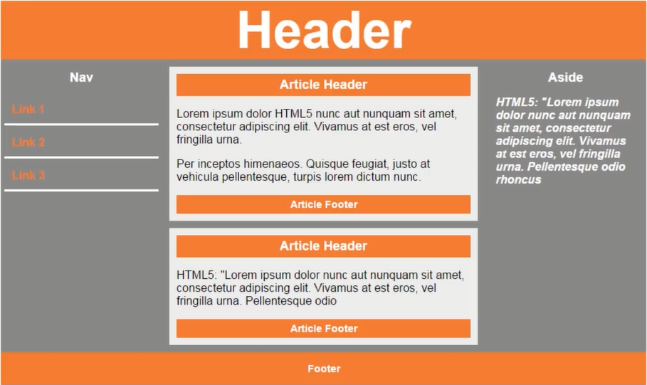

<!-- 2022.7.10 -->
# HTML5发展史浅谈
* HTML5草案的前身名为Web Applications 1.0,于2004年被WHATWG提出，于2007年被W3C接纳，并成立了新的HTML工作团队。
* HTML 5的第一份正式草案已于2008年1月22日公布。HTML5仍处于完善之中。然而，大部分现代浏览器已经具备了某些HTML5支持。
* 2012年12月17日，万维网联盟(W3C) 正式宣布凝结了大量网络工作者心血的HTML5规范已经正式定稿。根据W3C的发言稿称: "HTML5是开放的Web网络平台的奠基石。”
* 2013年5月6日，HTML 5.1正式草案公布。该规范定义了第五次重大版本，第一次要修订万维网的核心语言:超文本标记语言(HTML) 。在这个版本中，新功能不断推出，以帮助Web应用程序的作者，努力提高新元素互操作性。
* 本次草案的发布，从2012年12月27日至今, 进行了多达近百项的修改,包括HTML和XHTML的标签,相关的API、Canvas等 ,同时HTML 5的图像img标签及svg也进行了改进，性能得到进一步提升。
# 浏览器兼容
* 好说
* 常用的五大浏览器: IE Chrome Firefox Safari Opera

# HTML5语法
## 内容类型(ContentType)
* html5的文件扩展符与内容类型保持不变仍然为`.html`或`.htm`
## DOCTYPE声明
* 不区分大小写
## 指定字符集编码
* `meta charset="UTF-8"`
## 可省略标记的元素
* 不允许写结束标记的元素:
  * `br` `col` `embed` `hr` `img` `input` `link` `meta`
* 可以省略结束标记的元素:
  * `li` `dt` `dd` `p` `option` `colgroup` `thead` `tbody` `tfoot` `tr` `td` `th`
* 可以省略全部标记的元素:
  * `html` `head` `body` `colgroup` `tbody`
* 有些还是按以前的来比较好，别太自由了
## 省略引号
* 属性值可以使用双引号，也可以使用单引号。
# HTML5新增语义化标签
* `section`元素 表示页面中的一个内容区块
* `article`元素 表示一块与上下文无关的独立的内容
* `aside`元素 在`article`之外的，与`article`内容相关的辅助信息
* `header`元素 表示页面中一个内容区块或整个页面的标题
* `footer`元素 表示页面中一个内容区块或整个页面的脚注
* `nav`元素 表示页面中导航链接部分
* `figure`元素 表示一段独立的流内容，
  * 使用`figcaption`元素为其添加标题(第一个或最后一个子元素的位置)
* `main`元素 表示页面中的主要的内容(IE不兼容)
* 这是告诉爬虫以及其他开发者的，实际的布局还是要自己设置, 它们本身只是单纯的块元素
## 如图

# 音频视频
* 之前的霸主flash，由于安全性、计算资源使用率低，被抛弃了
* 音频
  * `<audio src="" controls loop></audio>`
    * `controls=controls` 控制栏
    * `loop` 循环
    * `autoplay` 自动播放(某些浏览器可能禁用)
    * `muted` 静音
* 视频
  * `<video src=""></video>`
  * 具备`audio`的那些属性
  * 额外属性
    * `poster` 属性海报
    * `width` `height` (CSS也可设置宽高) 均按比例缩放
    * chrome 自动播放不可，静音则可自动播放
# H5增强input
* 例: `<input type="" name="">` 
* `<input type="color" name="thiscolor">` 颜色选择
  * **必须加个name才能提交出去**
* `type="email"` 邮箱选择
* `type="url"` url地址(完整地址)
* `type="tel"` 电话号码(**手机端自动弹出数字键盘**)
* `type="range"` 滑块效果
  * 可设置`min` `max` 即最左最右值
  * 可设置`value` 为初始位置 即初始值
  * 可设置`step` 即为步长
* `type="number"` 数字类型 只可输入数字
  * `min` `max` `value` `step`
    * 注意`step`起点`min`, 影响快捷加减可取值
* `type="search"` 搜索类型
  * 具有快捷清空内容键
* `type="date"` 日期选择
  * `type="month"` 月份选择
  * `type="week"` 周选择
  * `type="time"` 时间选择
  * `type="datetime-local"` 本地时间选择
## 选项列表`datalist`
* `<input type="text" list="起的名字">`
* `<datalist id="起的名字">`
  * 里面套很多`<option value=""></option>`
* 这玩意儿支持模糊搜索 
## 一些问题及优化方案
* `autofocus` 获取焦点
* `required` 必填项 不能为空
* `multiple` 支持多个地址 用逗号隔开
  * 还可以应用于file
* `pattern` 将属性值设置为某个格式的正则表达式 在提交时会检查其内容是否符合给定格式
  * 例 `<input pattern = "[0-9][A-Z]{3}" title="输入一个数与三个大写字母" placeholder='输入一个数与三个大写字母'>`
<!-- p95 - p108 -->