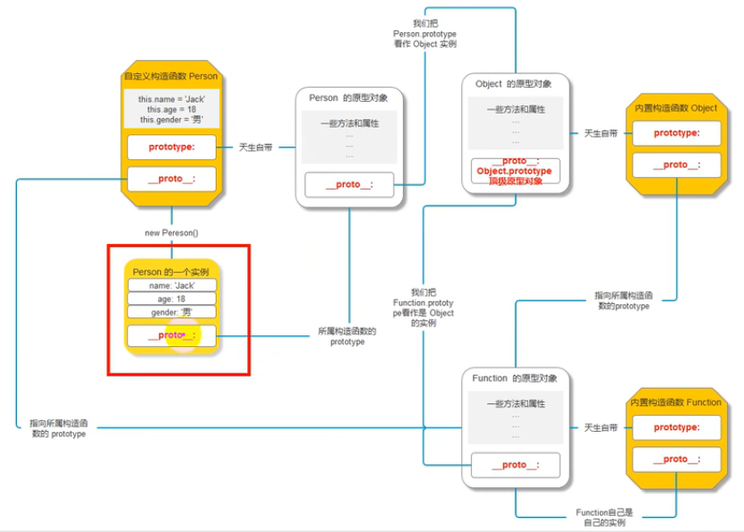
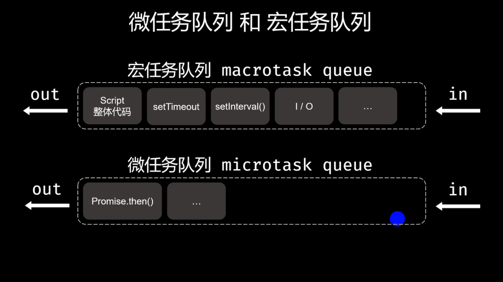
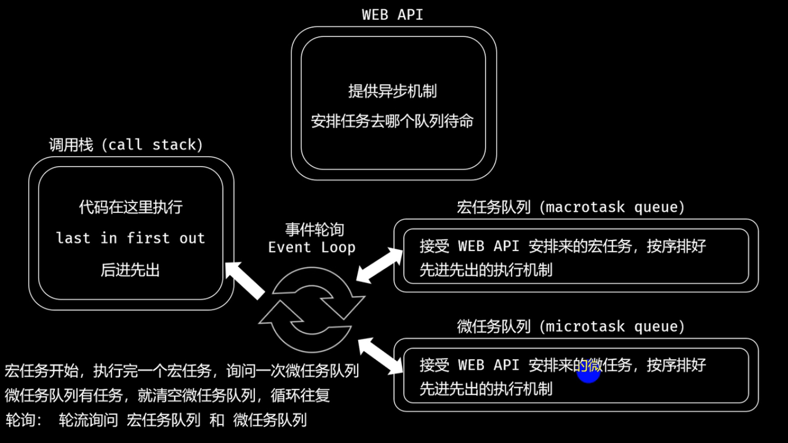
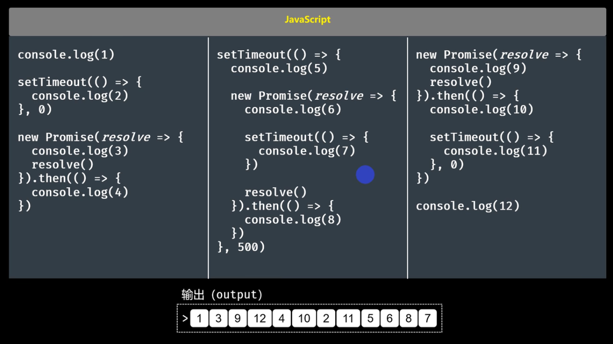
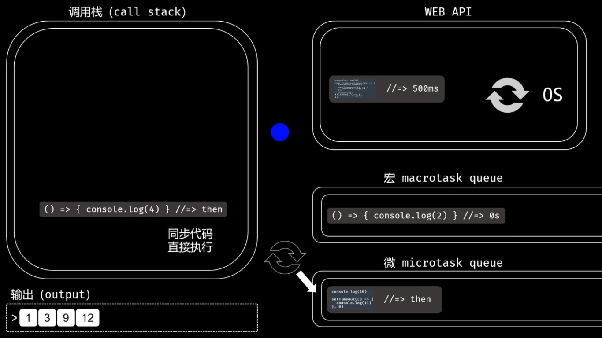

<!-- 2022.7.21 试听 -->
# 简单聊一聊
## 基本
* HTML 结构，CSS 样式，JavaScript 行为
* JS三大核心
  * ECMAScript
    * JS的标准 语法
  * BOM
    * browser object model
    * 就是一整套操作浏览器的属性和方法
  * DOM
    * document object model
    * 就是一整套操作文档流的属性和方法
* JS的本质
  * 就是通过JS的语法，让浏览器发生变化，让文档发生变化
## JS的书写
* 三种方式
  * 行内式
    * 强烈不推荐
  * 内嵌式
    * 不推荐
  * 外链式
* 行内式
  * a标签
    * a标签本身就有行为出现
    * 当我点击的时候，需要区分你是跳转链接还是执行JS代码
    * 在 href 属性里面书写一个`javascript: JS代码;`
    * `<a href="javascript: alert('Hello, world~')">hello</a>`
  * 非a标签
    * 因为没有自己行为，我们需要给它加一个行为
    * `onclick`
    * `<div onclick="alert('你好，世界~')">你好</div>`
* 内嵌式
  * `<script>JS代码</script>`
    * 不需要任何行为，打开页面就执行
  * 特点
    * 在一个页面内可以写无数个script标签，会从上到下依次执行
    * 理论上script标签可以放在页面的任何位置
    * 推荐放在body的末尾或者head的末尾
    * `代码代码</head>` 或 `代码代码</body>` 
    * 目前更推荐body末尾
* 外链式
  * JS代码写在.js文件内
  * 引入 `<script src="./test.js"></script>`
  * 不需要任何行为，打开页面就执行
  * 特点
    * 同上内嵌式
    * 当一个script标签被当做外链式使用时，写在其内部的东西无意义
    * 哪怕你写了src但是没引入，也不能作内嵌式使用了
## 注释
* 单行 //
* 多行 /**/
  * VSCode默认快捷键: Alt + Shift + A
# 输出语法
## alert()
* 以浏览器弹出层的形式展示内容
* 内容不是数字就得加引号 " / '
  * 推荐单引号
## console.log()
* 在浏览器控制台打印要输出的内容
* 内容不是数字就得加引号 " / '
### 推荐console
* alert会阻断程序执行，不点它 后面代码就不执行
## document.write()
* 在页面直接写入要输出的内容
* 内容不是数字就得加引号 " / '
* 注意
  * 因为直接把内容输出在页面上，所以可以**解析标签**
    * `document.write('<h1>')`
    * `document.write('这个就一级标题了')`
    * `document.write('</h1>')` 
<!-- 2022.7.22 -->
# 正式开讲 - 语法 
## 变量
### 基础语法
* 在一段程序的运行中，保存一个中间值使用的
* 例
  * 使用一个变量记录一个文本'你好，世界~Hello, world~'
* 语法(旧)
  * `var 变量名 = 值`
  * var 定义变量的关键字
  * 空格 分隔
  * 变量名 
  * = 赋值
  * 值
  * `console.log(变量名)` 输出语法不用引号就表示你这是个变量
* 特点
  * 一个变量只能保存一个值，后续赋值会覆盖前面赋值
  * 妹有var/let关键字也可以定义，不严格，过不了严格审查
    * 不推荐这样
* 定义变量的几种形式
  * 不赋值
    * `var a`
    * `let asd`
  * 同时定义多个变量
    * `var b, c, d`
    * `var n1 = 100, n2, n3 = 9`
      * 逗号表示这句话没结束   换行、分号表示结束
      * 可以加上逗号换行写
    * 可以赋值可以不赋值
### 变量的命名规则、规范
* 规则必须遵守，规范建议遵守
* 规则
  * 一个变量只能由 数字(0-9) 大小写字母(a-Z) 美元符($) 下划线(_) 组成
  * 不能以数字开头
  * JS严格区分大小写
  * 不能使用关键字、保留字(将来可能用的准关键字)
* 规范
  * 不要用中文命名
  * 变量名语义化
  * 驼峰命名法
    * 多个单词组成的变量名，第二个单词开始首字母大写
    * `var userEmail`
## JS的数据类型
* 分类
  * 基本数据类型(简单数据类型)
    * Number 数值
    * String 字符串
    * Boolean 布尔
    * Undefined 空
    * Null 空
  * 复杂数据类型(地址数据类型/引用数据类型)
    * Object
    * Function
* Number
  * 一切十进制表示的数字
  * 一切浮点数
  * 其它进制
    * 十六进制 0x `0xff`
    * 八进制 0 
    * 二进制 0d
    * console.log()时会自动转换为十进制
  * 科学计数法
    * 2e5 == 2 * 100000
  * NaN
    * not a number 非数字
* String
  * JS中单引号、双引号、反引号(Tab↑Esc↓那个小点儿) 包裹的内容都是
    * 字符串123和数字123不一样
    * 比如 做加法 '123' + 1 = 1231, 123 + 1 = 124
    * 在字符串里，空格占位
* Boolean
  * true 真 在计算机存储的时候就是1
  * false 假 0
  * 主要用来做判断
* 空
  * Undefined
    * 这里本该有一个值，但是没有
  * Null
    * 这里正有一个值，但是是空值
### 检测数据类型
* why?
  * 在运算的过程中，有的数据不是我们自己写的，可能是运算得到的或者别人给的
  * 为了保证程序正常地运行，我们需要进行数据类型检测
* 用法
  * `typeof 变量`
  * `typeof(变量)`
    * 返回值: 以**字符串**的形式给你变量数据类型 比如返回number、string
* 区别
  * 第一个只能检测紧跟着的一个变量
    * `typeof n1 + n2` 先把n1的type整出来，再加n2 
  * typeof()先运算括号内的结果，再检测结果的类型
  * 只能准确检测基本数据类型
    * 数值 number
    * 字符串 string
    * 布尔 boolean
    * undefined undefined
    * null object
### 数据类型转换 - 转数值
* `Number()` 
  * 会把你要转换的内容当做整体看待
  * 不能转换为数字结果的，得到NaN
* `parseInt()`
  * 把你要转换的内容一位一位的看
  * 第一位不能转换，直接NaN
  * 第一位能，转换、保留、继续第二位
  * 直至不能转换，输出已转换内容
    * `var b1 = true`
    * `var res5 = Number(b1)`   得1
    * `var res6 = parseInt(b1)` 得NaN 
  * 注意 **不认识小数点**
    * **正好用来取整**
  * 取整案例 四位数拆分
    * `var a = parseInt(num / 1000)`
    * `var b = parseInt(num % 1000 / 100)`
      * 对比 (num - a * 1000) / 100
    * `var c = parseInt(num % 100 / 10)`
    * `var d = num % 10`
  * 取整案例 秒数换成多少天多少小时分钟秒
    * `var days = parseInt(time / (24 * 60 * 60))`
    * `var hours = parseInt(time % (24 * 60 * 60) / (60 * 60))`
    * `var minutes = parseInt(time % (60 * 60) / 60)`
    * `var seconds = time % 60`
* `parseFloat()`
  * 在parseInt()基础上，多认识一个小数点
* 取正负值
  * +变量 -变量
  * 和Number的解析规则一样(整体)
  * `var b2 = -b1`
* 非加法的数学运算
  * `a * 1`
  * `a - 0`
  * `a / 1`
  * 加法不行(非加法嘛)
    * 不改变数值只改变类型
  * 和Number解析方法一样 
### 数据类型转换 - 转字符串
* `String()`
  * 任何数据类型都能转换
* `.toString()` 
  * 语法 `你要转换的数据.toString()`
  * undefined 和 null 不能转换
  * 报错 `Uncaught TypeError: Cannot read properties of undefined (reading 'toString')`
    * 代码里面必有一个 xxx.yyy
    * 之所以报错，是因为 xxx 是 undefined 
  * 报错 `Uncaught TypeError: Cannot read properties of null (reading 'toString')`
    * 报错是因为 xxx 是 null
* 加法运算
  * JS中，加号有两个意义
  * 字符串拼接
    * 只要任意一边是字符串
    * `''`也是字符串，但是没有内容
  * 数学加法
    * 两边都是数字或者布尔 
  * 练习
    * `console.log(1 + '2' + 3 * 4)` = 1212
    * `console.log(1 + '2' + 3 + 4)` = 1234
### 数据类型转换 - 转布尔
* `Boolean()`
  * 在 JS 中，只有五个内容转换成FALSE
    * 0 
    * 空字符串 `''`
    * NaN
    * undefined
    * null
  * 其他全是true
## 运算符
### 数学运算符
* `+`
  * 字符串拼接
  * 数学运算
* `-`
* `*`
* `/`
* `%` 
  * 取余 得到余数
  * `3 % 10` 得到 3
  * `10 % 3` 得到 1
* `**` 
  * 幂 
  * `a ** b` a的b次方
### 赋值运算符
* `=`
  * 把右边的给左边
* `+=`
  * `a+=b` 即 `a = a + b`
  * 注意顺序，自己在自己的基础上加，不是b+a
* `-=`
* `*=`
* `/=`
* `%=`
### 比较运算符
* `>`
* `<`
* `>=`
* `<=`
* `==`
  * 比较值是否相等 不看类型
  * NaN == NaN ? false 你记住 
  * NaN只能证明不是数字
* `===`
  * 比较值和类型是否都相等
* `!=`
  * 值
* `!==`
  * 值和类型 
  * 类型不一样时，直接true 
### 逻辑运算符
* `&&` 与(且)
* `||` 或
* `!` 非 
  * 双取反可以转布尔
  * `console.log(!!0)` 得false
### 自增自减运算符
* 是一元运算符: 一个符号带一个变量就能运算
* `++`
* `--`
* 前置与后置
  * 共同点
    * 只要执行了，那么变量本身一定会改变
  * 区别在于参与运算时
    * 前置自增自减 先改变自身的值 再用改变后的值去运算 
    * 后置自增自减 先用自身的值去运算 完事儿再改变自身的值
* 当一个表达式出现多个自增自减运算符的时候，按照从左到右的顺序依次一个一个执行
  * 注意表达式结果以及过程中自增值自减值的不断变化 
<!-- 2022.7.23 -->
## 条件分支语句
### if 语句 
* `if(条件){要执行的代码}`
  * 条件满足(true)时，{}里面的代码执行
  * 反之不执行
* `if(条件){要执行的代码}else{要执行的代码}`
  * 必然执行一个
* `if(条件一){条件一要执行的代码}else if(条件二){条件二要执行的代码}`
  * 从第一个条件开始看，哪个满足执行哪个
  * 如果前面的满足了，那么后面的就都不执行了
  * 最多执行一个 
* `if(条件一){代码一}else if(条件二){代码二}else(条件三){代码三}`
* 注意
  * JS `var n=17` `if(15 <= n <= 20){条件代码}` 
  * 15 <= n 得到 true 即 1, 1 <= 20 得到 true, 必执行条件代码 
  * 要这么写`if(15 <= n && n <= 20)`
### switch 语句
* 语法 代码示例
``` JavaScript
  switch(要判断的变量){
    case 情况1:
      情况1执行的代码
      break
    case 情况2:
      情况2执行的代码
    default:
      所有条件都不满足时执行的代码
  }
```
* 注意
  * 每个`case`和判断的变量的关系是`===`才叫满足
  * `switch`语句只能准确判断某一个值，不能判断范围
  * 关于每个`case`后面的`break`: 
  * 当你有break时，满足某个`case`, 然后执行完它的内容，就结束了
  * 没有break，执行完这个case，不管下一个case是否满足，都会执行
  * 直到遇见`break`, 遇不见那就直到`switch`结束 
  * 再注意: `break`的穿透，是从第一个满足条件的`case`开始
  * `default`可写可不写，作用类似`if`语句里的`else`, 兜底
* 利用穿透判断月份天数
  * `case 1: case 3: case 5: case 7: case 8: case 10: case 12: console.log('31天') break` 
  * 设置case后的代码为空，直接跳过
## 循环结构语句
* 根据条件决定一段代码重复执行多少次
### 循环成立的条件
* 初始值 作为循环的开始
* 条件判断 决定要不要继续循环
* 要重复执行的代码
* 改变初始值 为了让循环有结束
### while循环
* 语法
```javascript
  var n = 1
  while (条件) {
    重复执行的代码
    n = n + 1
  }
```
  * 浏览器检查 看断点理解循环进行 
* 循环能为我们提供一组有规律的数字 
### do while循环
* 语法
```JavaScript
  do {
    要执行的代码
  } while (条件)
```
* 和while循环的区别
  * 不管条件成立与否，先执行一遍
    * 只在第一次条件就不成立的时候会有区别
    * 第一次都成立的话，看不出什么区别
* 案例
  * 以用户为第一原则
  * 我给用户一些选项，你必须要按照我的来
  * 使用 `prompt()` 
### for循环
* 这个用得最多
* 但是书写很诡异(代码糖)
  * 代码糖: 用起来方便写起来方便，看起来不方便
* 语法
  * `for ( var i = 0; i < 10; i++) { 重复执行的代码 }`
  * 标准语法:
  ```JavaScript
    var i = 0
    for ( ; i < 10; ) {
      重复执行的代码
      i++
    }
  ```
  * `i++`是回来又执行的
* 案例
  * 1 - 100三的倍数
    * `if (!(i % 3)) {}` 
    * 注意这个!的使用
<!-- 2022.7.24 -->
<!-- 2022.7.24 -->
### 循环控制语句 break
* 当你在一个循环里面执行到break关键字时，**会结束整个循环** 
  * 见最大公约数.1
### 循环控制语句 continue
* 须知
  * 使用在循环里面的关键字
  * 代码执行到 continue 时，会结束循环的本次，继续下一次(continue后面的就全都不执行了) 
### 循环控制语句 JS标记语法
* 须知
  * break关键字可以跳出循环，但是是跳出当前循环
  * 标记语法，自己做个记号，想跳到哪儿就跳到哪儿 
* 使用
  * 直接在循环的开始位置做个标记(自己起个名字再跟个冒号)
  * 当你准备跳出的时候，`break 标记名`, 直接跳转到标记代表的循环结束位
* 代码示例
  ``` javascript
    here:
    for () {
      for () {
        if () {
          ...
          break here //到这里直接结束here后面那个大的for循环
        }
      }
    }
  ```
### 案例集合
* 水仙花数(三次自幂数)
  * 一个数字每一位的三次方之和 和这个数字一样 
    * 例: 153 = 1 * 1 * 1 + 5 * 5 * 5 + 3 * 3 * 3
    * 取值范围 100 - 999 一定是三位数
  * 思路
    * 循环得到 100 - 999
    * 把每个数字都拆开
    * 判断
  * 代码
  ``` javascript
    for (var i = 100; i <= 999; i++){
      var a = parseInt(i / 100)
      var b = parseInt(i % 100 / 10)
      var c = i % 10

      if (a ** 3 + b ** 3 + c ** 3 === i){
        console.log(i + '是三次幂数')
      }
    }
  ```
    * 顺带说一下开根号
      * 27的三次方根 即 27的三分之一次方 就是三次根号下27
      * `console.log(27 ** (1/3))`
* 打印三角形
  * 直角三角形
  * 等腰三角形
    * 等腰三角形变为1357行
    * `if(i % 2){原来的123456789行for循环}` 
* 最大公约数
  ```JavaScript
    for () {
      if () {
        ...
        break
        // 结束
      }
    }
  ```
  * 辗转相除法
    * 8 和 5
      * 8 / 5 no,
      * 5 / 3 no, 8 % 5 = 3
      * 3 / 2 no, 5 % 3 = 2
      * 2 / 1 yes, 得到最大公约数1 
    * 代码 
      ```JavaScript
      var a = 129
      var b = 49
      var m = a
      var n = b
      if (m < n) {
          var tmp = m
          m = n
          n = tmp
      }
      while (m % n !== 0) {
          tmp = m % n
          m = n
          n = tmp
      }
      console.log(a + '和' + b + '的最大公约数是' + n)
      ```
* 最小公倍数
  * 须知
    * 循环从小的数开始，直到两个数的乘积
    * 循环过程中，改变初始值时，每次加上一个大的数
    * for循环麻烦，改为while，但是，注意，只要写while循环，千万别写恒等式(不符规范)
  * 数学公式
    * x * y = x和y的最大公约数 * x和y的最小公倍数 
* 判断一个数字是不是质数
  * 须知
    * 循环可以从2开始
    * 大于数字的一半 肯定不能整除
    * 能开出整数平方根的，到平方根也可以结束了
    * break可以跳出 到什么位置循环结束就不重要了
    * 结束位 
      * 数字 - 1
      * 数字 / 2 取整
      * 数字 开平方根
  * 得到结果
    * 不是质数 可以在循环过程中得到答案
    * 是质数 循环结束才知道 
      * 凡是要整到循环结束的，都不能写if else 
    * 一般使用假设法处理
      * 在循环之前定义一个假设条件
      * 只是在循环里面否定我的假设
      * 循环结束了也妹否定我的假设，那我就成真的了
  * 代码示例
  ``` JavaScript
    var flag = '是质数', num = 49
    for (var i = 2; i <= parseInt(num / 2); i++) {
        if (num % i === 0) {
            flag = '不是质数'
            break
        }
    }
    console.log(num + flag)
  ```
* 打印1000 - 2000的闰年，四个一行
  * 代码
  ``` javascript
    var count = 0                   // count 的初始值 1 or 0? why? 初始值的设置影响后面代码位置
    for (i = 1000; i <= 2000; i++) {
        if (i % 4 === 0 && i % 100 !== 0 || i % 400 === 0) {
            document.write(i + ' ') //
            count++                 // 注意这几步的先后顺序
            if (count % 4 === 0) {  // 你要是非得count=1，那这里if放在++上面
                document.write('<br>')
            }
        }
    }
  ```
# 函数
## 了解函数
* 须知
  * 和数学的函数没有关系
  * 就是 JS 里的一个数据类型而已
  * 是复杂数据类型的一种
* 在 JS 里面
  * 函数就相当于一个盒子
  * 用来承载一段代码，当你需要执行这一段代码的时候
  * 只要呼唤这个盒子就可以
  * 实际上就是对一段代码的封装
* 过程
  * 把代码装在盒子里
    * 即 定义函数
  * 使用盒子里的代码
    * 即 调用函数
## 定义函数
### 声明式函数
* 语法 `function 函数名(){}`
  * function: 声明函数的关键字
  * 空格: 必须有，分隔
  * 函数名: 这个函数的名字(遵循变量命名规则和规范)
  * (): 参数
  * {}: 代码段 
### 赋值式函数
* 语法 `var 函数名 = function () {}`
### 函数的参数
* 在 JS 里面, 函数的参数分为两种
* 形参
  * 写在函数**定义**阶段的()里面
  * 相当于一个只能在函数内部使用的变量
  * 起名遵循变量命名规则和规范
  * 值由函数的实参来决定
* 实参
  * 写在函数**调用**阶段的()里面
  * 是个准确的值，为了给函数的形参进行赋值
* 数量
  * 形参和实参都可以写多个，用逗号隔开，按照从左向右的顺序一一对应 
* 数量关系
  * 一样多 一一对应
  * 实参多
    * 前面的按照顺序一一对应，多出来的实参在函数内没有形参接收，无法直接使用
  * 形参多
    * 前面的按照顺序一一对应，多出来的形参因为没有实参赋值，使用时就是 undefined
## 调用函数
* 定义方式不同，但是调用方式相同
* `函数名()`
* **注意**
  * 函数名 和 函数名() 不一样
  * 函数名 是个变量，表示这个函数的
  * 函数名() 是把这个函数执行掉
### 函数调用上的区别
* 两种声明方式，调用方式是一样的
* 区别在于调用函数的时机不一样
* 声明式
  * 可以在声明之前调用，也可以在声明之后调用
* 赋值式
  * 只能在声明之后调用
* 拓展 报错信息
  * Uncaught TypeError: fun is not a function
    * 不是说fun没有声明，只是说fun不是一个函数
    * 代码里写了个xxx(), 而这个xxx不是函数
  * Uncaught ReferenceError: fun is not defined
    * 表示fun这个变量没有定义过
    * 在某个位置使用了fun变量, 然而从未定义
## 函数的特点
* 代码复用
* 时机把握
* 代码简洁
<!-- 2022.7.25 -->
<!-- 2022.7.25 -->
## arguments
* 须知
  * `arguments` 是函数内天生自带的变量，不用你再声明
  * 表示所有实参的集合(伪数组)
* 属性
  * `length`
    * 表示长度 arguments里面有多少个数据 即: 你的函数调用有多少个实参
    * 是一个读写的属性 一般不设置长度没啥意思
  * 排列
    * 按照序号**从零开始**依次加一
    * 专业名字: 索引(下标) 
  * 某个数据的操作
    * 依靠索引操作arguments的某一个数据 
    * 读 `arguments[索引]` 获取索引位置的数据
    * 写 `arguments[索引] = 你要设置的值` 把索引位置的数据改变
      * 有这个索引是修改，没有这个索引就是添加
* 有啥用呢?
  * 索引它是有规律的数字, 循环也能提供有规律的数字，你猜有啥用
  * `for (var i = 0; i < arguments.length; i++) {}`
## return 函数的返回值
* 情景
  * 上面arguments求和后要求结果不同的输出方式，单独写一个个不同打印方式的函数麻烦
  * 可以利用函数把结果返回到函数外面
  * 在函数外面拿到结果后，爱干嘛干嘛
  * 来看 return
* 须知
  * return 一个函数的返回值(结果)
  * 在函数内使用 return, 它后面的内容就是这个函数的返回值, 是执行函数后的结果
  * 计算类的函数就只计算结果，不做输出操作，只做个结果返回就可。
## return 打断函数
* 当函数执行到某一步的时候，我不想继续执行了，就使用`return`关键字结束函数 
* 打断循环break，打断函数return
* 写在return后面的内容是函数返回值 而写在return后面行的内容则不会执行
## 递归函数
* 函数的一种应用方式
* 递 一层一层地进去
* 归 一层一层地回来
* 把一个事情分成若干个事情去做
* 例 五的阶乘
  * => 5 * 4 的阶乘
    * => 4 * 3 的阶乘
      * => 3 * 2 的阶乘
        * => 2 * 1 的阶乘
          * => 1的阶乘就是1
  * 递下去再归上来
* 本质: 
  * 一个函数自己调用自己
  * 当达到设置的终点的时候 再用return归回来 
* 注意
  * **写递归，先写停**(终点)
    * 避免死循环，写bug没事儿，别整死循环把浏览器干崩了就行(程序员最后的尊严) 
    * 浏览器 -> 检查 -> 源代码 -> 调用堆栈(Call Stack) / 作用域 
* 案例
  * 阶乘
  ```javascript
  function jc(n) {
     // 先写终点
     if (n === 1) {
         return 1
     }
     return n * jc(n - 1)
  }
  ```
  * 斐波那契数列 
    * 1 1 2 3 5 8 13 21
  ```javascript
  function fbnq(n) {
    if (n === 2 || n === 1) {
        return 1
    }
    return fbnq(n - 1) + fbnq(n - 2)
  }
  ```
  * 递归求最大公约数
    * 辗转相除法
    * 终点: a % b === 0 时，b 就是最大公约数
    * 没到终点之前: 小的数 余数
      * `return fn(b, a % b)` 
* 再注意
  * 在你的任何一段程序里面，**递归慎用** 
  * 你这递归里面能绕的全绕进去了一层套一层又一层 
## 函数和元素结合
* 函数和元素结合
  * 函数可以当做一个页面元素的事件处理函数
  * 当我在页面的某个元素上触发行为的时候，执行某一个函数
  * 语法 `元素.onclick = 函数` 
* 两种合作方式
  * 直接书写匿名函数
    * => `元素.onclick = 函数`
    * `box.onclick = function () { ... }`
  * 可以给事件赋值一个具名函数
    * => `元素.onclick = 函数名`
    * `function fn() { ... }`
    * `box.onclick = fn`
  * 注意嗷，函数是有括号的，而函数名就没有括号了
    * 变量名代表了一个函数，带上括号就是把这个函数执行了
* 页面元素的简单操作 
  * 在一个页面里，元素的 **id** 名，可以直接当做一个变量来使用
  * 这个变量就代表着这个元素
  * `<div id="box">盒盒盒</div>`
  * `console.log(box)` 得 盒盒盒 
* 案例 加法
  * 给button按钮绑定一个点击事件
  * 获取输入的内容
    * 在button按钮的点击事件里面获取文本框的内容
    * 当我点击 = 的时候，拿到输入的数据
    * `表单元素.value`表示在获取这个表单元素的value值
    * **注意** 只要你从页面元素里面拿出来的 都是字符串 
      * 非加法转换 -0 *1 /1 都可
<!-- 2022.7.26 -->
<!-- 2022.7.26 -->
## 循环与函数 - 作业
* 拼接字符串，可以考虑先写好想要的结果，再逐一替换，避免遗漏嘛
* button 标签对在 form 标签里的时候是 submit, 等价于 input type="submit"
* if or switch?
  * 代码少 没有判断 都推荐switch
* 反思 芝麻粒放棋盘 哪里想的太复杂哪里想的太简单 
* JS 的最大安全数字
  * -(2^53-1) 到 2^53-1 
    * ±9007199254740991
  * 2020年引入一个叫 大整数 的玩意儿，超过范围也能显示了 
    * bigint 数字后面加个n 但不能描述小数 
# 预解析
## 基础
* 须知
  * 告诉你代码的执行机制
  * 不是叫你代码怎么写，而是不要怎么写
  * 预 预先，在所有代码执行之前
  * 解析 解释，对代码进行通读并且解释(只是把整体代码当做一个文档)
* 解释了什么东西
  * var 关键字
    * 会把 var 关键字定义的变量在代码执行之前声明
    ```javascript
      console.log(num)
      var num = 100 
      console.log(num)
    ```
    * 结果 
      * undefined 
      * 100 
    * 真实的执行过程
      * `var num` 预解析
      * `console.log(num)`
      * `num = 100`
      * `console.log(num)`
  * 声明式函数
    * 会把这个函数名在所有代码执行之前声明，并且赋值为一个函数
      * 声明式函数的调用可以在定义之前可以在定义之后
      * 对比 赋值式函数 它是按照var的规则进行解析 所以只可在定义后面调用 
## 案例讲解
* 代码
  ```javascript
    fn()
    var fn = 100
    fn()
    function fn() {
        console.log('我是fn')
    }
    fn()
  ```
  * 变量和声明式函数皆有
  * 重名 
  * 预解析阶段 以函数为准
    * 得到结果 `我是fn()` 
    * 第一个`fn()`会执行，第二个开始就报错了
* 预解析
  * 1. var fn 声明fn变量
  * 2. function fn() { ... } 声明fn变量，并赋值为函数
  * 预解析结束时，浏览器记录的fn变量是个函数
* 代码执行
  * fn()
  * fn = 100
  * fn() 报错了直接，fn在上一步被赋值为100了 你现在整个`console.log(fn)`倒是能直接出来100
  * fn() 这就不执行了，上面报错程序中断
* 拓展 报错
  * `Uncaught TypeError: fn is not a function`
    * 我前面的代码是不是用过fn
## 预解析的无节操
* 咱这个JavaScript被瞧不起的一个地方就是这个预解析乱七八糟的
* if 条件不论是否成立，里面的代码都会进行预解析
  * 代码
  ```javascript
    console.log(num)
    if (false) { var num = 100 }
    console.log(num)
  ```
  * 输出两个`undefined`, 而不是报错`num is not defined` 
  * 预解析把它当成个普通文档，不会因为你 if 条件不满足就不管里面的东西 
    * 但是注释还是不管的 
  * 你用 let 定义 num 就报错，预解析看 var 
* return 它也不认识
  * 在 return 后面行写的东西，也会被预解析 
## 来点儿写代码的小建议
* 预解析相关
  * 函数名不要和变量名重名
  * 声明式函数虽然可以先调用，但是尽量不要先调用
  * 尽量使用赋值式函数来定义
* 变量 
  * 以名词为主
    * price 
    * car 
    * goods
  * 尽可能的两到三个单词
    * userName 
    * userInfoAge
* 函数名
  * 以功能区分
    * getRandomColor() 
    * setGoodsPrice()
    * clickHandler()
# 作用域
## 须知
* 作用域
  * 教给你怎么写代码
  * 作用: 生效、有用
  * 域: 范围
  * 作用域: 变量(变量名、函数名)生效的范围
* 两种
  * 全局作用域
    * 打开一个页面就是一个全局作用域
    * 全局作用域 叫做 window
  * 私有作用域(局部作用域)
    * **只有函数生成私有作用域**
    * 每个函数就是一个私有作用域 
* 作用域的上下级关系
  * 你的函数写在哪个作用域下
  * 你就是谁的子级作用域
  * 上下级关系确定变量的使用范围
## 变量的三个机制
* 三个机制
  * 变量定义机制
    * var 关键字
    * 声明式函数
  * 变量使用机制
    * 需要拿到某一个变量的值来使用
    * `i++`
    * `console.log(num)`  
  * 变量赋值机制  
    * 一定要有赋值符号
    * num = 100
### 变量的定义机制
* 一个变量(函数)
  * 定义在哪一个作用域里面
  * 只能在当前作用域 或者下级作用域里面使用
  * 上一级作用域不能使用
### 变量的使用机制
* 当你需要使用一个变量(函数)
  * 首先会在**自己**的作用域内查找，如果有，直接使用
    * 形参相当于在函数内部定义的私有变量
  * 如果没有，去上一级作用域查找，如果有，直接使用
  * 如果还没有，再去上一级查找...
  * 直到 window 都没有，那么就会**报错** 
### 变量的赋值机制
* 当你需要给一个变量(函数名)赋值的时候
  * 首先会在自己的作用域内查找，如果有，直接赋值
  * 没有就去上一级作用域查找，找到了就赋值
  * 还没有就再去上一级作用域查找，找到了就赋值
  * 直到 window 都没有，
    * **把这个变量定义为全局变量，再进行赋值**
    * 这个不注意容易乱套 影响上级的值
<!-- 2022.7.26 -->
## 作用域和预解析
<!-- 2022.7.27 kl jqr-->
* 搞清楚 作用域和预解析
  * 建议直接看html代码之 043
* 预解析时，作用域，比如，函数里的函数，它有这个变量，外面函数也有，预解析肯定先看自己的，切记
### 作用域里面的预解析
* 预解析阶段  
  * 全局预解析
  * 私有作用域预解析
* 全局预解析
  * 在页面打开的时候就进行了
  * 只解释属于全局的内容
  * 例
    ```javascript
      var a = 100
      function fn() {
        var b = 200 // 一上来的全局预解析只看了 var a 和 function fn() { ... } 没看里面这个 var b
      }
      fn()
    ```
* 私有作用域预解析
  * 当函数执行的时候 进行预解析
  * 执行几遍它就预解析几遍 
  * 函数内部的预解析 只属于函数内部 
* 问题来了
  * 函数执行的时候
    * 会进行形参赋值 会进行预解析
    * 一旦函数的形参和定义的私有变量重名
    * 先预解析还是先形参赋值?
  * 结论来了
    * 因为函数是单独进行预解析
    * 在函数执行的时候，先进行形参赋值，再进行预解析 
    <!-- 遗憾在电影里是主角崛起的前戏，在生活里是让人沉沦的毒药, 不要总是遗憾过去的遗憾 -->
# 数据类型
## 对象数据类型
* JS数据类型的一种
  * 一个复杂数据类型 Object
  * 函数: 一个盒子, 承载一段代码
  * 对象: 一个盒子, 承载一堆数据
    * 对象的本质: 抽象地描述一个事物
### 对象的创建方式
* 分类两种
  * 字面量创建
    * `var o = {}`
  * 内置构造函数创建
    * JS 给我们提供了一个内置构造函数叫做 `Object`
    * `var o = new Object()` 
* 两种方式的区别 
  * 字面量创建可以在创建的时候就向里面直接添加一些数据
    * 数据以键值对的形式出现
      * 即: `key: value` 的形式 
      *     成员: 值
      * key 就是这个数据的名字
      * value 就是这个数据的值
    * 多个数据之间使用逗号(,)分隔 
  * 内置构造函数目前我们不好直接添加成员
    * 直接创建一个空对象
    * 后期通过对象的操作语法来进行增删改查
### 对象的属性和方法
* 对象的**属性**
  * 值不是函数的成员叫属性
  * `num: 100,` `str: 'hello world~',`
* 对象的**方法**
  * 值是函数的成员叫方法
  * `fn: function () { ... }` 
### 对象的操作语法
* 操作
  * 增
    * 向对象里面添加一个成员
  * 删
    * 删除对象里面的一个成员
  * 改
    * 修改对象里面的一个成员
  * 查
    * 获取对象里面某一个成员的值
* 语法
  * 点语法
    * `.`可以翻译为'的'
    * 增 改
      * `对象名.成员名 = 值`
      * 原来有就是修改 原来没有就是添加
    * 删
      * `delete 对象名.成员名`
    * 查
      * `对象名.成员名`
      * 当你访问一个对象里面没有的成员的时候
      * 会给你一个 undefined
  * 数组关联语法
    * 和点语法达到一样的目的，只是路不同
    * 增 改
      * `对象名['成员名'] = 值`
      * 原来有就是修改 原来没有就是添加
    * 删
      * `delete 对象名['成员名']`
    * 查 
      * `对象名['成员名']`
  * 这两种语法混合使用没问题 
* 两种语法的区别
  * 点语法
    * 不能使用变量
    * 不能拼接字符串
    * 点的后面是什么 这个成员名称就是什么
  * 数组关联语法
    * 可以使用变量
    * 可以拼接字符串
    * 注意你的`[]`里写的是 字符串`''` 还是 `变量`  
* 注意
  * 因为对象数据类型是一个复杂数据类型
    * 在控制台打印的时候 会出现两种情况
    * 现在的样子和最终的样子
      * 在控制台上
      * 你未展开对象数据类型的时候，是当前的样子
      * 你展开对象数据类型以后，是最终的样子
      * 就是说，没点展开前是当时的那个阶段的，展开后都一样了全是最后阶段了
  * 怎么办?
    * 打印的时候直接打印你想看到的值
    * `console.table()`
      * 以表格的形式打印
### 循环遍历对象
* 咱之前遍历过 arguments
  * 因为 arguments 的排序是一组有规律的数字
  * for 循环能提供一组有规律的数字
  * arguments 的索引(下标)可以访问到里面的成员
* 遍历对象
  * 成员名可以访问到对象里的每个数据
  * 但是 名字不一定有规律
  * 引出 for in 循环
* for in循环
  * 大部分时候用来遍历对象
  * 语法
  ```javascript
    for (var 变量 in 对象) {
      重复执行的代码
    }
  ```
    * `for (var key in obj) { ... }`
    * 根据对象内有多少个成员 执行多少回 
    * 循环的每一次 key分别是对象的成员名称(**字符串类型**)
    * 就可以利用 key 和 数组关联语法 来获取每个成员的值
  * 判断一个成员是不是在这个对象里面
    * 使用 in 语法
    * `成员名 in 对象名` (成员名以字符串的形式书写)
    * 对象内的每一个成员名称都必须是**字符串** 
* 拓展
  * window 的 name 属性
    * 是个天生自带的全局属性
    * 作用: 在 iframe 标签和 name 属性合作进行跨域的
    * 特点
      * 被固定为字符串类型 
      * 不论你后来给 name 赋值为什么数据类型 它都会自动转换成字符串 
    * 自己定义变量的时候注意
## 数据类型存储的区别
* 数据类型分两种
  * 基本数据类型
    * Number String Boolean Undefined Null
  * 复杂数据类型
    * Function Object 
* 存储上是有区别的
* JS 打开的内存空间
  * JS 是一个脚本语言 依赖于浏览器执行
  * 本质是依赖浏览器里的 JS解析引擎
  * JS 本身不打开内存空间
  * 因为浏览器在你电脑上运行的时候 会占用一段内存空间
  * JS 就是在这一段内存空间里面运行的
  * 数据类型的存储 就是存储在浏览器分配给 JS 存储的一段空间
* 浏览器的一段存储空间
  * 栈内存
    * 存储机制 先来进栈底
  * 堆内存
    * 存储机制 随机存储
* 数据类型的存储
  * 基本数据类型
    * 直接把值存储在栈内存里面
  * 复杂数据类型(地址数据类型/引用数据类型)
    * 把数据放在了堆内存里面
    * 把地址放在栈内存的变量里面
    * 我们管这个地址叫做引用 
* 代码的执行
  * 我们只能直接访问到栈里面的内容
  * 要访问某个对象里面的成员 因为对象本身在堆内存里面, 
  * 我们要利用栈里面的地址 找到堆里面的空间,
  * 然后访问内部的成员 
## 数据类型赋值的区别
* 基本数据类型
  * 就是把变量存储的值直接赋值给另一个变量
  * 赋值过后两个变量没有关系了
* 复杂数据类型
  * 因为复杂数据类型中，变量存储的是地址
  * 赋值的时候，实际上是把一个变量的地址给了另一个变量
  * 赋值过后，两个变量操作一个空间
    * 配的钥匙 开一个门 进一个屋 改变的东西都可见
* 函数的形参和实参的关系
  * 实参就是在函数调用的时候给形参赋值
  * 实参和形参的交互，和变量赋值是一个道理
    * 全局基本数据类型 全局复杂数据类型 在函数内修改对外界的影响
    * 形参 a 和全局 num 没关系，形参 b 和全局 obj 指向同一个对象空间
* 函数的返回值也是变量赋值的一种
  * 返回值是把函数内部的数据 return 出去
  * 在函数外面有一个变量接收 
## 函数也是一个对象
* 对象保存一段数据
* 函数保存一段代码
  * 函数本身也是一个对象，可以保存一堆数据
  * `console.dir()`详细打印 看看函数
* 当你定义好一个函数以后
  * 函数就有两个功能
  * 1. 函数名()
    * 把函数当作一个函数执行掉
  * 2. 函数名.成员名 = '值'
    * 存储一些数据
  * 这俩功能**互不干扰 也没有关系** 
* 例 
  * 代码
  ```JavaScript
    function fn() {
        // console.log(age) // 报错
        // 访问的是age变量 是栈内存里面的age成员 
        // 然而咱们栈内存里面妹有age这个变量 只有fn这个变量 它指向一个存储空间
        // 在这个存储空间里才有age成员 来下面这个fn.age
        console.log(fn.age)
    }
    fn.age = 18 // 把一个函数当做一个对象来看
  ```
## 数组数据类型
* 也是 JS 的一种数据类型
  * 也是复杂数据类型 Array
  * 一个盒子 存储一堆数据
    * 但它不是按照键值对存储
    * 而是按照索引(序号)进行存储
### 数组的创建
* 分为两种
  * 字面量创建
    * `var arr = []`
  * 内置构造函数创建
    * JS 给我们提供了一个内置构造函数 Array
    * `var arr = new Array()`
* 创建的时候直接添加一些成员
  * 字面量
    * 直接写在中括号[]里, 多个数据使用逗号(,)分隔 
  * 内置构造函数
    * 不传递参数
      * 创建一个空数组
    * 传递一个正整数
      * 这个参数表示数组的**长度**
    * 传递多个数据
      * 每个数据都是放在数组里面的数据
      * 妹有表示长度的数据了
### 数组的操作
* 数组有一个 length 属性
  * 是一个读写的属性 (获取/设置 长度)
  * 当你设置的比本身长度小，就相当于删除
  * 当你设置的比本身长度大，多出来的用 空 补齐
* 数组的排列
  * 索引:
    * 从零开始 依次加一
    * 最后一位的索引自然就是 length-1 
  * 索引也是一个读写的属性
    * 读: 读取到指定索引位置的数据
      * 如果数组确实有这个索引位置 那么就是这么索引位置的数据
      * 如果没有 就是undefined
    * 写: 设置指定索引位置的数据
      * 如果有 就是设置
      * 没有 就是添加
      * 如果这个数字超出length很多 那么中间位置用 空 补齐 
* 数组的遍历
  * for 循环
* 数组也是一个对象
  * 数组除了可以按照索引排列一些数据
  * 还可以当做对象使用, 用 点语法 存储一些数据
  * 当做对象存储数据的时候 成员不占用length 
    * for循环遍历不会把它们整出来
    * for in 会
  * 但是一般不把数组当对象使用
  * JS "万物皆对象" 
### 数组常用方法
* 就 JS 自带的一些操作数组的方法
* 使用格式
  * `数组.xxx()`
* 数组和伪数组
  * length 和索引都一样, 循环遍历都一样, 长得也一样
  * 唯独数组常用方法 伪数组用不了
#### 1. push()
   * 语法: `数组.push(数据1, 数据2, 数据3, ···)`
   * 作用: 把所有参数按顺序追加到数组末尾位置
   * 返回值: 追加后数组的长度
   * **直接操作原始数组**
#### 2. pop()
   * 语法: `数组.pop()`
   * 作用: 删除数组的最后一个数据
   * 返回值: 被删除的数据
   * **直接操作原始数组**
#### 3. unshift()
   * 语法: `数组.unshift(数据1, 数据2, 数据3, ···)`
   * 作用: 把所有参数按原顺序插入到数组起始位置 (数据2还是在数据1后面)
   * 返回值: 插入后数组的长度
   * **直接操作原始数组**
#### 4. shift()
   * 语法: `数组.shift()`
   * 作用: 删除数组的第一个数据
   * 返回值: 被删除的数据
   * **直接操作原始数组**
#### 5. reverse()
   * 语法: `数组.reverse()`
   * 作用: 反转数组
   * 返回值: 反转后的数组
   * **直接操作原始数组**
#### 6. sort()
   * 语法: 
     * `数组.sort`
       * 按照每个数据中的每一位数据的ASCII码进行排列 (1, 100, 11)
     * `数组.sort(function (a, b) { return a - b })`
       * 升序
     * `数组.sort(function (a, b) { return b - a })`
       * 降序
   * 作用: 数组排序
   * 返回值: 排序后的数组
   * **直接操作原始数组**
#### 7. splice()
   * 语法: 
     * `数组.splice(开始索引, 多少个)`
       * 从开始索引，截取多少个
       * 第二个参数不写则直接到末尾
     * `数组.splice(开始索引, 多少个, 替换数据1, 替换数据2, 替换数据···)`
       * 把替换数据按顺序插入到截取的位置
       * 注意：**从哪个索引开始删除，替换数据的头一个就插入哪个位置**
         * **替换进了原数组** 不是截取出来的数组
         * 切记切记
       * 比如删除零个再插入 
   * 作用: 
     * **截取**数组
     * **替换**新内容
   * 返回值: 一定是个数组
     * 如果你截取多个数据，数组里面有多个
     * 如果你截取一个数据，数组里面有一个
     * 如果你一个都不截取，那么返回空数组
   * **直接操作原始数组**
#### 8. concat()
   * 语法: `数组.concat(数组1, 数组2, 数据1, 数组3···)` 数组/数据随便放
   * 作用:
     * 如果参数是数组，那么把数组拆开里面每一项**追加**到原数组后面
     * 如果参数是数据，那么直接**追加**
   * 返回值: 追加好的数组
   * **不改变原始数组**
#### 9. slice() 
   * 语法:
     * `数组.slice(开始索引, 结束索引)` - 包前不包后 [ , )
       * 第二个参数可以不写 表示到尾
         * 在此基础上 第一个参数也不写了 表示从头
       * 参数可以写负整数
         * 表示 length + 负整数 (倒着往前数相当于) 
   * 作用: **获取**数组里面的某些数据
   * 返回值: 一个数组
     * 如果你获取多个数据，数组里面有多个
     * 如果你获取一个数据，数组里面有一个
     * 如果你一个都不获取，那么是个空数组
   * **不改变原始数组** 
#### 10. join()
  * 语法: `数组.join('连接符号')`
    * 不写连接符号**默认逗号**处理
  * 作用: 把数组里面的每一个数据**使用连接符号连接在一起**
  * 返回值: 是一个链接好的内容 是个 **string** 类型
  * **不改变原始数组**
#### 11. indexOf() 
  * 语法: 
    * `数组.indexOf(数据)`
    * `数组.indexOf(数据, 开始索引)`
  * 作用: (/从某个指定索引开始)正向查找数组里面指定这个数据的索引
  * 返回值: 
    * 有这个数据的话，是第一个满足条件数据的索引
    * 没有的话，是 -1
#### 12. lastIndexOf()
  * 语法: 
    * `数组.lastIndexOf(数据)`
    * `数组.lastIndexOf(数据, 开始索引)`
  * 作用: (/从某个指定索引开始)反向查找数组里面指定这个数据的索引
  * 返回值:
    * 有这个数据的话，是第一个满足条件数据的索引
    * 没有的话，是 -1
    * 注意 索引值依然是正常索引 不会说搞什么反向索引之类的玩意儿
#### 13. forEach()
  * 语法: `数组.forEach(function (item, index, arr) {})`
    * `item` 数组的每一项
    * `index` 数组每一项的索引
    * `arr` 原始数组
  * 作用: 取代 for 循环的作用，遍历数组(性能差点)
  * 妹有返回值
#### 14. map()
  * 语法: `数组.map(function (item, index, arr) {})`
    * `item` 数组的每一项
    * `index` 数组每一项的索引
    * `arr` 原始数组
  * 作用: 映射数组
  * 返回值: 是一个新的数组
    * 里面是对原始数组每一个数据的操作
    * 返回值数组一定和原始数组长度一样
  * **不改变原始数组** 
  * map 底层封装
    * 准备一个新数组
    * 遍历原始数组 分别执行函数
    * 把每一次函数执行后的返回值放在新数组里面
    * 把新数组当做 map 的返回值给出来 
#### 15. filter()
  * 语法: `数组.filter(function (item, index, arr) {})`
    * `item` 数组的每一项
    * `index` 数组每一项的索引
    * `arr` 原始数组
  * 作用: 过滤原始数组中的数据，**把满足条件的放在新数组里面**
  * 返回值: 新数组，里面是所有原始数组中满足条件的项
  * **不改变原始数组**
  * filter 底层封装:
    * 准备一个新数组
    * 循环遍历原始数组
      * 数组有多少项，函数执行多少回
      * 每一回，如果返回值是 true, 那么就把这一项放在新数组里面
      * 返回值是 false, 就不放
    * 把新数组当做 filter 的返回值
#### 16. every()
  * 语法: `数组.every(function (item, index, arr) {})`
    * `item` 数组的每一项
    * `index` 数组每一项的索引
    * `arr` 原始数组
  * 作用: 判断原始数组里面是不是每个都满足条件
  * 返回值: 是个布尔值
    * 如果原始数组里面每个都满足条件，那么返回 true
    * 只要原始数组中有任意一个不满足条件，那么就返回 false 
  * every 底层原理:
    * 假设一个变量为 true, 表示所有数据都满足条件
    * 循环遍历数组
      * 执行传递进来的函数
      * 如果函数返回的是 true, 那么循环继续
      * 如果函数返回的是 false, 那么把假设改成 false, 结束循环
    * 循环结束以后，把假设当做 every 的返回值
#### 17. some()
  * 语法: `数组.some(function (item, index, arr) {})`
    * `item` 数组的每一项
    * `index` 数组每一项的索引
    * `arr` 原始数组
  * 作用: 判断原始数组里面是不是有某个满足条件
  * 返回值: 是个布尔值
    * 如果原始数组里有任意一个数据满足条件，那么就返回 true
    * 如果原始数组中每一个数据都不满足条件，那么就返回 false 
  * some 底层原理:
    * 假设一个变量为 false, 表示所有数据都不满足条件
    * 循环遍历数组
      * 执行传递进来的函数
      * 如果函数返回的是 false, 那么什么也不做，循环继续
      * 如果函数返回的是 true, 那么把假设改成 true, 结束循环
    * 循环结束以后，把假设当做 some 的返回值
#### 18. copyWithin()
  * 语法: `数组.copyWithin(目标位置, 开始索引, 结束索引)` 包前不包后嗷 [ , )
    * 目标位置: 替换内容时，从这开始
    * 开始索引: 数组哪个索引位置开始当做替换内容 
      * 默认值 0
    * 结束索引: 替换内容结束的索引位置
      * 默认值 尾, 不写第三个参数 默认到结尾
  * 作用: 使用数组里面的内容替换数组里面的内容
  * 返回值: 替换后的新数组
#### 19. fill()
  * 语法: `数组.fill(要填充的数据, 开始索引, 结束索引)` **都是包前不包后**
    * 要填充的数据: 字面意思 用引号包起来
    * 开始索引: 默认值 0
    * 结束索引: 默认值 尾
    * **前提**: 数组要**有length**
  * 作用: 使用指定数据去填充数据(覆盖掉以前的)
  * 返回值: 填充好的数组
#### 20. includes()
  * 语法: `数组.includes(数据)`
  * 作用: 查看数组中是不是有某个数据
  * 返回值: 一个布尔值
    * 有这个数据 就是 true
    * 妹有 false
#### 21. flat() 
  * 语法: `数组.flat(数字)`
    * 数字表示扁平化多少层 默认是1
    * 可以写 Infinity 降到底儿
  * 作用: 扁平化/降维/拍平数组
  * 返回值: 拍平以后的数组
  * 以前: `arr.toString().split(',')` 再用map()都-0 把字符串转成数字
#### 22. flatMap()
  * 听人家说也妹用过啊
  * 语法: `数组.flatMap(function (item, index, arr) {})`
  * 作用: 拍平二维数组，拍一层
  * 返回值: 是一个新的数组
    * 一边拍平 一边映射
#### 23. find()
  * 语法: `数组.find(function (item) {})`
  * 作用: 根据条件找到数组里面满足条件的数据
    * 找到就停了
  * 返回值: 找到的那个**数据**
#### 24. findIndex()
  * 语法: `数组.findIndex(function (item) {})`
  * 作用: 根据条件找到数组里面满足条件的数据
    * 找到就停了
  * 返回值: 找到的那个**数据的索引**
#### 总结
* 数组基础方法
  * push()
  * pop()
  * unshift()
  * shift()
* ES 3.0 - IE 6 7 8 可以使用
  * reverse()
  * sort()
  * splice()
  * join()
  * slice()
  * concat()
* ES 5.0 - IE 6 7 8 不好使了
  * indexOf()
  * lastIndexOf()
  * forEach()
  * map()
  * fliter()
  * every()
  * some()
* ES 2015 (ES6) 以后 - 标准浏览器 IE10以上
  * fill()
  * copyWithin()
  * includes()
  * flat()
  * flatMap()
  * find()
  * findIndex()
### 数组去重
* HTML-046 三个方案
  * 方案一
    * 遍历 重复就删除
    * 注意 数组塌陷(索引值的变化 不注意控制会跳过部分数组数据) 
    * 不推荐这个方案 改变了原始数组
    * 代码
  ```JavaScript
    for (var i = 0; i < arr.length; i++) {
      for (var j = i + 1; j <arr.length; j++) {
        if (arr[i] === arr[j]) {
          arr.splice(j, 1)
          j--
          // 注意数组塌陷 
        }
      }
    }
  ```
  * 方案二
    * 来个新数组 一个个往里push
    * 有了就不再push 没有就push
    * 代码
  ```JavaScript
    var newArr = []
    for (var i = 0; i < arr.length; i++) {
      if (newArr.indexOf(arr[i]) === -1) {
      // if (!newArr.includes(arr[i])) {
        newArr.push(arr[i])
      }
    }
  ```
  * 方案三
    * 老办法
    * 利用对象 成员名不可重复的特点(较之计数器那个 省 性能好)
    * 先把数组成员当做对象的 key
    * 再把对象的 key 当做数组值
    * 代码
  ```JavaScript
    var obj = {}
    for (var i = 0; i < arr.length; i++) {
      obj[arr[i]] = 'colorful'
    }
    var newArr = []
    for (var key in obj) {
      newArr.push(key - 0)
    }
    // console.log(obj)
    console.log(newArr)
  ```
### 作业 HTML-046
* 数组 插入新值 自动排序到对应位置
* 小技巧 - if
  * insert 函数不需要返回，只是对数组进行操作 
  * return 后面有没有内容无所谓
  * 如果 if 条件后面只有一句话 并且需要return 可以直接写一行
  * 写成 `return 你要执行的这句话`
  * `if (!arr.length) return arr.push(num)` 
* 考虑
  * 插入值小于已有min 或者大于已有max 或者数组为空
* 再考虑
  * 循环遍历 比较判断条件
  * 大于 和 小于, 八星 等于的放不进去
  * 大于等于 和 小于, 八星 死循环
    * 等于的数插入后重复满足条件重复插入 
    * 加 break 解决
  * 大于 和 小于等于, 行
    * 建议也加 break 避免后面没必要的循环
* 代码
  ```JavaScript
    function insert(arr, num) {
      if (num < arr[0]) return arr.unshift(num)
      if (num > arr[arr.length - 1]) return arr.push(num)
      if (!arr.length) return arr.push(num)
      for (var i = 1; i < arr.length; i++) {
          if (num > arr[i] && num <= arr[i + 1]) {
              arr.splice(i + 1, 0, num)
              break
          }
      }
    }
  ```
## 来几个排序
### 冒泡排序
* 为啥学冒泡排序?
  * 锻炼逻辑思维
  * 不是为了让你上班用的
* 会
  * 交换位置
  * 遍历数组 作比较 比较完了看看用不用交换
    * 过一遍 肯定确定一个头/尾 看你大的去后面还是前面
  * 重复执行第二步 比较 交换
* 代码
  ```JavaScript
    for (var i = 0; i < arr.length - 1; i++) {
      for (var j = 0; j < arr.length - 1 - i; j++) {
        if (arr[j] < arr[j + 1]) {
          var tmp = arr[j]
          arr[j] = arr[j + 1]
          arr[j + 1] = tmp
        }
      }
    }
  ```
* 口诀
  * 双层for循环 一层减一次 里层减外层 变量相交换
### 计数排序 countSort()
* 利用数组的索引
  * 数组索引也是数字嘛
  * 相当于索引表示值 而索引对应的值则表示数量
  * 代码
  ```JavaScript
    var arr = [1999, 2000, 49, 129, 2, 3, 9, 49, 129, 11]
    var tmpArr = []
    for (var i = 0; i < arr.length; i++) {
        if (tmpArr[arr[i]] !== undefined) {
            tmpArr[arr[i]]++
        } else {
            tmpArr[arr[i]] = 1
        }
    }
    // console.log(tmpArr)
    arr.length = 0
    for (var i = 0; i < tmpArr.length; i++) {
        if (tmpArr[i] === undefined) continue
        // console.log('这里有' + tmpArr[i] + '个' + i)
          // 搞清楚 tmpArr[i] 和 i 代表什么
        for (var j = 1; j <= tmpArr[i]; j++) {
            // 这些要排序的 最少一个 最多就tmpArr[i]个
            arr[arr.length] = i
            // length从一开始 索引从零开始 记住这个赋值方法
        }
    }
    console.log(arr)
  ```
  * 利用length动态变化这一特点进行索引赋值
  * 就是这个排序吧 它空间复杂度太高
### 选择排序
* 每次选择一个最小的放在前面
  * 遍历 假设固定位置最小 挨个比较 你更小那咱俩互换索引
  * 最后得到一个最小的数字的索引
  * 重复执行第二小第三小...
* 找规律
  * 第一轮 假设[0]最小 从1开始循环 交换的话是和[0]互换
  * 第二轮 假设[1]最小 从2开始循环 交换的话是和[1]互换
* 代码
  ```JavaScript
    for (var j = 0; j < arr.length - 1; j++) {
      // 这个循环是说总共排序多少轮
      var minIndex = j
      // 假设最小索引 就是起头嘛 
      for (var i = j + 1; i < arr.length; i++) {
          // 这个比较的开头比假设最小往后一个 省去自己比较自己
          if (arr[i] < arr[minIndex]) minIndex = i
      }
      var tmp = arr[j]
      arr[j] = arr[minIndex]
      arr[minIndex] = tmp
    }
  ```
<!-- 2022.7.29 0:29 -->
### 递归二分法(快速排序)
* 中间切开 小的放左边 大的放右边 如此往复
* 递归
  * 先写停
    *  `arr.length <= 1`
  * 再写其他 
    * 找到数组长度一半取整  
    * 把这个数据拆出来 splice()
    * 准备左右两个数组
    * 循环遍历拆走中间位置值后的原数组 并比较大小
  * 代码
  ```javascript
    function quickSort(arr) {
      if (arr.length <= 1) {
          return arr
      }
      var centerIndex = parseInt(arr.length / 2)
      var center = arr.splice(centerIndex, 1)[0]
      var left = []
      var right = []
      for (i = 0; i < arr.length; i++) {
          if (arr[i] < center) {
              left.push(arr[i])
          } else {
              right.push(arr[i])
          }
      }
      return quickSort(left).concat(center, quickSort(right))
    }
  ```
### 插入排序
* 从[1]开始循环数组
  * 因为第一个数字不用比 
* 把这个数字提前复制一份
* 留下一个从哪儿开始比的索引
  * 开始比较的索引 就是当前索引的前一个 
* 向前比较
  * 遇到比我小的就停下
  * 如果前一个比我大，就用前一个把我覆盖掉
* 代码
  ```JavaScript
    for (var i = 1; i < arr.length; i++) {
      var tmp = arr[i]
      var j = i - 1
      while (arr[j] > tmp) {
          arr[j + 1] = arr[j]
          j--
      }
      arr[j + 1] = tmp
  }
  ```
## 字符串 
### 字符串的创建
* 语法: JS 创建字符串有两种方式
  * 字面量创建
    * `var str = 'Hello'`
    * `var str = "world"`
  * 内置构造函数创建
    * `var str = String('你好，世界~')`
  * 两种方式创建的字符串没啥区别 
    * 就是在控制台打印的话不一样 一样使用
  * 字符串是 **包装数据类型**
    * 一个数据当你使用时自动转换成复杂数据类型
    * 使用完毕 自动转换成基本数据类型
    * 比如: 
      * obj.name 表示访问 obj 空间内部的 name 成员
      * 因为 obj 是一个复杂数据类型，在堆内存里面有一个空间
      * 而 string.length 也可以执行
      * str 是基本数据类型，在堆里面没有空间，但是当我们使用 str.length 的时候，
      * 会自动转换为复杂数据类型，在堆内存里面开辟一个空间，按照索引把每一位字符排列进去
      * 访问结束后，拿到了想要的内容，这个开辟的临时空间销毁
### 字符串的操作
* length
  * 空格也算一个长度
  * 长度是只读的 设置长度不会报错但也不会成功
* 索引
  * 从零开始
  * 只读 仅能获取不能设置 设置的话不报错也不成功
**基本数据类型不可能被改变 只能覆盖**
* 循环遍历
### 模板字符串
* ES2015之前 拼接字符串用 +
* ES2015退出新的字符串定义方式 
  * 使用反引号(``) 这样定义的叫模板字符串
* 和普通字符串的区别
  * 模板字符串可以换行 便于字符串组装HTML标签
    * 单双引号字符串换行报错
  * 模板字符串可以直接在字符串内解析变量
    * 单双引号字符串不能直接在字符串内解析变量
    * 需要解析时，写: `${变量}`   
    * 拼接的越多模板字符串这个优势越明显
  * 兼容性问题
    * ES6语法 IE低版本不支持
    * 但是不影响书写
      * 打包的时候它会自动给你转成支持的 语法层面的不兼容问题不大
### 聊聊ASCII码
* 读音: as key
  * 128个
* Unicode
  * 万国码
  * 前128是ASCII码 后面添加世界上大部分国家的文字
  * 随着web技术的发展，浏览器统一使用八位的Unicode编码 
  * 即: UTF-8
### 字符串常用方法
说明: **所有字符串方法都不会改变原始字符串**
#### 1. charAt()
* 语法: `字符串.charAt(索引)`
* 返回值: 该索引位置的数据
  * 有该索引位置 就是索引位置字符
  * 妹有 就是一个空
#### 2. charCodeAt()  
* 语法: `字符串.charCodeAt(索引)`
* 返回值: 该索引位置的字符编码(UTF-8编码)
#### 3. substr()
* 语法: `字符串.substr(开始索引, 多少个)`
* 作用: 截取字符串
* 返回值: 截取出来的字符串
#### 4. substring()
* 语法: `字符串.substring(开始索引, 结束索引)` 包前不包后
* 作用: 截取字符串
* 返回值: 截取出来的字符串
#### 5. toLowerCase()
* 语法: `字符串.toLowerCase()`
* 作用: 把字符串里面的大写字母转成小写字母
* 返回值: 转换好以后的字符串
#### 6. toUpperCase()
* 语法: `字符串.toUpperCase()`
* 作用: 把字符串里面的小写字母转成大写字母
* 返回值: 转换好以后的字符串
#### 7. replace()
* 语法: `字符串.replace('要被替换的字符', '替换成的字符')`
* 作用: 替换字符串内的某些字符
  * 只能替换查找到的第一个
  * 以后学习正则表达式了可以整点儿花样
* 返回值: 替换好的字符串
#### 8. concat()
* 语法: `字符串.concat(字符串)`
* 作用: 拼接字符串
  * 实际上咱直接用加号了不怎么用这玩意儿
* 返回值: 拼接好的字符串
#### 9. slice() 
* 语法: `字符串.slice(开始索引, 结束索引)` 包前不包后
  * 和 substring 的区别在于可以写负整数, 表示 length + 负整数
* 作用: 截取字符串
* 返回值: 截取好的字符串
#### 10. split()
* 语法: `字符串.split('切割符号', 多少个)`
  * 切割符号 按照你写的符号把字符串切割开
    * 如果不写 就切割成一个完整的
    * 如果写空字符串('') 就一位一位地切割
  * 多少个: 选填 默认是全部 表示你切割完后**保留**多少个
* 返回值: 一个数组 保留每一段内容 
  * 不管咋切割 **返回值肯定是个数组** 
#### 11. indexOf()
* 语法:
  * `字符串.indexOf(字符串片段)`
  * `字符串.indexOf(字符串片段, 开始索引)`
* 作用: 在字符串里面查找指定字符串片段
* 返回值: 
  * 查询到了 就是**指定索引** 长的就是开头索引
  * 查询不到 -1
#### 12. lastIndexOf()
* 语法:
  * `字符串.lastIndexOf(字符串片段)`
  * `字符串.lastIndexOf(字符串片段, 开始索引)`
* 作用: 在字符串里面从后向前查找指定字符串片段
* 返回值: 
  * 查询到了 就是指定索引 长的就是开头索引
  * 查询不到 -1 
#### 13. includes()
* 语法: `字符串.includes('字符串片段')` 
* 作用: 判断字符串里面是否包含该片段
* 返回值: 布尔值 true/false
#### 14. search()
* 语法: `字符串.search('字符串片段')` 
  * 区别于indexOf 这个search没有第二个参数 但是可以放正则表达式
* 作用: 查找字符串里面有没有匹配的片段
* 返回值: 
  * 有 就是指定索引 
  * 没有就是 -1
#### 15. match()
* 语法: `字符串.match('字符串片段')`
* 作用: 找到字符串里面的目标片段
* 返回值: 一个数组 里面是找到的字符串片段
* 实际应用: 不是传递字符串 而是传递正则 后面学了正则细说
#### 16. trim()
* 语法: `字符串.trim()`
* 作用: 去除字符串首尾的空格
* 返回值: 去除首尾空格后的字符串
#### 17. trimStart() trimLeft()
* 语法: `字符串.trimStart()`
* 作用: 去除字符串开头的空格
* 返回值: 去除开头空格后的字符串
#### 18. trimEnd() trimRight()
* 语法: `字符串.trimEnd()`
* 作用: 去除字符串结尾的空格
* 返回值: 去除尾部空格后的字符串
#### 19. padStart() 
* 语法: `字符串.padStart(目标长度, '填充字符串')`
  * 目标长度: 想把字符串**补充到**多长
    * 如果写的目标长度小于字符串本身长度 那么这个函数没意义
  * 填充字符串: 可以是一个或多个字符
    * 多个字符时 后面超长的话就不要了
* 作用: 从字符串前面补齐
* 返回值: 补齐后的字符串
#### 20. padEnd()
* 语法: `字符串.padEnd(目标长度, '填充字符串')`
  * 目标长度: 想把字符串**补充到**多长
    * 如果写的目标长度小于字符串本身长度 那么这个函数没意义
  * 填充字符串: 可以是一个或多个字符
    * 多个字符时 后面超长的话就不要了
* 作用: 从字符串后面补齐
* 返回值: 补齐后的字符串
#### 21. startsWith()
* 语法: `字符串.startsWith('字符串片段')`
* 作用: 判断该字符串是不是以这个字符串片段开始
* 返回值: 布尔值 true/false
#### 22. endsWith()
* 语法: `字符串.endsWith('字符串片段')`
* 作用: 判断该字符串是不是以这个字符串片段结尾
* 返回值: 布尔值 true/false
#### 下面是字符串里面特别无聊的方法
* 就是 挺鸡肋的
* small()/big()/bold()
  * `字符串.small()` `字符串.big()` `字符串.bold()`
  * 把字符串里的内容变成 小号文字/大号文字/加粗
  * 返回值: `<small>字符串</small>` `<big>字符串</big>` `<b>字符串</b>`
* fontsize()/fontcolor()
  * `str.fontsize(22px).fontcolor('cyan')`
* 对这些乱七八糟的方法感兴趣的话 
  * 在控制台直接new一个字符串`new String`然后回车自己扒开看
### 反转字符串
* split()变成数组，reverse()反转数组，join()拼接起来
  * `var res = str.split('').reverse().join()`
* 来个新的 倒着循环过去
  * `var newArr = ''` 
  * `for (var i = str.length - 1; i >= 0; i--) { newStr += str[i] }`
### 关键字隐藏
* 循环 replace()
  * `while (str.indexOf('MM') !== -1) { str = str.replace('MM', '**') }`
* 切割成数组 再数组合并回字符串
  * `str = str.split('MM').join('**')`
### 字符串计数
* 统计字符串里面每一个字符出现的次数
  * 对象数据类型 key: value 表示 字符: 出现次数
### 作业 HTML - 047
* 通过数据渲染一个表格
* 先来个静态的大体页面 然后把要变化的摘出来 循环遍历咱的数据 根据数据生成HTML结构  
* 关键代码
  ```JavaScript
    userList.forEach(function (item, index) {
        str +=  `
        <tr>
            <td>${ index + 1 }</td>
            <td>${ item.name }</td>
            <td>${ item.age }</td>
            <td>${ item.gender }</td>
            <td>
                <button>编辑</button>
                <button>删除</button>
            </td>
        </tr>
                `
    })
  ```
* 来说说动态创建页面结构的优缺点
  * 优点: 
    * 实时根据数据渲染页面
    * 当发生变化的时候，不需要刷新页面，直接进行二次渲染，用户体验很好
  * 缺点:
    * 源代码没有对应的结构，搜索引擎搜索不到
# JSON
## 基础须知
* 是什么?
  * 是一种固定的字符串格式
  * 'dsafewfwe' 普通字符串
  * '1209' 纯数字字符串
  * '<h1>gxk</h1>' HTML格式字符串
  * JSON 也是一种字符串的格式，和普通字符串本质上没有区别 只是多了一些固定格式
* 干啥用?
  * 在电脑网络传输过程中
  * 只能传递字符串 别的不好使 传递不了对象和数组数据类型
  * 如果你想传递对象或数组 需要转换成字符串的格式传递
  * JSON 格式就是满足对象和数组数据结构的一种字符串
* 怎么用?
  * JSON.parse()
    * 把 JSON 格式的字符串转换成 JS 格式的数组或对象
  * JSON.stringify()
    * 把 JS 格式的数组或对象转换成 JSON 格式的字符串
### JSON 数据格式(**重点**)
1. 描述数组或者对象数据类型 [] {}
2. 对象中的 key 和 value 都使用 双引号 包裹
   * 数字和布尔可以不需要引号
3. 数组里面可以放多个对象
4. 当多个数据的时候，最后一个数据后面不能有逗号(,)
5. 一个 JSON 格式中，可以使用的符号，只有 {} [] "" , 这四个
6. 转换 JSON 格式字符串的时候，函数会被自动过滤
## JSON 语法
* JSON.parse()
  * 语法: `JSON.parse(要转换的 JSON 格式字符串)`
  * 返回值: JS 格式的数组或对象
* JSON.stringify()
  * 语法: `JSON.stringify(要转换的数组或对象)`
  * 返回值: JSON 格式的字符串
* 报错:
  * `Uncaught SyntaxError: Unexpected token ; in JSON at position 15`
    * 必然执行了一段代码 `JSON.parse(xxx)`, 但你的xxx不符合JSON格式
* 小案例
  * `JSON.parse(JSON.stringify(obj))`
  * 你先stringify了 成了一个string类型 这是基本数据类型，
  * 后来把基本数据类型赋值给parse函数的第一个实参 得到新的对象数据结构，
  * 和原来的obj就没关系了 以后各玩各的互不影响
  * 所以 这俩一块用 可以复制一份没有函数的对象
## JSON 文件
* 后缀.json 
* 是个完全的JSON文件 里面只能书写JSON格式的内容 不符合规范就报错
* 它就是个字符串
## 本地缓存
* 把一些数据记录在浏览器中
  * 多种本地缓存之一
* localStorage
* sessionStorage
* 作用: 浏览器给我们提供的一些本地存储数据的机制
* 区别: 
  * localStorage 永久缓存 除非手动删除
  * sessionStorage 会话缓存 关闭浏览器就没有了
* 共同点:
  * 只能存储字符串格式的数据
  * 想存储对象数据结构，转换成JSON格式存储
* 语法
  * 1. localStorage
  * `localStorage.setItem('名字', '值')`
    * 存储一条数据
      * 去哪儿看? 右键检查 - application(应用程序) - localStorage(本地存储)
    * 名字不能一样，当你重复设置同一个名字的时候，就是修改
  * `localStorage.getItem('名字')`
    * 获取一条数据
    * 如果获取一个没有的名字，就是null
  * `localStorage.removeItem('名字')`
    * 删除一条数据
  * `localStorage.clear()`
    * 清除所有数据
  * 2. sessionStorage
  * 存储、获取、删除、清空，和 localStorage 那几个一样，换成sessionStorage就行
# 数学方法
* JS 里面有一个内置对象 Math, 里面存储了一些操作数字的方法
## 常用方法:
### 1. random()
* 语法: `Math.random()`
* 返回值: 0 ~ 1 之间的随机小数，包含 0 不包含 1 
### 2. round()
* 语法: `Math.round(数字)`
* 返回值: 四舍五入以后取整的数字
### 3. ceil()
* 语法: `Math.ceil(数字)`
* 返回值: 向上取整以后的数字 (向数轴正方向)
### 4. floor()
* 语法: `Math.floor(数字)`
* 返回值: 向下取整以后的数字 (向数轴负方向)
### 5. pow()
* 语法: `Math.pow(数字, 多少次幂)`
* 返回值: 数字取幂的结果
### 6. sqrt()
* 语法: `Math.sqrt(数字)`
* 返回值: 数字的算术平方根(正的那个)
### 7. abs()
* 语法: `Math.abs(数字)`
* 返回值: 数字的绝对值
### 8. max()
* 语法: `Math.max(数字1, 数字2, 数字3, 数字4, ······)`
* 返回值: max那个
* 注意: 传递数组不好使 得NaN
### 9. min()
* 语法: `Math.min(数字1, 数字2, 数字3, 数字4, ······)`
* 返回值: min那个
* 注意: 传递数组不好使 得NaN
### 10. PI 属性
* 语法: `Math.PI`
* 得到一个近似于 π 的值
## 数字转换进制
* 2 ~ 36 进制 (0,1 ~~~ 0,···,9,a,···,z)
* JS 里面转换进制分两种
  * 十进制转换其它进制
  * 其它进制转换十进制
* 十进制转换其它进制
  * toString()
  * 语法: `数字.toString(你要转换的进制)`
  * 返回值: 以**字符串**的形式返回给你转换好进制的数字
    * JS 里，你要不以字符串的形式返回，它自动转为十进制
    * 不能直接加法
* 其它进制转换十进制
  * parseInt()
  * 语法: `parseInt(要转换的数字, 这是几进制)`
  * 返回值: 转换好的十进制数字
  * 注意: 做计算时，确认好加数的进制，避免混乱相加
## 保留小数
* 指定保留几位
* toFixed()
* 语法: `数字.toFixed(你要保留几位小数)`
* 返回值: 以**字符串**的形式返回结果
  * 不够位数就用 0 补齐
  * 会四舍五入
## 封装-范围内随机整数 HTML-999
* 0 ~ 10 之间的随机整数
  * 1. Math.random() * 10
    * 取整
    * Math.ceil()
      * 向上取整 1 ~ 10
    * Math.floor()
      * 向下取整 0 ~ 9
    * Math.round()
      * 四舍五入 0 ~ 10
      * 0 ~ 0.499  0
      * 0.5 ~ 1.499 1
      * 8.5 ~ 9.499 9
      * 9.5 ~ 9.999 10
      * 存在概率问题
  * 2. Math.random() * (10 + 1)
    * 向下取整
    * 0 ~ 0.99 --> 0 ~10.99
* 0 ~ 20 之间的随机整数
  * Math.random() * (20 + 1)
* 10 ~ 20 之间的随机整数
  * 0 ~ 10 取完加十
* n ~ m 之间的随机整数
  * `Math.random() * (m - n + 1) + n`
**准备封装**
* 函数 接收俩参数
* 计算随机数
* 返回结果
## 封装-随机颜色 HTML-999
* 颜色表示方式
  * RGB()
  * 十六进制
* 返回
  * 字符串 表示颜色
  * 定个参数 决定rgb() or 十六进制
* 函数接收个参数
  * 表示是否十六进制
## 定时器
* 单线程
  * 代码从上到下执行
  * 一行一行执行，同时只能做一件事
* 同步异步
  * JS 是单线程同步代码机制
    * 当你写一个死循环的时候，后面的代码就全都不执行了
  * WEBAPI 给我们提供了一个队列的机制
    * 用来模拟多线程
    * 咱管这个叫单线程异步
  * 异步
    * 不会立即执行的代码
    * 当代码从上到下执行 遇到异步代码的时候，会把它放在队列里面 先不执行
    * 等到所有同步代码执行完毕，再从队列里面拿到代码执行
* JS 的定时器 
  * JS 提供了两个异步定时器机制
  * setTimeout()
    * 语法: `setTimeout(函数, 时间)` 毫秒
    * 时间到达的时候，执行一遍函数就结束了
    * 延时定时器 / 炸弹定时器
  * setInterval()
    * `setInterval(函数, 时间)` 毫秒 最小16毫秒(一秒60次)
    * 每间隔固定时间，执行一遍函数
    * 间隔定时器
* **定时器的返回值**
  * 有返回值
    * 不分定时器种类
    * 只表示你是页面中第几个定时器
    * 就是一个 number 数据类型
  * 返回值的作用
    * 用来关闭定时器
* 关闭定时器
  * clearTimeout()
    * 语法: `clearTimeout(要关闭的定时器返回值)`
  * clearInterval()
    * 语法: `clearInterval(要关闭的定时器返回值)`
  * 关闭定时器是不分种类的 随便关 
    * 只要你定时器的返回值是对的就行 
### 案例-广告弹出层
* 学个知识点: JS 里给元素设置 CSS 样式
  * `元素.style.样式名 = 值`
  * `box.style.backgroundColor = 'red'`
  * 分析
    * 分析:
      1. 打开页面的时候不显示
         => box 盒子默认隐藏
      2. 过会儿显示
         => setTimeout() 
         => box的display改为block 
      3. 点击 X 按钮，关闭
         => box 再隐藏
      4. 一会儿又出来
         => box 再显示 写在点击操作内 隐藏后面
  * 主要代码
    ```html
    <div id="box">
        <button id="btn">X</button>
    </div>
    ```
    ```JavaScript
    <script>
        setTimeout(function () {
            box.style.display = 'block'
        }, rangeRandom(999, 9999)) // utils.js 引入的rangeRandom
        btn.onclick = function () {
            box.style.display = 'none'
            setTimeout(function () {
                box.style.display = 'block'
            }, rangeRandom(12949, 49129))
        }
    </script>
    ```
### 案例-秒杀
* 分析
1. 布局
2. 出现一个定时器
   * 每一秒换一次内容
     * setInterval() 1000
   * 每秒算一次时间差
   * 获取时间节点
       * 定时器内 or 外
       * 当前时间: 每隔一秒需要重新获取一次
       * 目标时间: 永远都是一个时间
4. 把对应的时间填充到对应的 p 标签中
   * `元素.innerText = 值`
5. 出现问题
   * 刚打开页面不对劲 要等一秒才出现
   * 解决: 打开页面就执行一遍
       * 函数写成具名的
* 关键代码
  ```html
    <h1>距离出去浪^_^</h1>
    <div class="box">
        <p id="daysBox">xx</p> 天
        <p id="hoursBox">xx</p> 时
        <p id="minutesBox">xx</p> 分
        <p id="secondsBox">xx</p> 秒
    </div>
  ```
  ```JavaScript
    var target = new Date(2022, 11, 31, 6, 11, 21)
    function daojishi() {
        var time = new Date()
        var diff = getTimeDifference(target, time)

        if (diff.days < 10) diff.days = '0' + diff.days
        if (diff.hours < 10) diff.hours = '0' + diff.hours
        if (diff.minutes < 10) diff.minutes = '0' + diff.minutes
        if (diff.seconds < 10) diff.seconds = '0' + diff.seconds

        daysBox.innerText = diff.days
        hoursBox.innerText = diff.hours
        minutesBox.innerText = diff.minutes
        secondsBox.innerText = diff.seconds
    }
    daojishi()
    setInterval(daojishi, 1000)
  ```
# 时间
## 获取当前时间对象
* JS 内置构造函数 Date()
  * 专门用来创建时间对象的
  * 时间对象是一个复杂数据类型
* 语法: `var time = new Date()`
* 返回值: 当前终端的当前时间
## 可以创建一个指定日期的时间对象
  * 通过传递参数的方式获得
  * 1. 传递数字 逗号隔开
    * 第一个数字，表示年
    * 第二个数字，表示月
      * 0 表示一月，11 表示十二月
    * 第三个数字，表示日
    * 第四个数字，表示时
    * 第五个数字，表示分
    * 第六个数字，表示秒
    * 第七个数字，表示毫秒
    * 注意: 
      * **至少传递两个参数**，一个参数的时候获取的是格林威治时间
      * 年之外的数字会自动进位
  * 2. 传递字符串
    * `'yyyy-mm-dd hh:mm:ss'`
    * `'yyyy/mm/dd hh:mm:ss'` 
    * 注意: 
      * 当你使用字符串这个形式传递时，1 表示一月，12 表示十二月
      * 年月日 与 时分秒之间有个空格
## 获取时间对象信息的方法
* 从一个时间对象里面获取某些我需要的信息
* JS 提供了一些方法，专门获取时间对象内部信息的
### 1. getFullYear()
* 语法: `时间对象.getFullYear()`
* 返回值: 该时间对象的年份信息, number 数据类型
### 2. getMonth()
* 语法: `时间对象.getMonth()`
* 返回值: 该时间对象的月份信息, number 数据类型
* 注意: 0 表示一月，11 表示十二月
### 3. getDate()
* 语法: `时间对象.getDate()`
* 返回值: 该时间对象的日期信息, number 数据类型
### 4. getHours()
* 语法: `时间对象.getHours()`
* 返回值: 该时间对象的小时信息, number 数据类型
### 5. getMinutes()
* 语法: `时间对象.getMinutes()`
* 返回值: 该时间对象的分钟信息, number 数据类型
### 6. getSeconds()
* 语法: `时间对象.getSeconds()`
* 返回值: 该时间对象的秒钟信息, number 数据类型
### 7. getMilliseconds()
* 语法: `时间对象.getMilliseconds()`
* 返回值: 该时间对象的毫秒信息, number 数据类型
### 8-14. UTC
* 和之前七个一样
  * getUTCFullYear()
  * getUTCMonth()
  * getUTCDate()
  * getUTCHours()
  * getUTCMinutes()
  * getUTCSeconds()
  * getUTCMilliseconds()
* 获取的是世界标准时间的时间信息
### 15. getDay()
* 语法: `时间对象.getDay()`
* 返回值: 时间对象的礼拜几 number 数据类型
* 注意: 0 表示周日, 6 表示周六
### 16. getTime()
* 语法: `时间对象.getTime()`
* 返回值: 该时间对象的时间戳
#### 时间戳
* 格林威治时间(计算机元年): 1970 年 1 月 1 日 0 点 0 分 0 秒
* 时间戳: 时间对象 到 格林威治时间 的**毫秒数** 
* 这玩意儿常用
## 设置时间对象的信息
* 通过一些方法，设置时间对象中某一个指定信息 
### 1. setFullYear()
* 语法: `时间对象.setFullYear(你要设置的年)`
* 作用: 修改该时间对象的年份信息
### 2. setMonth()
* 语法: `时间对象.setMonth(你要设置的月)`
* 作用: 修改该时间对象的月份信息
* 注意: 0 表示一月，11 表示十二月
### 3. setDate()
* 语法: `时间对象.setDate(你要设置的日期)`
* 作用: 修改该时间对象的日期信息
### 4. setHours()
* 语法: `时间对象.setHours(你要设置的小时)`
* 作用: 修改该时间对象的小时信息
### 5. setMinutes()
* 语法: `时间对象.setMinutes(你要设置的分钟)`
* 作用: 修改该时间对象的分钟信息
### 6. setSeconds()
* 语法: `时间对象.setSeconds(你要设置的秒钟)`
* 作用: 修改该时间对象的秒钟信息
### 7. setMilliseconds()
* 语法: `时间对象.setMilliseconds(你要设置的毫秒)`
* 作用: 修改该时间对象的毫秒信息
### 8. setTime()
* 语法: `时间对象.setTime(时间戳)`
* 作用: 直接根据时间戳，定位到指定时间
### 日期对应周几固定不可更改
* 它也有一整套 UTC 时间设置的方法
## 获取时间差
* 两个时间对象
* 时间戳相减 取绝对值 得到毫秒 建议/1000然后取整 Math.round()
* 换算 parseInt()取整 天 - 小时 - 分钟 - 秒
* 封装起来
  * 函数接收俩时间对象
  * 函数内部计算时间差
  * 返回结果?
    * 字符串: 后续使用不便
    * 数组: 指向性不够明确
    * 对象: 数据灵活，指向性明确
## 案例-格式化时间
* 把时间格式化成中文形式
* 分析
  1. 准备个数组
    * 把汉字准备好
  2. 获取当前的时间节点
  3. 把时间对象里面的信息一个个整出来
  4. 转汉字
    * 根据读法 分类: 年、其他
    * 年 二零二二
    * 其他 几、十几、几十、几十几
    * 先判断数字去哪个范围 再和汉字组装
  5. 组装最终版
# BOM
* browser object model 浏览器对象模型
  * 浏览器给我们提供的一套操作浏览器窗口的属性和方法
  * BOM 的顶级对象是 window(也是前端的顶级对象)
    * window 是一个对象，当你打开一个页面的时候就有一个 window
    * 你在全局定义的所有变量都在 window 下
  * 所有和 BOM 相关的 API 都是 window.xxx
    * 在 JS 代码书写的时候，**可以省略 window. 不写**
## 浏览器窗口尺寸
* 窗口指可视窗口
* 滚动条
  * 一般算浏览器窗口的一部分
  * Mac上不算
* 俩属性获取
  * innerWidth
  * innerHeight
  * 都包含滚动条尺寸
## 浏览器的弹出层
* 在 BOM 里面，给我们提供了三个弹出层
  * 可以在浏览器弹出一些信息
    * alert() 警告框
      * 弹出提示文本 只有确认键
      * 语法: `window.alert('提示文本')` 后面 window. 就省略不写了
      * 返回值: undefined
    * confirm() 选择框
      * 弹出提示文本 有确定和取消键
      * 语法: `confirm('提示文本')`
      * 返回值: 确定/取消 - true/false
    * prompt() 输入框
      * 弹出提示文本 有 input 输入框 有确定和取消键
      * 语法: `prompt('提示文本')`
      * 返回值: 确认/取消 - 文本框内的内容(不写就是空字符串)/null
  * 会阻断程序的继续执行
    * JS 单线程
    * 弹出层不点按钮 认为这个没结束
    * 所以这玩意儿也不怎么用 用户体验不好
## 浏览器的地址栏(**重点**)
* 一个地址包含哪些内容及其作用(了解)
  * http://www.colorful3327.com?a=49&b=129#abc
  * http 传输协议
    * 前后端交互的方式
  * www.colorful3327.com 域名
    * 找到一台服务器电脑
  * ?a=49&b=129 查询字符串(queryString)
    * 打开这个页面的时候携带的信息
    * 不影响你打开页面
  * #abc 哈希(hash)
    * 锚点定位
* 在 window 下有一个成员叫 location
  * location 是一个对象，里面存储着和网页地址所有内容相关的信息
    * hash 当前页面的哈希值
    * href 是个读写的属性(当前地址栏地址)
      * 读: 获取当前打开的页面的地址(中文是 url 编码格式)
      * 写: 设置当前打开的页面的地址(跳转页面)
    * search 当前地址中的查询字符串(queryString)
      * 是别的页面带过来的 不能直接用 要解析一下子
  * location 里面还有一个方法
    * reload()
    * 重新加载当前页面
    * 写在打开页面就能执行的地方 直接无限刷新
* 解析 查询字符串
  * 两种情况
    * '' 和 '?key=value&ley=value' 
  * 步骤
    * 准备一个函数 接收一个参数(要解析的字符串)
    * 开始解析
      * 判断
        * 空字符串 直接返回空对象
        * 非空 解析 放在对象内返回
        * 咱直接最开始整个对象
        * 如果非空 就往对象里面添加
      * 截取
        * ? 表示开始 要它后面的东西
        * slice(1)
        * 用 & 切割开
      * 循环 
        * 拿到每一项
        * 把每一项再用 = 切割 
        * 切割好以后 [0]: [1] 即 key: value
      * 代码 
        * 封装在utils.js里了
## 浏览器的历史记录
* 操作浏览器前进后退
* window 下有一个叫做 history 的成员
  * 是个对象 包含了一些操作历史记录的属性和方法
* 方法
  * back()
    * 语法: `window.history.back()` 
    * 作用: 回退到上一条历史记录
    * 前提: 你得有历史记录
  * forword()
    * 语法: `window.history.forword()` 
    * 作用: 前进到下一条历史记录
    * 前提: 你得回退过才能前进
  * go()
    * 语法: `window.history.go(整数)`
      * 正整数表示前进，负整数表示后退，0 表示刷新
      * 数值就是前进后退的层数 
## 浏览器的版本信息(了解)
* 用来区分浏览器
* 在 window 下有一个 navigator 成员
  * 它是一个对象，存储着浏览器的版本信息
* userAgent
  * 表示浏览器的版本及型号信息
* appName
  * IE 高版本 和其他所有浏览器都是统一的名字 netscape
  * IE 低版本有自个儿的名字 
* platform
  * 表示浏览器所在的操作系统
## 浏览器的常见事件
* 由浏览器触发的事件
* 1. window.onload = function () {}
  * 页面所有资源加载完毕之后执行
  * 所有资源: 图片、视频、音频······
  * 作用: JS 前置
    * 当你要把 JS 代码写在 head 标签里面的时候，最好加上一个 window.onload
* 2. window.onscroll = function () {}
  * 浏览器滚动条滚动的时候触发
  * 不管横向还是纵向，只要滚动就触发
  * 作用: 
    * 楼层导航
    * 顶部通栏和回到顶部按钮的显示
    * 渐进显示页面
    * 瀑布流
* 3. window.onresize = function () {}
  * 浏览器可视窗口改变的时候触发
  * 一般结合 innerWidth 和 innerHeight 来判断屏幕尺寸
    * 移动端: 横屏
    * 响应式布局: 判断窗口大小
## 浏览器卷去的高度和宽度
* 当页面比窗口宽或高的时候，会有一部分是随着滚动被隐藏的
* 上面隐藏的叫做卷去的高度，左边隐藏的叫做卷去的宽度
* 获取卷去的高度
  * `document.documentElement.scrollTop`
    * 使用必须要**有** DOCTYPE 标签
  * `document.body.scrollTop`  
    * 使用必须**没有** DOCTYPE 标签
  * 咱直接兼容写
    * `var scrollTop = document.documentElement.scrollTop || document.body.scrollTop`
    * 为啥用 或: 当做短路表达式
      * || 前面为 true，直接返回前面的值
      * || 前面 false，直接返回后面的值，不管后面是否为 false
* 获取卷去的宽度
  * `document.documentElement.scrollLeft`
    * 使用必须要**有** DOCTYPE 标签
  * `document.body.scrollLeft`  
    * 使用必须**没有** DOCTYPE 标签
  * 咱直接兼容写
    * `var scrollLeft = document.documentElement.scrollLeft || document.body.scrollLeft`
### 短路表达式
* ||
  * 分隔俩表达式
    * 前面 true，后面不执行。
    * 前面 false，执行后面，无论是否false
  * 使用时，前面 true，得到前面的值，前面 false，得到后面的值。
* &&
  * 分隔俩表达式
    * 前面是 true，后面才执行。
    * 前面是 false，后面就不执行了。
  * 使用时，前面 true，得到后面的值，前面 false，直接返回前面的结果。
## 浏览器滚动到
* 通过 JS 代码，指定浏览器滚动到什么位置
* scrollTo()
  * 语法: `window.scrollTo(横向坐标, 纵向坐标)` 往右 往下
    * 书写不需要单位，给个数字就可以
    * 必须传递俩，一个就报错
    * 瞬间定位
  * 语法: `window.scrollTo({ top: 纵向坐标, left: 横向坐标 })`
    * 对象里面写几个值无所谓
    * 可以设置 behavior 的值控制瞬间定位还是平滑滚动 
      * 默认 'instant' 瞬间，'smooth' 平滑。
      * 不能决定滚动时间
## 自己完成浏览器回到顶部
* 首先啊
  * document.documentElement.scrollTop
  * document.documentElement.scrollLeft
    * 是读写的属性，可以获取可以设置。设置: 直接赋值就可以了。
* 想想定时器
  * 作用: 每隔一段时间执行一次代码
  * 不如这样: 咱每隔三十秒，让当前浏览器卷去高度 - 20
* 怎么停 
  * 在定时器里面判断，设置个目标 停止定时器 clearInterval(xxx)
* 怎么半路停
  * 你不到目标怎么往下拽也拽不停
  * 不如这样: 想办法知道在反向移动，就是说，下一次滚动比上一次滚动数值大，就停下来
    * 浏览器滚动事件的时候做这个事情  
    * 记录上一次的位置
* 主要代码
  ```JavaScript
  var timer = 0
  btn.onclick = function () {
    timer = setInterval(function () {
      document.documentElement.scrollTop -= 30
      if (document.documentElement.scrollTop <= 0) {
        clearInterval(timer)
      }
    }, 50)
  }
  var st = 0
  window.onscroll = function () {
    if (document.documentElement.scrollTop >= st) {
      clearInterval(timer)
    }
    st = document.documentElement.scrollTop
  }
  ```
# DOM
* document object model 文档对象模型
  * 一套操作页面元素的属性和方法
* 了解 DOM
  * 以树状结构存在，其顶级是 document 表示当前文档
  * 我们 PC 端的文档是插入浏览器运行的，所以在 PC 端，document 上面还有个 window
* 操作
  * 对 DOM 的操作，就是从 document 到各种标签、文本、属性、样式的操作。
* 问
  * window 下一定有 document? 对，document 上未必是 window，但反之一定。
## 获取 DOM 元素
* 通过 JS 获取到页面中的元素，进行操作
* 两类标签
  * 非常规标签
    * html
      * `document.documentElement`
    * head
      * `document.head`
    * body
      * `document.body`
  * 常规标签
    * 这个也可以获取非常规标签，但是一般不这样操作
    * getElementById()
      * 语法: `查找范围.getElementById('id名称')`
      * 查找范围: document 或者 一个元素
      * 返回值: 有这个 id 名匹配的元素，就是这个元素。妹有就是 null
    * getElementsByTagName()
      * 语法: `查找范围.getElementsByTagName('标签名')`
      * 返回值: 一个伪数组(数组常用方法不可使用)  
        * 若有这个标签名匹配的元素，有多少获取多少。妹有就返回个空的伪数组  
        * 想准确拿到某个元素，要么遍历要么索引
    * getElementsByClassName()
      * 语法: `查找范围.getElementsByClassName('类名')`
      * 返回值: 一个伪数组(数组常用方法不可使用)  
        * 若有这个类名匹配的元素，有多少获取多少。妹有就返回个空的伪数组  
    * getElementsByName()
      * 语法: `查找范围.getElementsByName('元素name属性的值')`
      * 返回值: 一个伪数组
        * 若有元素的 name 属性的值匹配，有多少获取多少。妹有就返回个空的伪数组  
    * querySelector()
      * 语法: `查找范围.querySelector('选择器')`
        * 选择器就 类名选择器 标签选择器 子代选择器··· 
        * 能在 css 里面写的选择器都能在这儿写
        * 补充个 交集选择器 `li.active#abc {}` 你得是 li标签 然后类名active id名abc 都满足才生效 
      * 返回值: 找到选择器匹配的元素，就返回第一个找到的内容。没有 就 null
      * IE 低版本不支持
    * querySelectorAll()
      * 语法: `查找范围.querySelectorAll('选择器')`
      * 返回值: 伪数组。找到选择器匹配的元素，有多少获取多少。没有则返回个空的伪数组
      * IE 低版本不支持
## 操作元素属性
* 先来看看元素属性吧
  * 原生属性
    * id / class / href / border ······
    * `<div id="box" class="box" style="color: red;"></div>`
    * id class style 是属性名，box box color:red; 分别是对应属性值 
  * 自定义属性
    * 自己随便书写的属性
  * 问题来了，你知道是不是原生嘛
  * data-xxx 
    * H5 自定义属性
* 使用 JS 语法操作
  * 原生属性
    * 语法: 
      * 读 `元素.属性名`
      * 写 `元素.属性名='值'`
    * 注意: class 除外，操作类名用 `元素.className`
  * 自定义属性
    * 不可以直接点语法
    * 三个方法
      * `setAttribute('属性名', '属性值')`
      * `getAttribute('属性名')`
      * `removeAttribute('属性名')`
    * 特点
      * 可以操作自定义属性，也可以操作原生属性
      * 不管你设置什么数据类型，当你再次从标签上拿到的时候，都是 字符串
    * H5 自定义属性
      * 每个元素身上都有一个属性叫 dataset，里面包含了所有 H5 自定义属性
        * key 是除了 data- 以外的内容，value 是这个属性的值
      * 操作 H5 的自定义属性，直接在 dataset 里面操作就可
      * 获取元素值
        * `元素.dataset.名字`
          * data-gxk 名字是 gxk
          * `console.log(document.querySelector('div').dataset.index)`
            * **获取后再操作**，别上来就`console.log(div.dataset.index)`
      * 设置
        * `元素.dataset.名字 = '值'`
        * 注意名字也是不含 data- 的
      * 删除元素标签
        * `delete 元素.dataset.名字`
## 操作元素类名
* 两种方式
1. 按照原生属性操作
* 设置类名
 * `元素.className = 'xxx'`
   * `div.className = "box"`
* 修改
 * `元素.className = '新值'`
* 追加
 * `元素.className = 元素.className + ' 新类名'`
   * 新类名前面要有一个空格
* 删除
 * 获取类名
   * 截取字符串
   * 按照空格切开，循环遍历，找到一个你想删除的删除掉
   * 再写一遍
2. H5 提供给我们的 API
* 元素身上有个属性叫做 classList，里面包含了所有 元素身上设置的类名
  * 这个 classList 提供了一系列方法来操作
* add()
  * 语法: `元素.classList.add('你要添加的类名')`
* remove()
  * 语法: `元素.classList.remove('你要移除的类名')`
* toggle()
  * 语法: `元素.classList.toggle('你要切换的类名')`
  * 有就删除，妹有就添加
## 操作元素文本内容
* innerHTML
  * 一个读写的属性
  * 操作元素的超文本内容
  * 读: 获取元素内部的所有内容
    * 语法: `元素.innerHTML`
    * 文本 + 标签全部内容
    * 以字符串的形式返回
  * 写: 设置元素内部的超文本内容
    * 语法: `元素.innerHTML = '你要设置的内容'`
    * 完全覆盖式的书写
    * 当你的字符串里面出现 html 结构的时候，会自动解析
* innerText
  * 一个读写的属性
  * 操作元素的文本内容
  * 读: 获取元素内部的所有文本内容
    * 语法: `元素.innerText`
    * 包括子元素所有后代元素里面的文本内容
    * 标签内容不获取
  * 写: 设置元素内部的文本内容
    * 语法: `元素.innerText = '你要设置的内容'`
    * 完全覆盖式的写入
    * 当你的字符串里面出现 html 结构的时候，不会自动解析，原样输出
* value
  * 一个读写的属性
  * 操作表单元素的 value 属性
  * 读: 获取表单元素的 value 值
    * 语法: `元素.value`
  * 写: 设置表单元素的 value 值
    * 语法: `元素.value = '你要设置的值'`
## 全选
* 业务逻辑分析
  * 都选中了，全选自动选中
  * 全选选中了，自动都选中
  * 反之全选不中
* 代码
  * 获取全选和每个  
  * 全选按钮点击事件 获取他的checked 循环遍历每个item设置一样
  * 每个
    * 假设是，有未选 否定
* 主要代码
  ```JavaScript
  var allBtn = document.querySelector('.all > input')
  var itemBtns = document.querySelectorAll('.items > input')
  console.log(itemBtns)
  allBtn.onclick = function() {
      var type = allBtn.checked
      // console.log(type)
      itemBtns.forEach(function(item) { item.checked = type })
  }
  itemBtns.forEach(function(item) {
      item.onclick = function() {
      var flag = true
      for(i = 0; i < itemBtns.length; i++) {
          if (!itemBtns[i].checked) {
              flag = false
              break
          }
      }
      // itemBtns.forEach(function (item) {
      //     if(!item.checked) flag = false
      // })
      allBtn.checked = flag
      }
  }) 
  ```
## 选项卡
* 分析
* for循环出现问题
  * 点击事件里面不知道你点击的是哪个 li
  * 因为你点击的时候，循环已经结束，元素身上并没有和索引相关的内容
  * 在事件处理函数里使用 this
  * 谁身上的事件，this 就是谁
* 主要代码
  ```JavaScript
  var btns = document.querySelector('ul > li')
  var tabs = document.querySelector('ol > li')
  // 先看这个循环
  for (var i = 0; i < btn.length; i++) {
      // 给每个 li 添加一个自定义属性 index
      btns[i].setAttribute('index', i)
      btns[i].onclick = function() {
          // 让 btns 里面的每个 li 没有 active 类名
          for (var j = 0; j < btns.length; j++) {
              btns[j].className = ''
              tabs[j].className = ''
          }
          // 让当前点击的这个 li 有 active 类名
          this.className = 'active'
          // 让 tabs 里面索引配套的那一个 li 有 active 类名
          var index = this.getAttribute('index') - 0
          tabs[index].className = 'active'
      }
  }
  // 再看这个循环
  btns.forEach(function fn(item, index) {
      item.onclick = function () {
          // 事件处理函数里面, item 就是你点击的这个 li
          //                  index 就是你点击的这个 li的索引
          tabs.forEach(function (t, i) {
              t.className = ''
              btns[i].className = ''
          })
          item.className = 'active'
          tabs[index].className = 'active'
      }
  })
  ```
## 回到顶部
* 代码实现
  1. 获取元素
    * 顶部通栏 回到顶部按钮
  2. 操作两个盒子显示/隐藏
    * 使用 window.onscroll 事件
    * 在事件里面随时获取浏览器卷去的高度
    * className  classList
  3. 回到顶部按钮
    * 按钮点击事件 scrollTo()
* 主要代码
  ```JavaScript
  <div class="topBar">顶部通栏</div>
  <div class="goTop">回到顶部</div>
  <script>
      var topBar = document.querySelector('.topBar')
      var goTop = document.querySelector('.goTop')
      // console.log(topBar)
      // console.log(goTop)

      window.onscroll = function () {
          var scrollTop = document.documentElement.scrollTop || document.body.scrollTop
          if (scrollTop >= 233) {
              topBar.className = 'topBar active'
              goTop.classList.add('active')
          } else {
              topBar.className = 'topBar'
              goTop.classList.remove('active')
          }
      }
      goTop.onclick = function () {
          window.scrollTo({
              top: 0,
              behavior: 'smooth'
          })
      }
  </script>
  ```
## 操作元素样式
* 样式分为两大类
  * 行内样式 和 非行内样式
* 获取元素的样式
  * style 的方式
    * `元素.style`
    * 利用原生属性的方式
    * 获取到的内容是一个对象，里面包含元素所有的可设置样式
    * 想要获取哪一个样式的值，直接从对象里面获取就可以了。但**只能获取到行内样式**
  * 获取非行内样式
    * window.getComputedStyle() 方法
      * 语法: `window.getComputedStyle(要获取样式的元素)`
      * 标准浏览器
      * 返回值: 一个对象，里面包含所有可设置样式，每个样式都有值，没设置的有默认值
        * 要哪个就直接访问
    * currentStyle 属性
      * IE 低版本
      * 语法: `要获取样式的元素.currentStyle`
      * 得到一个对象，里面包含元素的所有可设置样式，每个样式都有值
        * 要哪个直接查找
    * **注意**
      * 点语法 获取带有中划线(-)的样式时，要转化为驼峰的方式 `style.backgroundColor`
      * 数组关联语法 可以中划线 `style['background-color']`
    * 兼容方式?
      * 短路表达式 报错的不行 拿不到值的行
      * 自己写
        * 代码 见 utils.js
  * 设置元素的样式
    * 只有一种方式
      * 设置元素的行内样式
    * 前端 JS 理论上是不可以设置元素的非行内样式
      * 要修改样式得改 html 文件或者 css 文件，然而前端 JS 不能操作
    * 语法: `元素.style.样式名 = '值'` 
## DOM 结点
* 就是构成我们页面的每一个组成部分
  * 我们写的元素/注释/文本等内容都是
* 常用四种
  * 元素结点: 页面中的每一个标签
  * 文本结点: 写在标签里面的文本内容
  * 属性结点: 写在元素上的每一个属性
  * 注释结点: 页面中书写的注释内容
* 1. document 
  * 根节点
  * 页面中最大的**节点**，只有一个。承载所以结点的容器，**不属于元素**。
* 2. html  
  * 根元素结点
  * 页面中最大的**元素结点**，承载所有其他结点
* 3. 元素节点
  * head / body / div ······
  * 只是不同的标签在页面中的表现形式不一样
  * 特点: 是页面的标签
* 4. 文本结点
  * 每段文本都是，包括换行、空格
  * 一般作为元素节点的子节点存在，用来表示该元素节点在页面上显示的内容
* 5. 属性节点
  * 不作为独立结点出现，**必须依赖元素**
* 6. 注释结点
  * 作为独立结点出现
* 结点操作
  * 不光操作元素，还要操作注释结点文本节点属性节点
  * 获取 学了获取元素节点 接下来不限于此
  * 创建
  * 插入 形成父子关系
  * 删除
  * 替换
  * 克隆
### 获取节点
* 两个大类 方法与属性
* 方法: 
  * 就是上面那些 获取元素节点的
* 属性: 
  * 1. childNodes
    * `元素.childNodes`
    * 得到元素 所有 子节点(伪数组)
  * 2. children
    * `元素.children`
    * 得到元素 所有 子元素节点(伪数组)
  * 3. firstChild
    * `元素.firstChild`
    * 得到元素的 第一个 子节点
  * 4. firstElementChild
    * `元素.firstElementChild`
    * 得到元素的 第一个 子元素节点 
  * 5. lastChild
    * `元素.lastChild`
    * 得到元素的 最后一个 子节点
  * 6. lastElementChild
    * `元素.lastElementChild`
    * 得到元素的 最后一个 子元素节点 
  * 7. previousSibling
    * `元素.previousSibling`
    * 得到元素的上一个 兄弟节点(哥哥节点)
  * 8. previousElementSibling
    * `元素.previousElementSibling`
    * 得到元素的上一个 兄弟元素节点(哥哥元素)
  * 9. nextSibling
    * `元素.nextSibling`
    * 得到元素的下一个 兄弟节点(弟弟节点)
  * 10. nextElementSibling
    * `元素.nextElementSibling`
    * 得到元素的下一个 兄弟元素节点(弟弟元素)
  * 11. parentNode
    * `元素.parentNode`
    * 得到该元素的 父节点
    * 父节点: 大部分时候是元素，有特殊的 比如 document
  * 12. parentElement
    * `元素.parentElement`
    * 得到该元素的 父元素节点 
  * 13. attributes
    * `元素.attributes`
    * 得到该元素的所有 属性节点
## 节点属性
* 区别于属性节点
  * 属性节点是 元素身上放的属性 每个属性是个节点
  * 节点属性是 用来描述找的节点的信息 
* 有三个
* 1. nodeType
  * 以数字的形式来表示一个节点类型
  * 元素节点: 1
  * 属性节点: 2
  * 文本节点: 3
  * 注释节点: 8
* 2. nodeName
  * 节点的名称
  * 元素节点: 大写标签名(全大写字母)
  * 属性节点: 属性名
  * 文本节点: #text
  * 注释节点: #comment
* 3. nodeValue
  * 节点的值
  * 元素节点: null
  * 属性节点: 值
  * 文本节点: 值(包含换行、空格)
  * 注释节点: 值(包含换行、空格)
## 创建节点
* 1. createElement()
  * `document.creatElement('标签名')`
    * 标签名你写啥它是啥
  * 返回值 一个元素节点
* 2. createTextNode()
  * `document.creatTextNode('文本内容')`
  * 返回值 一个文本节点，注意 不是字符串
* 3. createComment()
  * `document.creatComment('注释内容')`
  * 返回值 一个注释节点
* 4. createAttribute()
  * `document.creatAttribute('属性名')`
    * 添加属性值: `节点.value = '属性值'`
  * 返回值 一个属性节点
* 底下这仨不常用 熟练使用第一个
## 插入节点
* 记着，你得先获取喽，别上来就 not defined
* 1. appendChild()
  * `父节点.appendChild(子节点)`
  * 把子节点插入到父节点里面，放在最后一个节点的位置
* 2. insertBefore()
  * `父节点.insertBefore(要插入的子节点, 哪个子节点前面)`
  * 把子节点插入到指定父节点的指定子节点前
## 删除节点
* 删除一个已经存在的节点
  * 可以在创建的节点里面删除，也可以直接在页面元素里面删除
* 1. removeChild()
  * `父节点.removeChild(子节点)`
  * 把子节点从父节点里面移除
* 2. remove()
  * `节点.remove()`
  * 把自己移出父节点
## 替换节点
* 可以直接替换页面元素，也可以替换我们自己创建的节点
* replaceChild()
  * `父节点.replaceChild(新节点, 旧节点)`
## 克隆节点
* cloneNode()
  * `节点.cloneNode(参数)`
    * 参数选填，默认是 false(不克隆后代节点)
    * true 表示克隆所有后代节点
  * 返回值 一个克隆好的节点
## 带有添加和删除功能的表格
* 先来看看快捷键吧 Ctrl + D，Ctrl + Shift + D，Esc
* 1. 分析
  * 添加
    * 拿到文本框的内容，组装一个 tr 标签出来，插入到 tbody 里面 
  * 删除
    * 找到所在的 tr，移除
  * 2. 代码实现
  * 获取元素
    * 添加按钮、三个文本框、tbody标签、每个删除按钮
  * 添加
    * 添加按钮绑定点击事件
    * 获取三个文本框里的内容
      * 元素.value
    * 表单验证
      * 非空验证。空的我就不插入
    * 创建一个节点
      * tr 节点
      * tr 节点里面有一系列子节点
    * 表单置空
  * 删除
    * 循环遍历 dels，并添加点击事件
    * 找到当前点击的这个删除按钮
      * this 谁身上的事件，this 就是谁
    * 找到删除按钮所属 tr，即 父之父
    * 删除
* 部分代码
```JavaScript
  dels.forEach(function (item) {
      item.onclick = function () {
          // console.log(this)
          var tr = this.parentElement.parentElement
          tr.remove()
      }
  })
```
## 动态创建表格 和 **文档碎片**
* 文档碎片(筐)
  * 用 JS 创建一个文档碎片节点，它可以承载节点
  * 当你把筐向页面元素添加的时候
    * 筐是不会进入页面的，是把筐里的内容倒进去
    * `document.createDocumentFragment()`
    * 返回值 是个文档碎片节点
* 动态创建表格 优化代码
  ```JavaScript
  var frg = document.createDocumentFragment()
  userList.forEach(function (item) {
      var tr = document.createElement('tr')
      tr.innerHTML = `
          <td>${ item.name }</td>
          <td>${ item.age }</td>
          <td>${ item.gender }</td>
      `
      frg.appendChild(tr)
  })
  tbody.appendChild(frg)
  ```
## 获取元素尺寸
* 元素的占地面积
  * 占地面积就是 内容区域 + padding + border 
* 两组方式
  * offsetWidth 和 offsetHeight
    * `元素.offsetWidth`
    * `元素.offsetHeight`
    * 得到元素的 内容+padding+border 的尺寸
      * 注意: `display: none;` 以后得到的是 0
      * 不占地了就是 0 
  * clientWidth 和 clientHeight
    * `元素.clientWidth`
    * `元素.clientHeight`
    * 得到元素的 内容+padding 的尺寸
      * 注意: `display: none;` 以后得到的是 0 
## 获取元素的偏移量
* 一个元素相对于参考系的坐标位置
* offsetParent  
  * `元素.offsetParent`
  * 作用: 拿到该元素获取偏移量的时候的参考父级
    * 当你想给这个元素设置一个绝对定位的时候，它根据谁来定位 它的 offsetParent 就是谁   
* offsetLeft 和 offsetTop
  * `元素.offsetLeft` 和 `元素.offsetTop`
  * 得到元素相对于参考父级的左边和上边偏移量
## 获取浏览器窗口尺寸
* 之前 BOM 级别的获取
  * innerWidth
  * innerHeight
  * 拿到的是包含滚动条的尺寸
* DOM 级别的获取
  * document.documentElement.clientWidth
  * document.documentElement.clientHeight
## 元素常用的事件
* JS 里面，事件分为以下几大类
  * 鼠标事件
  * 键盘事件
  * 浏览器事件
  * 表单事件
  * 拖拽事件
  * 触摸事件(移动端)
  * 其他事件
* **所有原生事件都没有大写字母**
### 鼠标事件
* click 鼠标左键单击
  * (**on 是绑定事件的方式** onclick)
* dblclick 鼠标左键双击
* contextmenu 鼠标右键单击
* mousewheel 滚轮滚动
* mousedown 鼠标按下
  * 左键右键 滚轮键 功能键 都可以触发
* mouseup 鼠标抬起
* mousemove 鼠标移动
  * `div.onmousemove = function () { console.log('鼠标移动') }`
* mouseover 鼠标移入
* mouseout 鼠标移出
* mouseenter 鼠标移入
* mouseleave 鼠标移出
* ······ 懒得写了
### 键盘事件
* 不是所有元素都能触发
* 表单元素(有选中效果)、document、window  
* keydown 键盘按下
  * 键盘上的按键均可触发，中文也好使
* keyup 键盘抬起
* keypress 键盘按下
  * 必须要嵌入到文本框里内容才可触发
  * 中文输入法下，不可(拼音不是输入内容) 中文标点也不认
  * 也可以说 按下的键要和你的输入内容一致
### 浏览器事件
* load 页面加载完毕
* scroll 滚动
* resize 窗口尺寸改变
* offline 网络断开
  * `window.onoffline = function () { console.log('断网了') }` 
* online 网络恢复
* hashchange 哈希值改变
* ······ 不常用的先不写了 
### 表单事件
* 表单事件绑定给 表单元素 和 form 标签 
* change 表单内容改变
  * 表单失焦的时候，如果和聚焦的时候的内容不一样 才叫做“内容改变” 才会触发
* input 表单输入事件
  * 只要在表单内输入内容/删除内容就会触发 
* focus 表单聚焦事件
* blur 表单失焦事件 
* submit 表单提交事件
  * 事件是绑定给 form 标签使用的
  * 当你点击 form 里面的 submit 的时候触发
* reset 表单重置事件
  * 也是绑定给 form 标签使用的
  * 点击 reset 按钮才能出发 
  * `form.onreset = function () { console.log('重置了表单内容') }`
### 拖拽事件
* 一般元素想要触发拖拽行为，要加个属性
  * `draggable = "true"`
* 一个完整的拖拽需要两个元素
  * 拖拽元素 和 目标元素 
* dragstart 拖拽开始
  * 绑定给拖拽元素的
* drag 拖拽移动
  * 绑定给拖拽元素
* dragend 拖拽结束
  * 绑定给拖拽元素
* dragenter 拖拽进入目标元素(光标进入)
  * 绑定给目标元素
* dragleave 拖拽离开目标元素(光标离开)
  * 绑定给目标元素
* dragover 拖拽元素在目标元素内移动
  * 绑定给目标元素
* drop 拖拽元素在目标元素内放手
  * 绑定给目标元素
  * 必须在 dragover 事件里面阻止默认行为 (`.preventDefault()`)
### 触摸事件
* 只能在移动端使用
* touchstart 触摸开始
* touchmove 触摸移动
* touchend 触摸结束
  * 其它的玩意儿都靠这仨
### 其他事件
* transitionend 过渡结束
  * 当你有过渡属性的时候，过渡结束触发 你过渡几个属性触发多少次
* selectstart 开始选择
  * 当你想在页面中框选文档的时候触发
  * 你可以加个 `.preventDefault()` 阻止框选(再配个弹窗就有内味了)
* visibilitychange 窗口隐藏和显示
  * 只能绑定给 document
## 案例
* P155开始
  * https://www.bilibili.com/video/BV14y4y1q754?p=155&spm_id_from=pageDriver&vd_source=83463c41063941e230c416c6f31d81d9
### 分页器分页渲染
* 1. 分析业务逻辑
  * 准备若干条数据
  * 决定一页多少条
  * 计算多少页
    * 根据计算的数字来渲染 ul 下面的 li
  * 先拿出第一页数据渲染表格
  * 当你点击切换按钮的时候
    * 换到对应的页的数据显示
* 2. 代码实现
  * 获取元素
    * .pageList, 每一页分页按钮渲染在里面
    * 上一页/下一页···/ 按钮, 有事件
    * tbody, 表格要渲染在里面
  * 准备数据
    * 自己循环创建一个数组
* 3. 开始渲染分页按钮
  * 根据多少条数据和一页显示多少计算多少页
    * 123，11 Math.ceil(123 / 11)
  * 拼接字符串
    * 没有办法再创建的时候直接添加事件
  * 创建节点
    * 可以在创建的时候直接添加事件
* 4. 渲染第一页的表格数据
  * 咱肯定不能使用 userList 渲染
    * 从 userList 里面获取一部分渲染
    * splice 不行 直接操作原始数组
    * slice 行 不改变原始数组
  * 准备新数组
    * 根据第几页来决定拿到哪些数据
  * 拆数组
    * 拆的同时要渲染 把拆数组和渲染写在一个函数里面
    * 每次切换的时候直接调用函数
    * [0]-[10] [11]-[21] [22]-[32] [(n-1)*11]-[n*11-1]
* 5. 绑定事件
  * 下一页事件
    * 改变 currentPage, 
    * 列表按钮需要改变 active 位置
  * 点击每个 li 的事件
* 6. 改变 active 的函数
  * 循环遍历 ul 下面的所有子元素
    * 让每一个都没有 active，让索引为 currentPage-1 的那个有。
* 关键代码
  ```JavaScript
    // 3. 渲染分页按钮
    var totlePage = Math.ceil(userList.length / 11)
    var frg = document.createDocumentFragment()
    for (var i = 1; i <= totlePage; i++) {
        var li = document.createElement('li')
        li.innerHTML = i
        li.dataset.page = i
        if (i === 1) li.className = 'active'
        li.onclick = function () {
            // console.log('点击事件')
            var page = this.dataset.page - 0
            currentPage = page
            bindHtml()
        }
        frg.appendChild(li)
    }
    pageList.appendChild(frg)
          // 4. 准备一个函数渲染页面
    function bindHtml() {
        var bindList = userList.slice((currentPage - 1) * 11, currentPage * 11)
        var str = ''
        bindList.forEach(function (item, index) {
            str += `
                <tr>
                    <td>${ index + 1 }</td>
                    <td>${ item.id }</td>
                    <td>${ item.username }</td>
                    <td>${ item.gender }</td>
                    <td>${ item.age }</td>
                    <td>${ item.class }</td>
                    <td>
                        <button>编辑</button>
                        <button>删除</button>
                    </td>
                </tr>
            `
        })
        tbody.innerHTML = str
        changeCurrent()         // 改变 active 的位置
    }
    bindHtml()
    // 准备一个改变 active 的函数
    function changeCurrent() {
        for (var i = 0; i < pageList.children.length; i++) {
            pageList.children[i].className = ''
        }
        pageList.children[currentPage - 1].className = 'active'
    }

    document.onselectstart = function (e) { e.preventDefault() }
  ```
### 下拉刷新分页渲染
* 业务逻辑分析 
  * 略
* 代码实现
* 1. 获取元素和数据
  *  ul 向里面插入数据
  *  屏幕的高度
  *  ul 的 offsetTop
* 2. 拆数组渲染第一页
  *  准备一个函数
  *  里面拆+渲染
* 3. 判断 ul 的底部进来了
  * 当 屏幕的高+浏览器卷去的高 >= ul 的 offsetTop + ul 的 高
  *  不能一开始就获取高
* 4. 加载下一页时
  * 出现问题
  *  滚动一次加载太多
  * 分析
  *  在滚动的那一瞬间可能会触发多次滚动事件
  * 解决
  *  准备一个开关，在 window.scroll 事件里面判断
  *  开关开启就加载，关闭就不加载
  *  bindHtml 里面开启
* 5. loading 效果
  * 要加载下一页的时候，
  *  先让 loading 盒子出来，1000ms 后渲染，渲染结束后让 loading 盒子消失
* 部分代码
  ```CSS
  li p {
      overflow: hidden;
      text-overflow: ellipsis;
      display: -webkit-box;
      -webkit-line-clamp: 2;
      -webkit-box-orient: vertical;
  }
  ```
  * JS 的自己看去吧
## 模板引擎
* 这啥?
  * 帮助我们快速渲染页面
  * 三体分离(结构、样式、行为 分开)
  * 一般都是第三方文件引入使用
* 常见的模板引擎?
  * art-template 前后端都可以用
  * underscroll 后端 JS 不能用
  * e.js 后端 JS 不能用
  * template 后端 JS 不能用
* art-template特点
  * html结构 和 JS代码 分离
  * 有自己独立的语法，但是也可以使用原生 JS 的语法
  * 有自己独立的渲染机制 
* 使用
  * 官方下载第三方文件，引入第三方文件，按照官方规则来使用
### 语法
* 1. 自己书写一个模板
  * 用 script 标签定义模板
    * 从来不会给 script 标签定义样式
    * script 标签里面书写的内容本身在页面上就不显示
  * 需要加一个 type 属性，值是 `text/html` 或者 `text/template`
    * 只要不写成 `type/javascript`, script 里面的代码不会当做 JS 代码来执行
    * 写成要求的这俩是为了有代码提示
* 2. 在 JS 里面使用模板
  * 导入第三方文件
  * 使用一个叫做 template 的方法
    * 语法: `template(模板标签的 id 名, 选填)`
      * 选填: 对象数据类型，在模板里面使用的数据
      * `{ title: 'one' }` 当你在模板里使用 title 这个变量的时候，会自动渲染成 'one' 字符串
        * 模板代码里直接 {{ title }}, 得到 one
    * 返回值: 字符串 是你模板标签里面的 html 结构
* 3. 在模板里面使用的语法
  * 输出内容的语法
    * 原生 JS 输出
      * `<%= 你要输出的变量 %>` 不会解析 html 结构字符串
      * `<%- 你要输出的变量 %>` 会解析 html 结构字符串
    * 模板引擎语法输出
      * `{{ 你要输出的变量 }}` 不会解析 html 结构字符串
      * `{{@ 你要输出的变量 }}` 会解析 html 结构字符串 
    * 输出的时候可以写个简单的表达式(一行的大概都算简单)
  * 条件判断
    * 原生 JS 语法
      * `<% if (条件) { %>`
        * `html 结构`
      * `<% } %>`
    * 模板引擎语法
      * `{{ if 条件 }}`
        * `html 结构`
      * `{{ /if }}`
  * 循环
    * 原生 JS 语法
      * `<% for (条件) { %>`
        * `html 结构`(循环多少次，这段 html 结构就有多少个)
      * `<% } %>`
    * 模板引擎语法
      * `{{ each 数组 }}`
        * `html 结构`(`$value` 表示数组的每一项, `$index` 表示数组的索引)
      * `{{ /each }}`
      * 你要是嫌那个$value $index麻烦，
        * 可以在一开始写成`{{ each 数组 v, i }}`这种自己定义，
        * 头一个是内容 后一个是索引，
        * 这样之后 $value 和 $index 就不能用了
# 了解事件
* 我们提前和浏览器约定好一些行为
  * 当用户在浏览器触发这些行为的时候，有一个事件处理函数执行
* 事件三要素: 
  * 事件源: 在谁的身上绑定事件
  * 事件类型
  * 事件处理函数
* 事件绑定分类
  * DOM0级
    * on···
  * DOM2级
    * 事件监听
## 事件的绑定
* dom0 级事件
  * on···
* dom2 级事件
  * **可以同时给一个事件类型绑定多个事件处理函数**
  * addEventListener()
    * 标准浏览器
    * `事件源.addEventListener('事件类型', 事件处理函数)` 注意，妹有on
    * **至少**两个参数
    * 多个事件处理函数 **顺序绑定顺序执行**
  * attachEvent()
    * IE 低版本
    * `事件源.attachEvent('on事件类型', 事件处理函数)`
    * **只有**两个参数
    * 多个事件处理函数 **顺序绑定倒叙执行**
## 事件的解绑
* 复杂数据类型的比较
  * 是地址的比较
* dom0 级的解绑
  * 因为是直接=赋值，所以再赋值为null就可
* dom2 级的解绑
  * `事件源.removeEventListener('事件类型', 要解绑的事件处理函数)` 
    * 解绑是循环遍历依次比较，找到一个一样的 splice()
    * 想解绑 那绑定的时候就要把函数单独书写 写成一个具名函数的形式 以函数名的形式绑定事件处理函数
  * `事件源.detachEvent('on事件类型', 要解绑的事件处理函数)` 
    * 一样，具名函数绑定
## 封装事件绑定和解绑
* why?
  * 兼容问题 使用方便
* 封装需要几个参数?
  * 仨: 事件源、事件类型、事件处理函数
* 手动抛出异常
  * `throw new Error('错误信息')`
  * 用代码的方式在控制台报错 一旦代码执行会直接中断程序
* 开始封装
  * 参数验证
  * 兼容处理
## 事件对象
* 当一个事件触发的时候，对本次事件的描述
* 比如说:
  * 鼠标点击
  * 点的啥 点的哪儿 点的哪个按键 触发的什么事件类型
* 如何获取?
  * 标准浏览器
    * 直接在事件处理函数上接收一个形参
    * 会在事件触发的时候，由浏览器自动传递实参
    * 一般用 e, ev, event `function(e) {}`
    * 每次触发都会获取最新的 对当前事件的描述
  * IE 低版本
    * 不需要接收形参
    * 直接使用 `window.event` (在标准浏览器里也可使用)
  * 兼容 `function (e) { e = e || window.event }`
### 鼠标事件的事件对象信息
* 哪些信息?
  * 按下的按键
    * 用 mousedown 事件
    * 事件对象的 button 属性: `0表示左键、1表示滚轮键、2表示右键`
  * 光标的坐标(**重点**)
  * 只要是鼠标事件，任何鼠标事件都好使
    * `clientX`和`clientY` 
      * 右、下为正，此乃距离
      * 就是说 **屏幕滚动会影响值**
    * `pageX`和`pageY`
      * 距离文档流 **滚动条不影响它**
    * `offsetX`和`offsetY`
      * 光标距离目标元素左上角的位置
      * 元素: 光标触发事件的元素(**不是事件源**)
        * 你要是想按照事件源为准，设置css样式`pointer-events: none;`(不拿自己当事件触发元素)
* 鼠标跟随
  * 闪烁问题?
    * 不断触发又不断失效(进入提示文本就算离开了目标)
    * 咋办? 差开点儿，不至于不断失效生效
### 判断移入角度
* 1. 获取元素
  * .content 判断进入角度
  * .mask 瞬间定位，移动
* 2. 绑定事件
  * mouseover
    *  获取坐标 offset
  * 确定坐标原点
    *  元素的 offsetLeft + 元素宽度的一半
  * 根据坐标计算进入的角度
    *  JS 拿不到角度，只能拿到一个弧度
    *  Math.atan2(y, x) 拿到弧度
    *  1度 = 1弧度 * (180 / PI)
    *  得到角度 顺时针12点开始: -90 ~ 0 ~ 90 ~ 180
    *  不方便，咱 +180° 吧
* 3. 根据角度定位
  *  设置延迟 定时器
* 4. 干掉 transition
* 5. 同样的再来一套 
### 键盘事件的事件对象信息
* 关注点
  * 按下的是哪个按键
    * `key` 按下的内容，但IE低版本不支持
    * `keyCode` 按下内容的编码 但火狐20以下版本不支持 它用`which`
  * 是不是组合按键
    * 属性的值都是布尔值
    * altKey
    *  Mac是options键
    * ctrlKey
    * shiftKey
    * metaKey
    *  window键(IE 不支持) / Mac是command键
    * true就表示同时按下，可以多个(多个上述键)
### 事件的传播
* 当我们在某个元素上触发事件的时候，会把**同类型事件**向结构父级上传递，直到 window 为止
* 你在我的**里面**，点你就是点我(跟你摆在哪儿没关系，关键看结构父级)
* **只能触发同类型事件**
* 事件对象里面有一个信息叫做 path，表示当前事件传播的路径
### 事件的目标冒泡和捕获
* 目标: 准确触发事件的那个元素
  * 事件对象里的属性 `target` 表示本次事件触发的时候准确触发的元素，叫做事件目标
  * IE 低版本不支持， 用`srcElement`
  * 处理兼容`var target = e.target || e.srcElement`
* 冒泡与捕获 争论失败的遗留
* **冒泡**
  * 按照从 目标 到 window 的顺序执行所有事件
* 捕获
  * 从 window 到目标(IE不支持 IE只支持冒泡)
* 按照 `addEventListener()` 方法的第三个参数来决定用哪个
  * `true` 捕获
  * `false` 冒泡(默认值)
### 移入移出事件的区别
* mouseout 和 mouseover
* mouseleave 和 mouseenter
* **enter和leave不会进行事件传播**
### 阻止事件传播
* `e.stopPropagation()`
  * 标准浏览器
* `e.cancelBubble = true`
  * IE 低版本
* 兼容
  * 1. `if (e.stopPropagation) { e.stopPropagation() } else { e.cancelBubble = true }`
  * 2. `try { e.stopPropagation() } catch (err) { e.cancelBubble = true }`
  * try 报错就执行 catch 里面的代码，catch 接收的 err 参数表示 try 的报错信息
### 事件委托
* 利用事件的冒泡 把子元素的事件绑定在共同的父元素身上
* 2-1 循环绑定到 li
* 2-2 把 li 的事件都绑定给父级元素 比如 ul
  * 事件目标 `target`
  * if () {}
  * 元素节点.nodeName : 大写标签名
* **优点**: 
  * 减少元素的事件绑定 
  * 减少dom操作，提高性能 
  * 对于新添加进来的元素也可以执行事件，不需要重新绑定
* 注意:
  * 事件委托要委托给一个同级的结构父级
  * 注意在父级的事件处理函数里面用事件目标去判断
  * 事件目标的兼容处理
  * 如果判断的是 nodeName 或者 tagName，注意是大写标签名
* 示例代码
  ```JavaScript
  ul.onclick = function (e) {
      e = e || window.event
      var target = e.target || e.srcElement
      if (target.nodeName === 'LI') {
          console.log('你点击的是 li', target)
      } else if (target.nodeName === 'UL') {
          console.log('你点击的是 ul', target)
      }
  }
  ```
### 阻止浏览器的默认行为
* 啥是浏览器默认行为?
  * 不需要我们手动绑定，本身就带有的事件行为
  * a 标签，自带点击行为
  * form 标签，自带表单提交
  * 框选，自带效果
  * 鼠标右键单击······
* 阻止浏览器的默认行为
  * 在同类型事件里面阻止
  * `e.preventDefault()`
    * 标准浏览器
  * `e.returnValue = false`
    * IE 低版本
  * 兼容
    * `if () {} else {}`
    * `try {} catch (err) {}`
    * `return false`
### 渲染购物车
* 渲染整个购物车
  *  目前: 本地模拟购物车
  *  使用 localStorage 模拟刷新，依靠数组渲染
* TODO1: 准备一个数组 - 购物车数据
  * [{}, {}, {}, {}]
  * id: 每一条数据的唯一值
  * url: 图片地址
  * desc: 商品描述
  * number: 库存
  * price: 价格
  * cart_num: 购买数量
  * isSelect: 是否选中
* TODO2: 根据数组渲染页面
  * 写成函数，后期方便
  * bindHtml()
  * 使用模板引擎
    * template 生成 HTML 字符串，把它放在固定的标签里
* TODO3: 在渲染模板的时候把数据准备好
  * 计算总价、件数
  * isSelect === true
  * 全选按钮
    * every()
  * 传递到模板 渲染
* TODO4: 按钮们
  * 页面渲染的 后期可能变，innerHTML 完全覆盖，不能循环绑定事件
  * 直接给 box 委托一个点击事件
  * 操作选中
    * 每项选中点击的时候，修改数组里面的 id 对应的数据，修改 isSelect，重新渲染一遍(bindHTML)
  * 点击减少数量
  * 点击删除
  * 结算
  * 带过去总价   
  * 清空
  * 全选
  * 遍历 isSelect 整成target.checked
* TODO5: 数据持久化
  * localStorage
  * 每次修改都改掉
  * 每次都执行bindHtml()
  * 页面打开 从 localStorage 获取
  * 每次bindHTML的结尾把新的数组存储进去
### TodoMvc
* 官网
# 自执行函数
* `(function () {})()`
  * `(function (形参) {})(实参)`
  * 不会预解析
* `~function() {}()`
* `!function() {}()`
* 一般单独书写 JS 文件的时候使用，为了不让变量污染全局
  * 每个 JS 文件里初始化使用一个自执行函数包裹
  * 在这个自执行函数里定义的变量别的没法用，想用就`window.xxx`定义
* 关于代码风格
  * 不写分号
    * 注意: 每行不能以 ( [ ' 开头，得头上加个;
# this 指向
* 定义
  * 是一个使用在作用域内的关键字
  * 全局很少用 大部分是在函数内使用
* 指向
  * 全局使用: window
  * 函数使用: **不管函数怎么定义，不管函数在哪儿定义，只看函数的调用(箭头函数除外)**
  * 普通调用(直接调用/全局调用)
    * `函数名()`: this -> window
  * 对象调用
    * `xxx.函数名()`: this -> 点前面的所有
  * 定时器处理函数
    * `setTimeout(function() {}, 0)`: this -> window
    * `setInterval(function() {}, 0)`: this -> window
  * 事件处理函数
    * `xxx.onclick = function () {}` this -> 事件源(绑定在谁身上的事件)
    * `xxx.addEventListener('', function () {})` this -> 事件源(注意啊注意，事件源不是事件目标)
  * 自执行函数
    * `(function (){})()` this -> window
## 改变 this 指向
* this 有它本身的指向性
* 不管你本身指向哪里，我让你指向谁，你就指向谁
* 三个方法
* call()
  * `fn.call()`
  * `obj.fn.call()`
  * 参数
    * 第一个参数 是函数内部的this指向，
    * 第二个参数开始 依次给函数传递参数
  * 特点: 会立即执行函数(不适合定时器、事件处理)
  * 作用: 伪数组借用数组方法
    * `var res = [].every.call(arguments, function (t) { return t >= 20 })`
* apply()
  * `fn.apply()`
  * `obj.fn.apply()`
  * 参数
    * 第一个参数 是函数内部的this指向
    * 第二个参数 数组or伪数组，里面的每一项依次给函数传递参数
  * 也会立即执行
  * 作用: 可以以数组的形式给某些功能函数传参
    * `Math.max.apply(null, arr)`
* bind()
  * `fn.bind()`
  * `obj.fn.bind()`
  * 参数
    * 第一个参数 是函数内部的this指向，
    * 第二个参数开始 依次给函数传递参数
  * 但是它不会立即调用函数
    * **会返回一个新的函数**，一个已经被改变好this指向的函数
  * 作用
    * 改变事件处理函数or定时器处理函数的this指向
# ES6 
* ES6: 官方名称 ES2015
  * 语法层面的更新
    * var a -> let a
  * 咱们不用考虑语法层面的兼容
    * es6 转 es5 的工具: babel
## 定义变量
* ES6定义变量
  * 俩关键字
    * `let` 变量
    * `const` 常量
  * let/const 和 var 的区别
    * var 会预解析，那俩不会 必须先定义后使用
    * var 可以声明重复变量名
    * var 没有块级作用域
      * 块级作用域: 被代码块限制变量的使用范围
      * var 只有函数可以限制
      * let/const 只要是个{}就行
  * let 和 const 的区别
    * 变量 常量
    * let 可以在声明的时候不赋值，const 必须赋值
    * let 声明的变量可修改，const 不可
      * 注意，const 的变量是地址时，地址对应的变了 ≠ 地址变了
* 变量的定义规范
  * 尽量使用 let 和 const
  * 尽可能使用 const
## 变量的块级作用域
* 特点:
  * 可以把循环过程中 **每一次的变量限制在每一次的{}里面** 
## ES6 的箭头函数
* 新的函数定义方式
  * 对于函数表达式的简写方式(匿名函数)
* `() => {}`
* 特性
  * 若只有一个形参，可以省略小括号不写
    * `(a) => { ... }` 可以写成 `a => { ... }`
    * `let res = arr.every(function(item) { return item >= 10 })`
    * `let res2 = arr.every(item => { return item >= 10 })`
  * 箭头函数代码段若只有一句话，可以省略大括号不写，并且会自动 return 这句话的结果
    * `let res3 = arr.every(item => item >= 10)`
  * 箭头函数里面妹有 arguments 这个东西
  * 箭头函数里面妹有 this 关键字
    * 官方解释: 箭头函数里的 this 是上下文(context)，外部作用域的 this 就是箭头函数的 this
    * 私人解释: 箭头函数的 this 就是你写的那一行**上面那行**的 this (注意怎么算一行)
  * 箭头函数的 this 改变不了
## 函数的参数默认值
* 给函数的形参设置个默认值
* 直接在形参后面用 = 赋值
* 箭头函数设置默认值后 不管多少个形参 都得写小括号了
## 模板字符串
* 反引号嘛
* 换行可以
* ${ xxx }
* 模板字符串可以调用函数
  * 字符串里面的内容是函数的参数
    * `${}`把字符串切开，组合成一个数组当做第一个参数
    * 从左到右的每个 `${}` 里的内容作为函数后面的参数
## 点点点运算符
* `...`
* 展开运算符
  * 在 函数的实参位置、数组、对象 里面使用的时候
  * `let arr = [1, 2, 3]` `console.log(...arr)` 得 1 2 3
    * `Math.max(...arr)` 能行 
    * `let arr2 = [...arr, 4, 5, 6]`
* 合并运算符
  * 在 函数的形参位置 使用的时候
  * `function fn(...a)` 
  * `function fn (a, ...b)` 头一个是a, 然后第二个**到最后**都放到b 数组的形式
    * 在`...x`后就不能再有东西了
  * 作用:
    * 箭头函数没有arguments，咱用合并运算符整一个
    * `let fn = (...arg) => { console.log(arg) }` `fn(10, 20, 30)`
## 解构赋值
* 快速从对象或数组里面获取数据
* 解构数组
  * `let [变量1, 变量2, ···] = [数据1, 数据2, ···]`
  * 多维数组同理 照着要解构的抄一遍格式就行
  * 交换变量`var [b, a] = [a, b]`, 当然了 let 八星 重复变量
* 解构对象
  * `let { key1, key2, ··· } = { 键值对1, 键值对2, ··· }`
  * 可以起别名
    * `{ key1: 别名1 }`
  * 也可以解构多维对象
    * 相当于高维的起个别名叫 {}
    * `let { a, b, o2: { c } } = obj` 
      * 里面相当于`let { c } = obj.o2`
## 对象的简写
* key 和 value 一模一样的时候，可以只写一个
* key 的值是一个函数的时候，并且不是箭头函数，可以省略 `: function` 不写
# swiper
* 前端插件: 实现页面上滑动类效果
* 官网 冲
# 面向对象开发
* 这是个开发思想
* 面向过程
  * 开发中，关注每一个步骤、细节、顺序，实现效果
* 面向对象
  * 开发的过程中，不关注那些过程，只关注有没有一个对象能帮我完成
* 可以说
  * 面向过程就是自己做，面向对象是有人替我们做
  * 面向对象是对面向过程的高度封装(高内聚低耦合)
  * 咱们啊
    * 当你要完成功能A的时候，找到JS有没有这个完成功能A的对象
    * 没有，咱就制造一个"机器" 这个机器可以制造完成功能A的对象
      * **构造函数**就是这个机器
  * 机器
    * 能创造一个 有属性、有方法、合理的 对象
## 创建对象的四种方式
* 字面量创建
  * `var obj = {}`
* 内置构造函数创建
  * `var obj = new Object()`
* 工厂函数创建
  * 先自己做个工厂函数 使用工厂函数来创建对象
  ```JavaScript
  // 工厂函数
  function createObj(name, age, gender) {
      let obj = {}
      obj.name = name
      obj.age = age
      obj.gender = gender
      return obj
  }
  // 使用
  let o1 = createObj('Jack', 18, '男')
  ```
* 自定义构造函数创建
  * 自己书写一个构造函数 使用构造函数创建对象
  * 构造函数就是普通函数
    * 调用的时候和 `new` 关键字连用, 才有构造函数的能力
    * 只要你和 `new` 连用，this 就指向 当前对象(new前面的那个变量名)
  ```JavaScript
  function createObj(name, age, gender) {
      this.name = name
      this.age = age
      this.gender = gender
  }
  let o1 = new createObj('Jack', 18, '男')    // 本次调用 函数内部的this就指向o1
  ```
## 构造函数的书写和使用
* 记住 构造函数也是函数
  * 目的 创造一个 有属性、有方法、合理的 对象
* **调用必须有** `new` 关键字
  * 没有 那么就没有创建对象的能力
  * 有 就会自动创建对象
* 在构造函数**内部不要写**`return`
  * 基本数据类型 写了白写
  * 复杂数据类型 构造函数白写
* 构造函数在**调用**的时候，
  * 如果不需要传递参数 最后的小括号可以不写 但是推荐写
* 构造函数推荐**首字母大写**
  * 区分
  * 看到首字母大写的 基本和new连用
* 当函数和 new 关键字连用
  * 会创造对象 我们管这个创造出来的对象叫做**实例对象** 这个创造过程叫做**实例化**
  * 构造函数内的 this 指向**当前实例对象**(就是本次new的时候创建的那个对象)
### 构造函数是否合理
* 一旦在构造函数内书写了方法
  * 你创建了多少个实例化对象，那么就有多少个方法要占用内存空间
  * 这不合理 多余的内存空间被占用
* 咋整?
### **prototype**(原型 / 原型对象)
* 定义: **每个函数天生自带一个属性叫做prototype，它是一个对象**
* 构造函数也是函数
* 这个天生的prototype里面有个属性叫做constructor
  * 表示我是哪个构造函数伴生的原型对象
  * `Person.prototype.sayHi = function () { ... }`
### __proto__
* 定义: **每个对象天生自带的属性 __proto__, 它指向所属构造函数的 prototype**
* 实例化对象也是对象
  * `Person.prototype === p1.__proto__` true
## 对象访问机制
* 当你访问一个对象的成员的时候
  * 如果对象自己本身有，直接返回结果给你，停止查询
  * 如果对象自己本身没有，会自动去 `__proto__` 上访问
    * 有就返回结果 停止查询
  * 如果还没有
    * 未完待续
    * 续 再去 `__proto__`上找
    * 一直找到顶级的`__proto__`都没有，就返回 undefined
* 利用 `prototype` 和 `__proto__` 和 `对象访问机制`
  * 解决了构造函数的不合理
  * 属性直接写在 构造函数体内
  * 方法书写在 构造函数的 prototype 上
### 来 分析
* 分析
  * 定义1: 每个对象都有 `__proto__`
    * 随便一个实例化对象的 `__proto__` 是所属构造函数的 `prototype`
  * 定义2: 每个函数都有一个 prototype 它是一个对象
    * 每个构造函数的 prototype 也有个 `__proto__`, 指向谁?
    * 构造函数也是函数 函数也是对象
    * 函数也该有个`__proto__`, 指向谁?
* 定义
  * 每个函数天生自带一个属性 `prototype` 是个对象
  * 每个对象天生自带一个属性 `__proto__` 指向所属构造函数的 `prototype`
  * 当一个对象 没有准确的构造函数来实例化的时候，我们都看做是内置构造函数 Object 的实例
    * `var arr = []` Arrey的实例
    * `var obj = {}` Object的实例
    * `var time = new Data()` Data的实例
    * ...
    * `Person.prototype` Object的实例
    * `Array.prototype` Object的实例
* 结论:
  * 任何一个对象 **按照`__proto__`开始向上查找**
    * 最终都能找到 `Object.prototype`
    * 我们管这个使用`__proto__`串联起来的对象链状结构 叫做 **原型链**
  * 原型链作用: 为对象访问机制服务
* 看图
  * 
  * 只要是函数就是 Function 的实例
#### 原型链
* 从任何一个对象出发 按照`__proto__`串联起来的对象链状结构
  * 作用: 为对象访问机制服务
* 数组
  * 数组所属构造函数是Array
    * `数组.__proto__ === Array.prototype`
    * `Array.prototype.__proto__ === Object.prototype`
    * `数组.__proto__.__proto__ === Object.prototype`
* 如果我想给 数组 拓展一个方法，写在`Array.prototype`上
* 如果我想给 函数 拓展一个方法，写在`Function.prototype`上
#### 原型
* 每个函数天生自带一个属性叫做prototype，它是一个对象
  * 为了存放一些方法 给这个构造函数的所有实例使用
#### constructor 属性(构造器)
* 只有函数天生自带的那个 prototype 上才有
  * 表示我是哪一个构造函数所自带的 原型对象
* 判断数据类型
  * `let p1 = new Person()` 
  * `p1.constructor === Person` true
  * `console.log([].constructor === Array)` 不得true就说明[]不是数组
    * 数组没有constructor 
    * 去`数组.__proto__`找 得Array.prototype 
    * 找到就是Array.prototype.constructor 这不就是Array
## 构造函数相关的 this 指向
* 构造函数体内的 this 指向
  * 因为和 new 关键字连用，this 指向当前实例
* 构造函数原型上的方法里面的 this 指向
  * 因为方法是依靠实例对象在调用
  * this 指向当前实例
## 判断数据类型
* typeof
  * 准确判断基本数据类型，对于复杂数据类型不准确。
* constructor
  * 利用原型的属性 和 对象访问机制
  * 验证不了 undefined 和 null
* instanceof
  * `对象 instanceod 构造函数` 
    * 判断这个对象是不是从这个构造函数出来的实例化对象
    * 就是说 你前面这个玩意儿是不是在后面这个的原型链上
    * 基本数据类型不好判断
* Object.prototype.toString.call()
  * `Object.prototype.toString.call(你要检测的数据类型)`
## 数据劫持
* for in 循环
  * 专门遍历对象 遍历对象身上的所有属性
  * 遍历对象身上所有的 可枚举 的属性(包括原型链上的可枚举的属性)
    * 一种是自定义属性
    * 我们可设置可枚举属性
* 对象自己的方法
  * hasOwnProperty()
    * 查看是不是自己的属性
    * `对象.hasOwnProperty('你要检测的属性名') `
  * defineProperty() **数据劫持**
    * 一种给对象添加属性的方法
    * 我可以给一个我设置的属性设置各种各样的行为状态
    * `Object.defineProperty(给哪一个对象添加, key, { 对key添加的设置 })`
      * 关于设置: 默认设置不可枚举
        * `value: 'xx',` 这个key成员值
        * `enumerable: false,` 是否可枚举
      * `get () { return '男' }` 劫持
      * `set (形参) { ... }` 想改的话在set里面修改对象的内容
## ES6 的类
* 在 ES5 以前，我们用 函数 整出 构造函数来充当 类
* ES6 引入了一个 类 的概念
  * 其实就是使用一个新的关键字来定义构造函数(类)
  * 定义完毕后 就是一个类
  * 这个类**就不能当函数来调用**了 只能通过 new 来得到一个对象
* 类的语法
  ```JavaScript
  class 类名 {
    // 构造器，我这个类创造的对象里面有哪些属性
    constructor (name, age) {   // 形参
      this.name = xxx
      this.age = xxx
    }
    // 直接书写原型上的方法
    init () {}  // 原型上的方法init, 不需要function关键字 也不用逗号
  }
  ```
## 分页器 HTML - 056 & JS - pagination
* 自己再看看
## 模块化开发
* 为什么模块化开发?
  * 参照上一个 分页器
  * pagination 一个 JS
  * setCss creEle 一个 JS
  * 把一类方法放在一个单独的 JS 里面, 用起来方便
  * 咱管这个封装好的 JS 文件叫做一个 模块
* 什么是模块化开发?
  * 多个 JS 文件之间的相互配合实现效果
  * 一个 JS 文件里面只封装一类内容
* 问题?
  * 多个 JS 文件
    * JS 文件顺序
    * JS 之间的相互依赖不清晰
    * JS 内部的变量会污染全局
### 模块化的前世今生
* 妹有模块化
  * 按顺序引入 把整合的文件放在最后面
  * 问题
    * 没办法维护
      * 一般整合的叫 main.js 这个好找
      * 但是并不知道依赖了哪个文件
    * 全局变量污染
    * 依赖关系不清
* IIFE 伪模块化标准
  * immediately invoked function expression
    * 自执行函数 (function () {})()
  * 所有的内容放在一个自执行函数里 但是外界不能直接使用
    * 可以把我向外暴露的内容直接暴露出来
    * `window.modA = { ... }`
  * 解决问题
    * 依赖不清
      * 直接能在自执行函数的参数位置看到依赖了哪些
    * 变量全局污染
  * 问题
    * 文件顺序不能动
    * 只能知道依赖了几个模块 但是模块在哪一个文件中不好说
* CommonJS 模块化标准
  * 2009年  nodeJS出现了
  * 使用 JS 去做服务端语言
  * 伴生的是 CommonJS 模块化标准
  * 缺点
    * 只能在后端 JS 里面用
* AMD 模块化标准 **依赖前置**
  * Async Module Definition
  * 2011年 社区发起
  * 非官方 没有关键字 大家书写了 require.js 的第三方文件 来实现模块化标准
  * 把每个JS文件独立出来
    * 使用导入导出的语法实现模块化
    * 在 JS 文件里面引入另一个 JS 文件
  * 定义模块
    * 调用 define 方法
    * 独立模块定义(我不依赖其他文件 我就是一个单纯的模块)
      * 每个模块文件开始 执行`define()`
      * 向外暴露的内容直接 `return` 出去就好了
    * 依赖其他模块的模块(我也是模块文件 但我依赖了其他模块内容)
      * 使用`define()`定义
      * `define([ 依赖文件1, 依赖文件2, ...], function(模块A, 模块B, ...) {})
    * 导入 JS 文件(其他模块) (我是一个模块整合文件 我就直接使用a.js里面的方法)
      * 使用`require()`这个方法
      * `require([ 依赖文件1, 依赖文件2, ... ], function(模块1, 模块2) { ... })`
  * 解决问题:
    * 依赖清晰。只有一个文件 那么所有东西都在一个文件里出现
    * 变量全局污染: 没有全局污染 都在私有作用域
  * 问题: 
    * 依赖前置
      * 不管多少行后使用的东西 都会在打开页面的时候就加载进来
      * 写个大的循环 等吧你就
      * 首屏加载时间长
      * 不过后期操作流畅
* CMD Common model definition 通用模块定义 **即时依赖**
  * 2011 社区开发 淘宝"玉伯" 开发了一个cmd的模块化标准
  * 依赖于一个叫 sea.js 的文件来实现模块化标准
  * 弥补了AMD的依赖前置问题
  * 使用:
    * 引入 sea.js
    * 独立模块定义
      * `define(function (require, exports, module) { })`
      * require() 用来导入其他文件
      * module.exports 为了本文件导出内容
      * exports 是 module.exports 的别名 `var exports = module.exports `
    * 依赖其他模块的模块
      * 你需要依赖其他文件模块
        ```JavaScript
          define(function (require, exports, module) {
            // 在你需要的位置使用require()方法来导入
            var modA = require('地址')
          })
        ```
    * 资源整合
      * 使用 seajs.use()
      * `seajs.use(['你要依赖的模块'], function(模块A) {})` 没有要依赖的就空着[]
  * 解决问题:
    * 依赖前置
      * 按需加载
      * 也留了依赖前置的接口
  * 问题:
    * 即时依赖
      * 首屏加载快
      * 操作不流畅
* ES6 Module
  * 2015发布 ES6语法自带模块化标准
  * 各大浏览器厂商并不买账
  * 2016年开始 Vue出现了 脚手架(开发的大框架直接搭建好)
    * 这个架子内置ES6的模块化标准
  * 2018年 各大浏览器厂商开始原生支持ES6模块化标准
  * 2018年中 Chrome 率先原生支持ES6模块化
  * 特点: 页面必须在服务器上打开
    * live server插件
    * 如果你想使用模块化语法 script要加个属性`type="module"`
  * 使用: 
    * 每个文件都可以作为独立模块 也都可以作为整合文件
    * 导出语法
      * `export default 你要导出的内容`
        * 一个文件只能有一个 要导出多个你就写成对象or数组
      * `export var num = 200`
        * 这个可以多个 当然var也可以换成别的
    * 导入语法
      * `import 变量 from '哪一个 JS 文件'` ---- 接收export default导出
      * `import { 接收变量 } from '哪一个 JS 文件'` ---- 接收export导出
  * 解决问题:
    * 变成关键字 不需要依赖第三方文件
    * 每个文件都可以作为独立模块 也都可以作为整合文件
  * 问题: 
    * 浏览器支持不好
      * 必须在服务器上打开 不过项目上线肯定这样
    * 依赖前置
* ES2020
  * 多了一个 按需加载的模块化
  * `import(你要加载的文件).then(function(res) { ... })`
  * 解决依赖前置
### 贪吃蛇 html - 056.6 JS - main food snake game
* 拆成四个模块
  * 食物模块
  * 蛇模块
  * 游戏设置
  * 整合
* 1. 食物模块
  * 创建标签 类名food，
  * 计算位置
  * 插入到地图里面
* 2. 蛇
  * 准备数组 存储蛇[head, body, body] 尾变头
  * 准备变量存储方向
  * 准备方法计算下个头的位置
  * 准备方法给蛇加一节
  * 调用pos得到坐标 原来snake数组里有东西 把第一个改成body 没有直接加 类名head
  * 准备方法 初始化 蛇
  * 按照你的要求 几节都行
  * 准备一个方法 移动一格 蛇
  * 把数组最后一个删除 从页面把最后一个移出 加一个头
  * 准备方法 死亡判断 0-800 0-600 自己碰自己
  * 准备方法 判断是不是吃到食物 
* 3. 游戏规则
  * 初始化 new 蛇和食物
  * 准备变量表示等级
  * 准备方法根据等级设置速度
  * 准备方法暂停 关闭定时器
  * 准备方法重新开始 重新加载页面
  * 准备方法修改方向 
  * 给document绑定一个键盘按下事件 根据keyCode判断方向修改
  * 准备方法 计分
  * 准备变量记录吃了多少 根据吃更新分数
* 模块化开发
  * 准备一个main.js
# 正则表达式 - RegExp
* regular expression
  * 规则表达式
* 作用
  * 专门用来验证字符串是否符合规则
  * 从字符串里面获取一部分符合规则的内容
## 创建
  * 字面量
    * `var reg = /abcd/`
    * 不能进行字符串拼接
    * 书写基础元字符直接 `\xx`
  * 内置构造函数 
    * `var res = new RegExp('abcd')`
    * 可以进行字符串拼接
    * 书写基础元字符要写 `\\xx`
  * 这俩的意义: 字符串内包含一段字母 abcd 就可
## 两个方法
* 匹配: 验证自放醋是否符合正则规则
  * 语法: `正则.test(你要检测的字符串)`
  * 返回值: true/false
* 捕获: 从字符串里面获取符合规则那一部分片段
  * 语法: `正则.exec(你要捕获的字符串)`
  * 返回值: 
    * 没有符合规则的
      * null
    * 有
      * 基础捕获
        * 返回值是个数组
        * [0]是捕获出来的片段
        * 不管有多少个片段 都只是捕获第一个片段
        * 不管捕获多少次 都是第一个片段
      * 当正则表达式有()的时候
        * 返回值是个数组
        * 从索引[1]开始依次是每个小括号的单独捕获
      * 当正则表达式有g标识符的时候
        * 第二次从第一次的结束位 直找不到了 给null 再从头
## 正则表达式的元字符
* 元字符 组成正则的基本符号
* 以符号的形式代替文本内容
### 基础元字符
* `\s` 表示一个空格 等价于`/ /`
* `\S` 表示一个非空格 
* `\t` 表示一个制表符(Tab) 注意不等于多个空格
* `\d` 表示一个数字
* `\D` 表示一个非数字
* `\w` 数字、字母、下划线 三选一有一个就可
* `\W` 非(数字、字母、下划线) 三个以外任意一个就行
* `.` 非换行的任意字符
* `\` 转义符
  * 把没有意义的内容转换成有意义的内容
  * 把有意义的内容转换成没有意义的内容
  * 比如说 要匹配`.`这个玩意儿 但是`/./`是说有个非换行 那怎么办?这样`/\./`转义要求有个点文本
### 边界元字符
* `^` 表示字符串开始
  * `const reg = /^\d/` 你的字符串需要以一个数字开头  
* `$` 表示字符串结尾
  * `const reg = /\d$/` 你的字符串需要以一个数字结尾  
  * `const reg = /^\d$/` 你的字符串需要以一个数字开头结尾 (就只能是一个数字)1b2得false
### 限定元字符
* 写在普通元字符或者字母符号的后面
  * 修饰前面**一个符号**的出现次数
* `*` 表示出现 0~多 次
* `+` 表示出现 1~多 次
* `?` 表示出现 0~1 次
* `{n}` (注意语法没有空格) 表示出现 n 次 
* `{n,}` 表示出现 n~多 次
* `{n,m}` 表示出现 n~m 次
#### **正则的贪婪性和非贪婪性**面试
* 贪婪
  * 当你给一个符号使用**限定符**的时候
  * 在你捕获时 它会尽可能多的捕获内容
* 非贪婪
  * 写限定符时加个?在后面
  * 捕获时尽可能按照最小捕获
### 特殊字符
* `()`
  * 一个整体
  * **单独捕获**
    * 在你捕获一个字符串的时候
    * 从左边开始每个小括号依次是数组里面的[1]开始的内容
      * 从左到右 按照小括号开始的左半边排序
* `(?:)`
  * 整体匹配**但不捕获**
  * 只是标志一个整体 但是捕获的时候不会单独捕获出来
* `|`
  * 占位或
  * 表示左边或者右边的都行
  * 通常和小括号连用 表示一个整体或一个整体
  * 注意 或分开的是左边和右边整个
* `[]`  
  * **一个[]占一个字符位置**
  * 表示里面的任意一个都行
* `[^]`  
  * **一个[^]占一个字符位置**
  * 表示非里面的任意一个都行
* `-`
  * 用在[]里面 
  * 表示从哪一个字符到哪一个字符
  * 前提是它们在ASCII码是连着的
* 一些组合形式
  * `[0-9a-zA-Z_]` 等价于 `\w`
  * `[^0-9a-zA-Z_]` 等价于 `\W`
  * `[0-9]` 等价于 `\d`
  * `[^0-9]` 等价于 `\D`
  * `[ ]` 等价于 `\s`
  * `[^ ]` 等价于 `\S`
* 特殊说明
  * 当点出现在`[]`或者`[^]`里面的时候 表示一个点文本
* 小练习
  * 验证字符串 只能由数字字母下划线组成 下划线不可开头 6-12位
  * `const reg = /^[0-9a-zA-Z]\w{5,11}$/`
* 正则验证数字范围
  * 0-255
    * `/^(\d|\d{2}|1\d{2}|2[0-4]\d|25[0-5])$/`
    * `/^(1?\d{1,2}|2[0-4]\d|25[0-5])$/`
## 正则表达式的预查
* 正向预查
  * 正向肯定预查
    * `(?=)`
    * 当我在捕获一个内容时 后面必须跟着是我选择的某个才可(但是我不捕获后面跟着的东西)
  * 正向否定预查
    * `(?!)`
* 负向预查
  * 负向肯定预查
    * `(?<=)`
    * 前面必须是
  * 负向否定预查
    * `(?<!)`
## 重复出现
* `/num`
  * /1 /2 /3
  * num是个正整数 表示的是正则第num个**可被捕获**的小括号
    * 这个可被捕获的小括号位置是啥 出现一份一模一样的内容
## 标识符
* 标识符是写在正则表达式的外面 从来修饰整个正则表达式的 
  * `i` 忽略大小写
  * `g` 全局
    * 匹配/捕获的时候 都是只能找到第一个
    * 而当它有全局标识的时候 后面就从前面的结束位开始查找
    * 直到找不到了 返回null
    * 再后面 再从头
  * `y` 粘性全局
    * 第一次必须是刚好从[0]位置能捕获到
    * 第二次必须是刚好从第一次的结束位能
* 语法 
  * `/abcd/igy`
  * `new RegExp('abcd', 'igy')`
* 练习
  * 替换三位数为**
  ```JavaScript
    let str = 'aacaad123xaxsaeqw123caeg123ojj'
    const reg = /\d{3}g/
    console.log(str.replace(reg, '**'))
    // 你有全局标识符g 直接replace就行
  ```
## 字符串和正则合作的方法
* 都是字符串的方法 只不过参数位置可以写正则
* `search()`
* `replace()`
  * 有g 第一个替换
  * 没有g 全部替换
* `match()`
  * 有g 返回一个数组 所有满足条件的
  * 没有g 第一个 等于exec()
* 补 正则匹配中文
  * 在正则表达式里面 \u 表示查找中文
  * 后面带上中文的 四位Unicode编码
  * `[\u4e00-\u9fa5]` 任意一个中文字符
# 闭包
* 函数的一个高级应用
* 官方定义: 函数内部函数
* 函数
  * 函数定义
    * 在堆里面开辟一个空间
    * 把函数体内的所有代码当做字符串存储在这个空间中
    * 把空间地址赋值给栈里面的变量(函数名)
  * 函数调用
    * 按照存储的地址找到函数的存储空间
    * 在调用栈(不是栈内存)里面再次开辟一个函数执行空间
    * 在函数执行空间内进行形参赋值
    * 在函数执行空间内进行预解析
    * 把函数存储空间的代码复制一份拿到函数执行空间里面执行
    * 代码全部执行完毕 执行空间销毁
  * 定义在函数内部的变量
    * 会随着函数执行完毕 函数执行空间的销毁而销毁
* 一个不会被销毁的函数执行空间
  * 函数每次执行会创建一个函数执行空间
  * 当函数内部返回一个 复杂数据类型 的时候，并且函数外部还有变量在接收
  * 这个函数执行空间不会被销毁
  * 用处
    * 延长了变量的生命周期
## 聊聊闭包
* 形成闭包的条件
  * 一个不会被销毁的函数执行空间
  * 函数内部 直接 或者 间接 返回一个函数
  * 内部函数操作(访问、赋值)着外部函数的变量
  * 满足上面仨条件
    * 我们管内部的函数叫做 外部函数的闭包函数
* 作用
  * 保护变量私有化
    * 定义在函数内部的变量就是私有变量
  * 在函数外部访问函数内部的私有变量
    * 利用闭包函数访问
* 特点
  * 保护变量私有化
    * 优点 不会污染全局
    * 缺点 外部不能访问 需要闭包函数
  * 可以在函数外部访问函数内部变量
    * 优点 不局限于私有变量
    * 缺点 外部访问需要闭包函数
  * 变量的生命周期
    * 优点 延长了
    * 缺点 不会被销毁的函数空间
  * 致命缺点
    * 一个不会被销毁的函数空间
      * 内存泄漏
      * 闭包慎用
## 闭包销毁
* 外部不再有变量接收
* 外部接收的变量重新赋值
## 闭包的应用 - 沙箱模式
* 是设计模式的一种
  * 解决 变量私有化以后的访问和操作
* 使用
  * 利用闭包 把你所有的函数或者属性都放在一个函数内部
## 闭包的语法糖
* 获取器 getter
* 设置器 setter
* 作用
  * 把你制作闭包想做的事 伪装成一个对象内部的成员
* 语法
  * 要形成闭包
  * 返回值是个对象
  * 在对象里面以getter和setter的语法形式返回函数
  * `{ get 函数名 () {}, set 函数名 () {} }`
## 函数柯理化
* 一种函数的封装形式
* 把一个函数的两个参数拆开成为两个函数 每个函数一个参数
  * 多个参数的时候
  * 把第一个参数单独提取出来
# 继承 extend
* 让B构造函数的实例能够使用A构造函数的属性和方法
  * B是A的子类 A是B的父类
## 来个父类
```JavaScript
  function Person(name, age) {
    this.name = name
    this.age = age
  }
  Person.prototype.sayHi = function () { console.log('Hello World~') }
```
## 原型继承
* 利用改变原型链的方式继承
  * 直接把父类的实例当做子类的prototype
* 构造函数的原型对象
  * 我把你的原型赋值为一个新的对象
  * new Person()的时候 得到的也是一个新的对象
* 核心代码
  * `子类.prototype = new 父类`
* 优缺点
  * 优点 构造函数体内和原型上的都可以继承
  * 缺点 一个构造函数的内容 在俩位置传递参数。继承来的属性不在子类实例的身上
## 借用构造函数继承
* 借用继承/call继承
* 通过改变父类构造函数的this指向来达到继承效果
* 核心代码
  * 在子类构造函数体内 `父类.call(子类的实例)`
* 构造函数的执行
  * 是个普通函数 可以当做函数直接调用
  * 当做普通函数执行的时候 this指向谁 就向谁身上添加内容
  * call方法可以改变函数的this指向
* 优缺点
  * 继承来的属性在自己身上
  * 一个实例化过程在一个位置传递参数
  * 只能继承父类构造函数体内的内容
  * 父类原型上的内容不能继承
## 组合继承
* 把原型继承和借用构造函数继承组合使用
* 优点
  * 父类构造函数体内和原型上的内容都能继承
  * 继承下来的属性放在自己身上
  * 在一个位置传递所有参数
* 缺点
  * 当你给子类添加方法的时候 实际上是添加在了父类的实例身上
## 拷贝继承
* (for in 继承)
  * 利用for in循环的特点 来继承所有内容
  * 先实例化一个父类的实例
  * 使用for in循环来遍历这个实例对象
    * 因为for in循环不光遍历对象 还会遍历__Proto__
    * 直接把父类身上的所有内容复制到子类的prototype上
* 核心代码
  ```JavaScript
    const p = new Person('Jack', 18)
    for (var key in p) { }
  ```
* 优缺点
  * 优点
  * 父类的构造函数体内和原型上的东西都可以继承
  * constructor能正常配套
  * 添加自己的方法的时候 确实是在自己原型身上
* 缺点
  * for in 循环会一直遍历到Object.prototype
  * 不能继承不可枚举的属性
  * 继承来的属性不在自己身上 在原型上
## 寄生继承
* 实际上是伪继承
* 核心代码
  * `const instance = new Person(name, age)`
  * `return instance`
* 寄生继承2
  * 不直接寄生实例 寄生原型
* 优缺点
  * 优点 
  * 号称完美继承
  * 原型和构造函数体内的都能继承下来
  * 寄生原型的话 自己的属性和方法依旧可以添加和使用
  * 缺点
  * 寄生实例的时候 没有自己的任何内容
  * 寄生原型的时候 一旦修改原型 父类的实例也会有这些方法
## 寄生式组合继承(完美继承)
* 合并了 寄生继承 原型继承 独立的第三方构造函数 借用继承
* 核心代码
  ```JavaScript
  (function () {
    // 第三方构造函数
    function Abc(name, age) {}
    // 原型继承
    // 让第三方构造函数来继承父类的原型
    Abc.prototype = Person.prototype
    Student.prototype = new Abc()
  })()
  ```
## ES6 类的继承
* 关键字了
* extends
  * `class 子类类名 extends 父类 {}`
* super()
  * 在constructor里书写一个 `super()` 
  * super(name, age) 等价于 Person.call(this, name, age)
* 注意 
  * 自己的属性必须书写在super()后面
  * ES6的继承可以继承ES5的构造函数也可以继承ES6的类
# 事件轮询 event loop (客户端)
* 来


* 看看代码

  * 结果 
  * 
  * 1 3 9 12 4 10 2 11 5 6 8 7
* 就是JS代码的异步同步执行机制
  * 调用栈
    * 专门用来执行代码的栈
    * LIFO
  * 队列
    * 异步任务排队的位置
    * 事件队列 event queue
    * 微任务队列 Microsoft Queue
      * Promise.then()
    * 宏任务队列 macrosoft queue
      * 整体代码
      * 定时器
    * FIFO
  * WEB APIs 
    * 提供异步机制的
    * 分配任务到哪一个队列
    * 会在每次 调用栈空 的时候 进行计时和分配
  * Event Loop
    * 轮询
    * 一个宏任务 清空一次微任务队列
# 设计模式
* 解决特定问题而给出的简洁优化方案
  * 之前说了懒惰和沙箱
  * 再来四个
* 单例模式
* 观察者模式
* 发布订阅模式
* 策略模式
## 单例模式
* 单一、实例。 
  * 一个构造函数一生只有一个实例
  * 应用 自定义弹出层 百度一下layer看看
* 核心代码
  ```JavaScript
    let instance = null
    function singleTon () {
      if (!instance) instance = 实例对象
      return instance
    }
  ```
* 问题
  * 书写代码的时候 构造函数已经没有关系
  * new 关键字没了
### 单例模式改造
* 要把instance变量保存下来
* singleTon是个函数 里面可以判断 可以返回
* 以闭包的形式执行一段代码
* 为了保存构造函数 把它也写到闭包里
* 你觉着使用需要new 你就直接写
## 观察者模式
* 监控一个对象的状态 一旦状态发生变化 马上触发技能
* 需要两个构造函数实现
* 创建被观察者
  * 属性 自己的状态
  * 队列 记录都有谁观察着自己
  * 方法 能设置自己的状态 当我需要改变的时候 要触发这个方法改变状态
  * 方法 添加观察者
  * 方法 删除观察者
* 创建观察者
  * 需要一个身份证明
  * 需要一个技能
## 发布订阅模式
* 有一个对象 有个人一直看着它
  * 当这个对象发生变化的时候 第三方通知这个看着的人 触发技能
## 策略模式
* 一个问题匹配多个解决方案 不一定用哪个
  * 有可能随时添加多个方案
* 把我们的多种方案以闭包的形式保存起来
* 对外留个接口 可以添加或减少