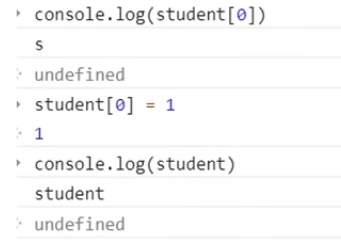

**狂神说Java** 
# 简单聊一聊
## 前端三要素
* HTML(结构): 决定网页结构和内容
* CSS(表现): 设定网页的表现形式
* JavaScript(行为): 是一种弱类型脚本语言，其源代码不需经过编译，而是由浏览器解释运行，用于控制网页的行为
## CSS预处理
* 用一种专门的编程语言，进行web页面样式设计，再通过编译器转化为正常的CSS文件，以供项目使用。
### 常用的CSS预处理器
* SASS
  * 基于Ruby 通过服务端处理，解析效率高
* LESS
  * 基于NodeJS 通过客户端处理 使用简单
  * 百度官方文档
## 行为层
* Native原生JS开发
  * 按照ECMAScript标准的开发方式，简称ES
  * ES5 全浏览器支持
* TypeScript 微软的标准
## JavaScript框架
* jQuery
* Angular 模块化开发
* React 虚拟DOM
* Vue 模块化开发+虚拟DOM
* Axios 前端通信框架
## UI框架
* Ant-Design 阿里巴巴出品 基于React
* ElementUI、iview、ice 饿了么出品 基于Vue
* Bootstrap Twitter出品 成熟
* AmazeUI H5
## JavaScript构建工具
* Bable: JS编译工具
* WebPack: 模块打包器
## JS历史
* 1995.5 Brendan Eich对Java莫得兴趣 为了应付公司的任务，十天开发了JS 多年以后 ……他还是看不起Java
* 但是JavaScript这个名字还是蹭了Java热度 它们就像老婆和老婆饼
==一个合格的后端开发，必须精通JavaScript==

# 快速入门
## 引入JavaScript
* 内部标签
  * HTML内 ``标签里面写
  * 这个script标签可以放在head里也可以放body里
  * `alert('Hello, world~');`
* 外部引入
  * ``
    * 注意嗷 就写双标签 别单着 容易出事儿
    * 老的开发软件可能要写上`type="text/javascript"` 一般默认 
## 基本语法入门
* 变量类型 变量名 = 变量值;
  * 变量类型 只有一个`var`
    * `var name = "colorful";`
    * `var num = 1;`
* `if(){}else if(){}else{}`
* 严格区分大小写
### 调试
  * 网页 检查 console
  * `alert()`打印
  * `console.log()`打印
    * 相当于Java里的`System.out.println();`
  * 检查 源代码 点击设置断点 刷新 卡住 一步步走 哪里走不好哪里看看
## 数据类型
* `number` 数字 不区分小数整数
  * 整数 浮点数 科学计数法 负数 NAN(不是一个数字not a number) infinity(无穷的)
* 字符串
   * `'asas'` `"jioaj"`
* 布尔值
  * `true` `false`
* 逻辑运算
  * `&&` `||` `!` 与或非
* 比较运算符
  * `=` 赋值
  * `==` 等于 (类型不一样值一样也true)
  * `===` 绝对等于 (类型 值都一样才true)
    * 切记 用`===`作比较
    * `NaN` 和谁也不等(===) 包括自己
    * `isNaN(NaN)` true
  * 浮点数问题
    * `console.log((1/3) === (1-2/3))` false
    * 尽量避免浮点数运算 会有精度损失
* `null`和`undefined`
  * 空和未定义
* 数组
  * Java中 一系列相同类型的对象
  * JavaScript中 可以不一样
  * `var arr = [1, 2, 3, 'asad', null, true]`
    * 取数组下标，越界 出现undefined
* 对象
  * 大括号
  * 每个属性之间`,`隔开 最后一个不需要隔开
* 变量
  * 不可以数字开头
## 严格检查
* 在script里**第一行**加入`'use strict';`
  * 预防JavaScript随意性导致一些问题
  * 局部变量建议都使用`let`定义
  * 必须写在第一行
* 前提: 代码编译器设置支持ES6语法
# 数据类型
## 字符串
* 正常字符串我们使用单引号或者双引号包裹
* 转义字符`\`
  * `\'`
  * `\n`
  * `\t`
  * `\u####` u + 四个字母数字 = Unicode字符
    * `\u4e2d` 表示"中"
  * `\x##` ASCII字符
* 多行字符串编写
  * `var msg = 内容用tab上面那个就是md里面圈代码的那个键包起来，你换行它就跟着换`
* 模板字符串
  * `let name = 'wc';` 
  * `let msg = tab↑你好，${name}tab↑`
* 字符串长度
  * str.length
* 字符串的可变性 不可变
  * 
* 大小写转换
  * `student.toUpperCase()`
  * `student.toLowerCase()`
  * 注意这里是方法不是属性
* `student.indexOf('t')` 
  * 字母第几个 从0开始 
* `student.substring(1, 3)`
  * 截取位序1、2这俩字母 
  * [)
  * 只有一个值则表示后面全部
## 数组
* Array可以包含任意的数据类型
* 长度
  * 假如给arr.length赋值，数组大小会发生变化
  * 赋值过小则会导致元素丢失
* indexOf
  * 通过元素获得下标索引
  * 字符串"1"和数字1不一样
* slice()
  * 截取Array的一部分 返回一个新的数组
  * 类似于字符串的substring
* push() pop()
  * `push()` 压入尾部
  * `pop()` 弹出尾部的一个元素
* unshift() shift()
  * `unshift()` 加入头部
    * `unshift('a', 'b')`
  * `shift()` 弹出一个头部元素
* 排序 
  * `sort()`
* 元素反转
  * `reverse()`
* 拼接
  * `concat()`
  * 注意 并未修改数组
* 连接符
  * `join()`
  * 打印拼接数组 使用特定的字符串连接
* 多维数组
  * `arr = [[1, 2], [3, 4], [5, 6]]`
  * 下标起点 00
## 对象
* JavaScript中所有键都是字符串，值是任意对象
* 代码
  * `var 对象名 = { 属性名: 属性值, 属性名: 属性值 }`
* 对象赋值
  * `对象名.属性名 = "value"`
* 使用一个不存在的对象属性不会报错
* 动态地删除属性
  * `delete 对象名.属性名`
* 动态添加属性
  * `对象名.要加的属性的名字 = "value"`
* 判断属性值是否在对象中
  * `'age' in person`
  * `true`
  * `'toString' in person`
  * `true` 继承
* 判断一个属性是否是这个对象自身拥有的
  * `psrson.hasOwnProperty('toString')`
  * `false`
## 流程控制
* if判断
  * `if(){}else if(){}else{}`
* while循环
  * `while(){}`
    * 避免死循环
  * `do{}while()`
* for循环
  * `for (let i = 0; i < 100; i++){console.log(i)}`
* forEach循环
  * `var age = [12,3,45,6,88,9]`
  * `age.forEach(function(value){console.log(value)})`
* for...in
  * `var age = [12,3,45,6,88,9]`
  * `for(var num in age){if(age.hasOwnProperty(num)){console.log(age[num])}}`
    * `for(var index in object){}`
## map 和 set
* ES6的新特性
* Map
  * `var map = new Map([['tom',100],['jack',90]]);`
  * `var name = map.get('tom');` 通过key获取value
  * `map.set('admin',123);` 新增或修改
  * `map.delete("tom");` 删除
* Set 无序不重复的集合
  * `set.add(2);` 添加
  * `set.delete(1);` 删除
  * `console.log(set.has(3));` 是否包含某个元素
## iterator
* 遍历数组
  * `for (var x in arr){console.log(x)}`
* 遍历map
  * `for (let x of map){console.log(x)}`
* 遍历set
  * `var set = new Set([5,6,7]);`
  * `for (let x of set){console.log(x)}`
# 函数及面向对象
<!-- 2022.7.21 暂时搁置，看一下千峰的 -->