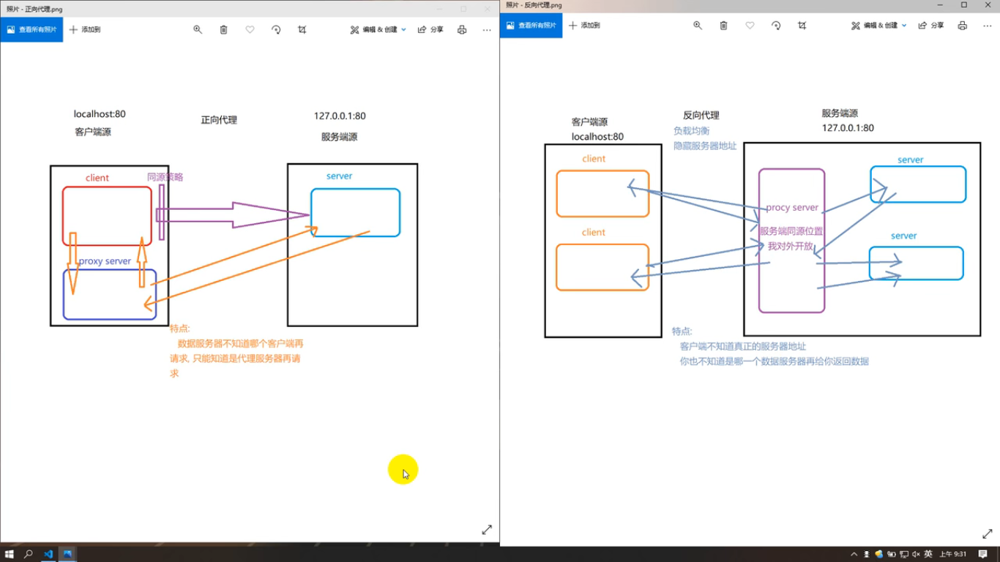

# 前后端交互
* 为什么学PHP?
  * 面试要求 了解非JS语言
  * 自己写demo
  * 了解后端开发状态(工作配合 防止甩锅)
  * 简单学一下基础
* 安装环境
  * 浏览器不运行PHP文件
  * PHP解析需要一个Apache环境
  * 涉及到后端 数据库(MySQL)
  * WAMP MAMP 集成环境
    * window/macOS Apache MySQL PHP
  * 安装集成环境
    * 如果当初全都配置在系统服务里 你再安装集成环境会冲突，不需要卸载 直接停掉服务就可
  * 安装
  * 运行
## 服务和服务器
* 服务: 能提供给你一些 东西
* 服务器: 支持服务的机器
* HTTP默认端口号40，HTTPS默认端口号443
  * 取值范围 0 ~ 65535
# PHP开发
  * 所有的PHP文件都要放在phpstudy对外开放的文件夹里
  * 通过访问服务器的形式打开 不能直接本地打开
  * 不要命名中文
    * Apache服务器 html支持中文 php不支持
    * Nginx服务器 都不
## 了解phpstudy
* 启动以后 Apache和MySQL一起启动的
* 端口号 默认80可修改
* 开放目录 默认是安装目录下的WWW文件
* 默认首页
  * 当你的开放目录下 有任何一个文件夹里面有 index.html index.php index.htm 
  * 会自动打开 看不到目录
* 默认不允许查看目录结构
* 服务器启动以后
  * 访问其他同学的电脑 使用IP地址 
  * 访问本地服务器 使用localhost域名或者127.0.0.1 IP
  * 就是在访问你自己电脑下Apache软件的开放磁盘空间
* 数据库可视化工具
  * MySQL管理器
## PHP语法 
* 后缀`.php`
* 必须写在PHP标签对内部`<?php 巴拉巴拉 ?>`
  * 外面的浏览器运行时当做html解析
* 每句话都要有分号`;`
* 要运行PHP文件 必须启动Apache 在服务器环境下访问文件
  * 直接本地打开 浏览器不认识 
### 基本语法
* 定义变量
  * `$名字 = 值;` 
    * 不需要关键字
    * $是变量名的一部分 使用的时候记得带着
* 输出语法
    * 输出并不明确输出给谁 只是单纯输出
    * 关键看谁要
      * 浏览器访问php文件就给浏览器 JS访问就给js
  * `echo 你要输出的内容;`
    * 只能输出基本数据类型 输出复杂数据类型会报错
    * 输出true会转换成1 输出false会转换成空 
  * `print_r(你要输出的内容);`
    * 所有数据类型都可输出
    * 输出true会转换成1 输出false会转换成空 
  * `var_dump(你要输出的内容);`
    * 可以输出所有数据类型 每个数据类型在输出的时候都会有详细信息输出
  * 三种语法区别:
* 解决中文乱码
  * why?
    * php的输出只是单纯输出了内容
    * 没说用啥字符集解析
  * how?
    * 输出之前说一声呗
    * 用header()告诉浏览器
    * `header('content-type: text/html;charset=utf-8;');`
* 字符串
  * 单引号: 普通字符串
  * 双引号: 特殊字符串(可以直接解析变量)
  * 字符串拼接 
    * PHP里面加号就只是加法运算
    * 拼接字符串用 点 `.`
* 流程控制语句
  * `if () {}`
  * `switch () {}`
  * `for () {}`
    * `for ($i = 0; $i < 10; $i++) { echo $i . '--- </br>'; }`
    * for循环后面不要分号
  * `while () {}` 
  * `do {} while ()`
* 数组
  * 索引型数组
    * `$arr = array('数据1', '数据2', '数据3', ···);`
    * `$arr = ['数据1', '数据2', '数据3', ···];`
    * 按照索引排列
    * 等价于JS的[ 数据1, 数据2, 数据3, ··· ]
  * 关联型数组
    * `$arr = array(key => value, key2 => value2, ···)`
    * 按照键值对排列
    * 等价于JS的{ key: value, key2: value2, ··· }
  * 访问数组成员
    * `数组名[索引]`
    * `数组名[key]`
### PHP操作MySQL数据库
* 了解MySQL
  * 关系型数据库
  * 存储数据的"仓库"(磁盘: D, E)
  * MySQL仓库有很多的 database(库) 理解为文件夹
    * 一个网站的内容放在一个 库 里
  * 每个库由多个 表 组成，理解为一个文件
    * 一类数据存储在一个表上
  * 每个表由 表头 和 表体 组成
    * 我们叫做 字段 和 数据
* php操作数据库的基础语法
  * 1. 和数据库建立连接
    * 保证你的MySQL是启动的
    * 语法: `$link = mysqli_connect('IP', '数据库用户名', '数据库密码', '你要操作哪一个库');`
      * 例: `$link = mysqli_connect('localhost', 'root', 'root', 'gp20');`
    * IP: 你要访问的数据库所在电脑的IP地址 本级是localhost 或者 127.0.0.1
    * 用户名: phpstudy 默认是 root
    * 密码: phpstudy 默认是 root
    * database: 选择一个你要操作的库
    * 返回值: 一个连接信息
  * 2. 执行sql语句操作数据库
    * sql语句是操作MySQL数据库的唯一方法
    * 不管你执行的是增删改查哪个 都是使用的一个方法 只是不同的sql语句
    * 简单来个 
    * 'SELECT * FROM `表名`' (注意反引号)
    * 查询数据库这个表里面所有数据
    * 语法: `$res = mysqli_query(数据库连接信息, '要执行的sql语句')`
    * 返回值: sql 语句的执行结果
  * 3. 解析查询结果
    * 只有查询要解析 增删改不用 它们几个都是true或false没啥好解析的
    * 语法: `$data = mysqli_fetch_all(要解析的数据, 解析的数据格式)`
      * 要解析的数据: mysqli_query的返回值
      * 解析的数据格式: MYSQLI_ASSOC 解析成关联型数组
### php的JSON格式
* PHP -> json
  * `json_encode(PHP数据格式)`
* json -> php
  * `json_decode(JSON格式字符串)`
# sql语句
* 操作MySQL的唯一方法
## 规范
* 关键字建议大写 
* 字段名和表名建议用 反引号 包裹
* 当你使用一个值的时候 
  * 字符串类型需要用 引号 单独包裹
## 查询
* 查询所有
  * SELECT * FROM `表`
  * 查询这个表里的所有数据 每个数据的每个字段都要
* 查询所有 但是只要几个字段
  * SELECT 字段1, 字段2, ··· FROM `表`
* WHERE 关键字
  * 按照条件查询
  * SELECT * FROM `student` WHIERE `age`>28;
* AND 关键字
  * 并列条件查询
  * SELECT * FROM `student` WHIERE 条件1 AND 条件2;
* OR 关键字
  * 或者
  * SELECT * FROM `student` WHIERE 条件1 OR 条件2;
* LIMIT 关键字
  * 分页查询
  * SELECT * FROM `student` LIMIT 开始索引, 多少个;
* ORDER BY
  * 排序
  * SELECT * FROM `student` ORDER BY `字段` DESC;
  * SELECT * FROM `student` ORDER BY `字段` ASC;
* LIKE % 
  * 模糊查询
  * SELECT * FROM `student` WHERE `name` LIKE '三%';
    * 三开头
  * SELECT * FROM `student` WHERE `name` LIKE '%三';
    * 三结尾
  * SELECT * FROM `student` WHERE `name` LIKE '%三%';
    * 有三就行
* LIKE _
  * 模糊查询
  * 一个 _ 只表示一位
  * SELECT * FROM `student` WHERE `name` LIKE '_三_';
    * 必须是 x三x
* 聚合函数
    * 在查询的时候直接帮我们计算一些内容
  * count() 统计数字
    * SELECT count(*) 别名 FROM `student`; 
  * avg() 平均值
    * SELECT avg(哪一个字段) 别名 FROM `student`;
  * max()
    * SELECT max(字段) 别名 FROM `student`;
  * min()
    * SELECT min(字段) 别名 FROM `student`;
## 增删改
### 插入
* 按照字段全部插入
  * INSERT INTO `student` VALUES(1025, '郭翔', 18, '男', 'GP20', 100);
  * 在插入的时候 主键可以不写 写个null 它自增
* 选取字段插入
  * INSERT INTO `student` (`字段1`, `字段2`, ···) VALUES(数据1, 数据2, ···);
    * 其他字段需要允许为空
  * 例: INSERT INTO `student` (`name`, `score`) VALUES('郭翔', 100);
### 删除
* DELETE `student` FROM WHERE 条件
  * 条件也可以 AND OR 什么什么的
### 修改
* UPDATE `student` SET 要修改的字段=要修改的值 WHERE 条件
* 例: UPDATE `student` SET `gender`="男" WHERE `id`=1024;
## 登录页
* form标签有个自动提交功能 
  * action: 提交到哪个地址(哪个PHP文件)
  * button 标签对 等价于submit按钮
* input 
  * form 表单的自动提交 
  * 只会提交有 name 属性的表单
  * name的值作为key 表单的value作为value
* PHP有个自带的关联型数组 叫做 $_GET
  * 所有从地址栏带过来的参数信息 都自动存储在里面
* 关于 true 只是表示sql语句没语病 注意 不要混淆成符合要求
  * 你得自己判断 比如查询结果的length
    * length: count(数组), 返回值是这个数组的length
  * 再比如 修改sql语句
    * 只要能查到数据 就表示成功，解析结果 直接能得到一个关联型数组 里面只有一个数据
# HTTP 传输协议
* 必须经历四个步骤
  * 建立连接
  * 发送请求(前端给后端)
  * 返回相应(后端给前端)
  * 断开连接
* 只能由前端发起
* 一次只能说一个事情
* 前后端交互只能交互字符串
## 1. 建立连接
* 基于 TCP / IP 协议的三次握手
* 浏览器和服务器做的
* 目的: 为了保证通道的连接
* 1. 前端和后端说 在?
* 2. 后端和前端说 在。
  * 后端知道 前端正常发送
  * 后端知道 后端正常接收
* 3. 前端和后端说 行。
  * 前端知道 后端正常接收
  * 前端知道 前端正常发送
  * 前端知道 前端正常接收
  * 前端知道 后端正常发送
* 4. 后端和前端说 嗯。
  * 后端知道 前端正常接收
  * 后端知道 后端正常发送
## 2. 发送请求
* 前端发送给后端 必须以请求报文的形式发送
  * 一个特殊格式的字符串文件(由浏览器进行组装)
* 请求报文
  * 请求行
    * GET / POST: 请求方式: ()
    * ./login.php: 请求地址
    * HTTP/1.1: 传输协议版本
  * 请求头
    * 对本次请求的描述信息
    * Host: 请求主机
    * Accept: 期望的数据类型
    * UserAgent: 请求终端
    * Content-type: 请求体的数据格式
    * ···
    * Cookie:   ()
  * 请求空行
    * 分隔请求体和请求头
  * 请求体 
    * 前端携带给后端的参数
    * 有的有 有的没有
## 3. 接收响应
* 每个响应是由服务器端接收到前端的请求以后 给出的结果
  * 必须以响应报文的形式发送给前端
* 响应报文
  * 状态行
    * 200: 响应状态码: ()
    * ok: 对响应状态码的简单描述
    * HTTP/1.1 传输协议版本
  * 响应头
    * 对本次响应的描述信息
    * Date: 服务器时间(世界标准时间)
    * Server: 服务器信息
    * Content-type: 响应体的数据格式
    * ···
  * 响应体
    * 后端给前端的数据
## 4. 断开连接
* 基于 TCP / IP 协议的四次挥手
* 为了保证断开连接
  * 前端给后端 响应体收到，我准备断开连接了
  * 后端给前端 行，知道你收到响应体了。 我已经准备断开链接了，再次收到就断。
  * 前端收到后端第一句 不干啥
  * 前端收到后端第二句 好，我断开了，勿回。
## 响应状态码
* 以一个数字表示本次请求的响应状态
  * 成功: 创建成功、删除成功···
  * 失败: 客户端失败、服务端失败···   
* 100 - 599 
  * 100 ~ 199 连接继续
  * 200 ~ 299 成功
  * 300 ~ 399 重定向
  * 400 ~ 499 客户端错误
  * 500 ~ 599 服务端错误
## 请求方式
* 前后端的交互手段
  * 最早: 部分 get/post
  * 后来做了区分 为了语义化 但是本质一样
* 常见的请求方式
  * HTTP/1.0
  * 1. GET
    * 偏向于获取 
    * 大部分是给后端一些参数用来获取一系列数据
  * 2. POST 
    * 偏向于给服务器一些数据
    * 大部分是登陆 给服务器一些信息 你给我简单的结果
  * 3. PUT
    * 偏向于给服务器一些信息 但是是添加使用
    * 大部分做注册 给服务器一些信息 你把这个信息存储起来
  * 4. HEAD
    * 用来获取服务器头信息
  * HTTP/1.1
  * 5. DELETE
    * 偏向于删除
    * 删除评论 删除微博
  * 6. CONNECT
    * 管道连接改变代理连接使用
  * 7. PATCH
    * 偏向于给服务器一些信息 偏向于修改一些信息
    * 大部分用于完善用户资料
  * 8. OPTIONS
    * 用于获取服务器性能 需要服务器同意
### **GET 和 POST 请求方式的区别(重点)**
* get
  * 语义是 获取
  * GET 携带参数的方式是 queryString 在地址栏后面直接拼接 不在请求体里面
  * GET 理论上携带数据无限 但是浏览器地址栏有限 IE 2KB
  * GET 会被浏览器主动缓存
  * GET 明文发送
  * GET 只能发送url编码的数据(ASCII码) 如果是中文会自动转码
* post
  * 语义是 给
  * POST 携带参数方式是 requestBody 在地址栏没有 在请求体里面
  * POST 理论上携带数据无限 但是会被服务器限制
  * post 不会被浏览器主动缓存 除非手动设置
  * POST 暗文发送
  * POST 理论上可以发送任意格式的数据 但是要和请求头里面的 content-type 配套
## Cookie
* 浏览器端的本地存储空间
  * 用了存储一些数据
* 特点: **记下来**
  * 按照域名存储
    * 俩域名一个网站 不行 各存各的
  * 按照文件路径存储
    * 子级可以访问父级 父级不能访问子级
  * 按字符串的形式存储
    * `'key=value; key2=value2; key3=value3'`
  * 存储大小
    * 4KB 左右
    * 50条 左右
  * 时效性
    * 默认 会话级别的时效(关闭浏览器就没有了)
    * 可以手动设置
  * 操作权限
    * 前后端都可
  * 请求自动携带
    * 只要cookie里面有数据
    * 那么你在发送任何一个请求的时候 自动携带
### 前端操作 cookie
* 前提: 页面必须在服务器上打开
  * 读: `document.cookie`
    * 会把cookie空间里面的所有数据全部拿出来 字符串的形式
  * 写: `document.cookie = 'key=value'`
* **设置cookie**
  * 一次只能设置一条
  * 在设置时 每一条的分号后面可以书写对本cookie的描述
    * expires 过期时间
      * 默认会话级别时效性
      * 修改 `expires=时间对象`
    * path 存储路径
      * 不设置就按照目前路径
  * 在设置时 不管你存储什么数据类型
    * 都会自动转化成字符串格式存储
    * cookie一般就存储一些简单数据
  * 设置时 设置同名的cookie就是修改
    * 注意 要是相同路径下同名的
  * 设置时 如果设置一个cookie的过期时间是当前时间以前
    * 就是**删除**这条cookie
* 设置一个有时效性的cookie
  * expires要接收一个时间对象 或者时间对象的字符串
  * 获取的是终端时间 不是世界标准时间，设置cookie时 不管设置啥 都当做世界标准时间。
  * 那我要设置一个30s过期的cookie
    * 当前时间 向前八小时 再向后30s
  ```JavaScript
  var time = new Date()
  var t1 = time.getTime()
  var t2 = ti - 1000 * 60 * 60 * 8
  var t3 = t2 + 1000 * 30
  time.setTime(t3)
  document.cookie = 'a=100;expires=' + time
  ```
  * 封装个方法setCookie
### 前端获取cookie
* 见utils.js
### 后端操作cookie
* 凡是前后端都能的 后端一定省事儿
* 获取
  * PHP天生自带一个关联型数组 $_COOKIE
  * 里面包含所有cookie信息
  * 你想获取哪一个 直接从关联型数组里面获取
* 设置
  * 方法 setcookie()
  * `setcookie(key, value, expires, path)`
  * 后端获取时间`time()` 单位:秒
    * 服务端咱拿时间全是世界标准时间
# session
* 一个存在于服务器端的存储空间
  * 当它打开的一瞬间 就会生成一个 密码
  * 这个密码的一半自动存储到cookie里面 
  * 等到返回前端的时候 会自动把这个带回去
* 开启session空间
  * `session_start();`
  * 只要你想向session空间里面存储东西或者获取内容
    * 就得先开启空间
* 存储
  * PHP内置关联型数组 `$_SESSION`
# Ajax
* async JavaScript and XML
* 前后端交互的一种手段
  * 通过JS向服务端发起请求
    * 所有服务端返回的响应都不会直接显示在页面上
    * 而是返回给JS这个语言
  * 说明: JS 和 服务端交互
    * 依赖于浏览器来发送请求
## 使用方式
* 找到一个对象能帮我发送Ajax请求
  * XMLHttpRequest() 内置构造函数
  * 专门创建实例化对象帮你发送Ajax请求
* 对本次请求进行配置
  * open()
  * `XMLHttpRequest的实例化对象.open(请求方式, 请求地址, 是否异步)`
    * 请求方式: GET POST PUT 大小写无所谓
    * 请求地址: 你要请求哪一个后端位置
    * 是否异步: 选填 默认true false表示同步
* 把请求发送出去
  * send()
  * `xxx.send()`
* 接收响应
    * onload事件
    * `xxx.onload = function () {}`
    * 本次请求结束以后触发(响应成功了触发)
      * xxx里面有个属性叫responseText 就是响应体
* 例子
  ```JavaScript
  const xhr = new XMLHttpRequest()
  xhr.open('GET', './server/get.php')
  xhr.send()
  xhr.onload = function () {
    console.log(JSON.parse(xhr.responseText))
  }
  ```
## 同步异步
* Ajax的异步问题
  * 创建Ajax对象 同步
  * 配置请求信息 同步
  * 发送请求 异步 
    * 当代码执行到这句话的时候 先把请求发出去再等待响应的过程是异步
  * 事件 会在满足条件的时候触发 
    * 条件 响应回来
* 异步执行的时候
  * console.log('start')
  * 1 创建Ajax对象
  * 2 配置请求信息
  * 3-1 把请求发出去
  * 4 绑定事件 请求完成的事件
  * console.log('end')
  * 3-2 响应回到客户端 触发事件
  * console.log(响应体)
* 同步执行的时候
  * console.log('start')
  * 1 创建Ajax对象
  * 2 配置请求信息
  * 3-1 把请求发出去 
    * 等到响应回来再执行代码
  * 3-2 响应回到客户端 不会触发事件 没绑定呢
  * 4 绑定事件 但是已经不会触发了
  * console.log('end')
  * 如果想接收到响应 需要在send之前绑定事件
* 结论
  * 同步 事件要在send之前
  * 异步 随便
  * 书写Ajax的时候 都要按照 1 2 4 3 的步骤写
  ```JavaScript
  const xhr = new XMLHttpRequest()
  xhr.open('GET', './server/get.php')
  xhr.onload = function () {
    console.log(JSON.parse(xhr.responseText))
  }
  xhr.send()
  ```
## Ajax的兼容
* 不主动向下兼容
* 两部分
  * 创建
  * 接收响应
* 创建
  * `new XMLHttpRequest()` 标准浏览器
  * `new ActiveXObject('Msxml.XMLHTTP)` IE 7 8 9 
  * `new ActiveXObject('Msxml2.XMLHTTP)` IE 6
  * `new ActiveXObject('Microsoft.XMLHTTP)` IE 5.5+
  * 再向下的IE不支持Ajax
  * 你用的IE11浏览器跑不起来
    * Ajax是基于内核的兼容
* Ajax 状态码
  * 响应状态码 描述本次请求的状态
  * Ajax状态码 描述Ajax进行到哪一个步骤了
  * `xhr.readyState`
  * 0 创建Ajax对象成功
  * 1 配置请求信息完成
  * 2 请求发送出去了 响应报文回到了浏览器
  * 3 浏览器正在解析响应报文
  * 4 浏览器解析响应报文成功 已经可以正常使用 xhr.responseText
* ajax的状态码改变事件
  * `xhr.onreadystatechange = function () {}`
* 响应状态码
  * `xhr.status`
  * 100 - 599
* 接收响应的兼容
  * 在IE低版本没有onload事件
  * 只能用onreadystatechange事件接收响应
    * 在事件里面判断
    * xhr.status 在200-299之间
    * xhr.readyState===4的时候
    * 正常使用响应体
## **发送带有参数的请求**
* GET
  * get请求就直接在地址栏后面拼接queryString方式携带参数
  * open的第二个参数就是请求地址
  * `xhr.open('GET', './server/get.php?a=100&b=200')`
  * `xhr.send()`
* POST
  * post携带参数是在请求体 不需要在地址栏拼接
  * 数据格式无所谓 不过得跟 content-type 配套
    * application/x-www-form-urlencoded
  * send()的括号里面就是请求体
  * `xhr.open('POST', './server/post.php')`
  * `xhr.setRequestHeader('content-type', 'application/x-www-form-urlencoded')`
  * `xhr.send('a=100&b=200')`
## Ajax的登录
* 前后端分离式的开发模式
  * 前端负责和用户沟通(拿到你输入的用户名密码)
  * 前端负责把用户名密码发送给后端
  * 
  * 后端负责接收前端的信息
  * 后端负责去数据库操作
  * 后端把结果返回给前端(不做任何客户端的操作)
  * 
  * 前端接收到后端给的结果以后反馈给用户
* 前后端不分离
  * 大部分的前端操作 由后端控制
* 前端业务逻辑
  * 获取元素
    * `input[name] { style }` 只要input有name属性就可以
    * `input[name=username] {style}` input有name属性且值是username
    * `[name=password]`任何标签只要有name属性且值是password
  * 绑定事件
    * submit事件
    * button的点击事件
    * **阻止表单的自动提交**
      * `e.preventDefault()`
  * 获取用户输入内容
  * 表单验证
    * 非空验证
    * 格式验证
  * 提交到后端
  * 根据响应做回应
* 后端业务逻辑
  * 接收数据并判断
    * `exit;` 打断代码
  * 去数据库比对
  * 判断
# 前后端交互的报错
* json 解析出错
* 分析原因
  * 报错 JSON.parse(xxx) 出错
  * xxx 后端给的响应体
  * 肯定是因为后端给的不是JSON格式的数据
  * 检查后端给的到底是啥?
    * 1 把JSON.parse()去掉 直接看xhr.responseText
    * 2 打开浏览器 network 找到你的这个请求 点击response
  * 报错信息同样是PHP的输出
# 封装Ajax
* 设计模式
  * 为了解决特定问题而给出的简介优化方案
* 懒惰模式 
  * 解决了多种方案选择一种的问题
  * 例: 创建Ajax 四种方案
    * 判断 创建一次以后 后来就不判断了 按第一次判断的来
* 封装创建xhr对象
* 封装Ajax
## 来吧
* 创建
  * 不需要参数 
  * 返回值就是一个可以在本浏览器使用的xhr对象
  * 每个情况一个函数
    * 这个函数行 那大函数重新赋值
  * 把四个函数放在一个数组里
    * 循环遍历 循环try
  * 准备个开关 
    * 都不行的情况
* 封装
  * 哪些作为参数?
    * 请求方式
      * type: 默认值GET
    * 请求地址
      * url: 必填
    * 是否异步
      * async: 默认值true
    * 是否执行JSON.parse()
      * dataType: 默认string 不解析
    * 传递给后端的数据
      * data: 'a=100&b=200' || { a: 100, b: 200 }
  * 怎么传递参数
    * 对象 便于使用默认值
  * 开始封装
    * 参数验证
      * url 
        * 必填
      * type: 
        * 不传递、get、post 大小写无所谓
        * 其他不行
      * async验证
        * 不传递 或者 布尔
      * dataType
        * 不传递 string JSON
      * data
        * 不传递 字符串 object
      * success和error 
        * 不传递 函数
    * 默认值来一套
      * data 对象的话要还原成字符串
    * 发送请求
      * 请求地址
        * get ?
        * post 直接
      * send()
        * 是不是post post要设置头
    * 回调函数
      * 目前发送Ajax只能把结果打印在控制台
      * 我们把请求结束后要做的事包装成一个盒子 传递给Ajax里面
      * 让他在请求成功的时候 把这个盒子执行掉
# 跨域请求
* 同源策略
  * **是浏览器给的一个行为**
  * 当你在发送一个请求的时候 会涉及到两个地址
    * 打开当前页面的地址
    * 你要请求的地址
    * 地址
      * 打开页面 localhost/index.html
        * 在里面发送一个请求 ajax({ url: './a.php' })
        * 请求地址 localhost/a.php
      * 完整地址
        * http://localhost:80/index.html
        * http://localhost:80/a.php
  * 两个地址中只要 端口号、域名、传输协议 有任意一个不一样
    * 就是非同源请求 就会触发浏览器的同源策略
    * 不允许你获取这个服务器上的数据
  * 触发了同源策略的请求就是跨域请求
    * 就是请求别人家的数据
    * why?
      * 真实开发环境
      * 页面(html css js 静态资源) 一个服务器
      * 数据数据库一个服务器
      * 我自己不具备条件 (美团用地图) 新闻
  * 解决
    * 基于HTTP协议
    * jsonp
    * cors
    * 代理
## jsonp跨域
* 绕开同源策略的影响
* script
  * 自带type属性 默认 type="text/javascript"
    * 所以把里面的代码当做JS执行
  * src属性
    * 引入外部资源
    * 不受同源策略的影响
  * 他俩结合 引入任何内容都当做JS代码解析
* jsonp
  * 利用script的src属性
  * 去向非同源的服务器请求数据
  * 只要这个服务器返回个字符串 我就当JS解析
* jsonp请求数据
  * 要求服务器返回一个 函数名() 这样的字符串
  * 要求提前准备好一个函数
  * 要求前端告诉后端你函数名叫啥
    * 在发送请求的时候 以参数的形式告诉后端
* 面试题
  * jsonp原理
    * src不受同源策略影响
    * script会把请求的内容当做JS代码执行
  * jsonp返回值
    * 函数名() 这样的字符串
    * 或者说 一段可执行的JS代码字符串
  * jsonp的优缺点
    * 优点
      * 方便 以script外部资源的形式请求
      * 实现了跨域请求
    * 缺点
      * 不好做安全防护
## 代理
* 正向代理
  * 特点 
    * 数据服务器不知道哪个客户端在请求 只能知道是代理服务器在请求
* 反向代理
  * 特点
    * 客户端不知道真正请求的服务器地址 你也不知道哪个数据服务器在返回数据
  * 负载均衡
  * 隐藏服务器地址
  * 
* 利用正向代理实现跨域
  * 任何一台服务器都可以做代理
    * Apache代理HTTP免费 代理HTTPS需要整数
    * Nginx都免费
      * 不能中文
  * nginx.conf 文件
    * 找到当前服务器的server标签对 在闭合标签的上一行书写配置
    * `location /xx { proxy_pass 地址; }`
    * /xx 代理标识符 请求这玩意儿的时候 Nginx会自动帮你转发到后面的地址
    * proxy_pass 代理目标地址
    * 修改了就得重启服务器 
* 使用别人的数据
  * 当你查看数据的时候 发现response是一个JSON格式的数据 使用代理方式
  * 当你发现response是一个字符串 '函数名()' 的时候 使用jsonp
* `<meta name="referrer" content="no-referrer">`
* 函数防抖
```JavaScript
  var timer = null
  window.onscroll = function () {
    clearTimeout(timer)
    timer = setTimeout(() => {
      console.log('触发')
    }, 300)
  }
```
* 函数节流
  * 固定时间内 触发同一事件
  * 固定时间内 只有第一次执行 后面每次都不执行了
  * 直到设置的固定时间到达
```JavaScript
  var flag = true
  window.onscroll = function () {
    if (flag === false) return
    flag = false
    console.log('执行')
    setTimeout(() => {
      flag = true
    }, 300)
  }
```
## cors
* 跨域资源共享
  * 不是请求发不出去
  * 实际上是请求已发送 而且到了服务器了 响应也回到浏览器了
  * 但是浏览器判断非同源 不许你使用 
  * 由服务器告诉浏览器一个事情 这个域名我允许请求我的内容
* 这是个和前端毫无关系的方式
  * 找到代码写上就行给服务端
# 回调函数
* callback  
  * 把A函数当做参数传递到B函数内部
  * 在B函数内部以形参的方式调用A函数
* 缺点
  * 回调地狱
  * 代码妹有可读性可维护性
* 那为啥回调?
  * 异步
  * 我要在异步末尾/中间做些事情
# Promise
* 一个承诺几个状态?
  * 持续 pending
  * 成功 resolved
  * 失败 rejected
* 是ES6的语法
  * 解决回调地狱
  * 是ES6的内置构造函数
  * `new Promise(function () { 你要执行的异步的事情 })`
  * 实例化的时候 接收两个参数
    * resolve reject
    * 语法
      * 实例化对象身上有俩方法
      * then()
        * `promise对象.then(function () {})`
        * then方法的函数传递给了实例化的resolve
      * catch()
        * `promise对象.catch(function () {})`
        * catch方法的函数传递给了实例化的reject 
      * 当你书写`resolve()`的时候 实际上实在调用then里面的函数
      * 当你书写`reject()`的时候 实际上实在调用chach里面的函数
## Promise的进阶语法
* 当你在一个promise对象的then里面返回一个新的promise对象
  * 你可以在这个then的后面继续来一个then接收第一个then里面promise对象的结果
* 改变封装异步代码的思路
  * 按照promise的思想来封装异步代码
  * 分析 为啥可以使用then
    * 得是一个promise对象
  * 封装
    * function pAjax() {}
    * 只要pAjax里面返回的是一个promise对象
    * pAjax({ 配置项 }).then()
* Promise的另一个语法
  * `Promise.all()`
  * 目的是把多个promise对象封装成一个
  * `Promise.all([ promise对象1, promise对象2, promise对象3, ··· ]).then(function () {})`
  * then会接收所有promise完成以后的结果 以一个数组的形式返回
  * 致命缺点: 必须都成功，不然一个结果也得不到
# async / await
* ES7 的语法
  * 回调地狱的终极解决方案
  * 把异步代码写的看起来像同步代码
* async书写在函数的前面 是对这个函数的修饰关键字
  * 必须有async关键字 await才可以在函数内使用
  * await等待的必须是一个promise对象 才会有等待的结果 不然没有意义
  * 当你满足了以上三个条件以后 你的promise对象本该在then里面接收的结果
    * 就可以直接定义变量接收
    * 你的promise里面的异步代码没有结束之前 不会继续向下执行
# generator函数
* 一种长得很像函数的玩意儿
  * 但是不是函数 是函数生成器(迭代器)
* 在定义函数的时候 在 function后面/函数名前面 加个星号 *
  * 函数内部有一个 yield 关键字可以使用
  * 类似于 return
  * 可以给你制造一个结果
  * 让这个generator暂停
  * 当你再次回到这个generator的时候，从上次的yield继续执行代码
* generator的返回值是一个迭代器
  * 包含一个next()方法
  * 每一次next执行 就会执行到下一个yield位置为止
# for ··· of 循环
* 可以遍历数组
  * `for (let value of 数组) {}`
* 遍历迭代器
# Set 数据结构
* ES6 新增
  * 迭代器结构的数据
  * `new Set()`
    * 可以在实例化的时候传个数组 数组里面的每个数据就是set数据类型的每个数据
    * 不接受重复数据
      * 可以去重
      * `const res = [...new Set([1, 2, 9, 4, 9, 22, 11, 1])]`
* 常用方法
  * add()
    * `set数据类型.add(要添加的数据)`
  * delete()
  * has()
    * 返回值 true/false
  * clear()
  * forEach()
    * `set数据类型.forEach(function (item, item, set) {})`
  * for of 循环遍历
  * size属性
    * 长度 set数据结构内有多少数据
# Map 数据结构
* 面试题
  * JS里面 Object类型叫做键值对的集合
    * key只能存储字符串
    * 当你把一个不是字符串的内容当做key的时候 会自动转换成字符串格式
* 因为object类型只能存储字符串作为key
  * ES6出现Map数据结构
  * 是 值=值 的数据结构
  * 它可以使用复杂数据类型来作为key使用
* `new Map()`
  * 实例化的时候接收一个二维数组
    * 里层数组的[0]作为key
    * 里层数组的[1]作为value
* 方法
  * set()
    * `map数据结构.set(key, value)`
  * get()
    * 根据key
    * 复杂数据类型 地址 地址 懂?
  * delete()
    * 根据key
  * clear()
  * forEach()
    * `map数据结构.forEach(function (value, key, map) {})`
    * 遍历map数据结构
  * for of 遍历
    * 遍历出来的是每个内容key和value
    * `for (let [key, value] of m) { console.log(key, '-----', value) }`
  * has()
    * key
    * 返回值 true/false
  * size属性