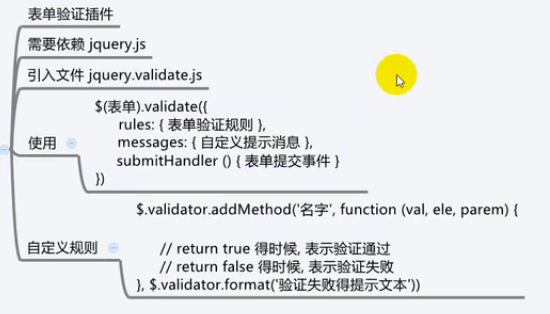

# jQuery
* 前端方法库
  * 插件、库、框架 的区别
  * 插件 实现某一个单一类功能
  * 库 封装了各种功能和你需要的工具
  * 框架 自己的完整的生态系统
* 封装了各种dom操作
* 优点
  * 无所不能的选择器
  * 无处不在的链式编程
  * 无人可及的隐式迭代
* 特点
  * 号称全兼容
  * 2.0 以后不再兼容IE
* 当你**引入**一个 jquery.js 或者 jQuery.min.js 以后
  * 会向全局暴露两个变量名
  * jQuery
  * $
## jQuery的选择器
* 选择器
    * 对元素的获取
  * 基本选择器
  * 特殊选择器
* 筛选器
  * 对已经获取到的元素集合进行二次筛选
## 基本选择器
* 语法 `$(选择器)`
* 返回值 满足条件的所有元素(id选择器除外)
  * 放在一个数组里面返回给你
  * 都是一个集合的形式
  * **我们管这个集合叫做jQuery元素集合**
* 你的css如何捕获标签 这里就可以怎么填写参数
  * `console.log($('div > ul > li:nth-child(odd)'))`
## 特殊选择器
* 语法 `$(选择器)`
  * 对你已经存在的选择器进行修饰
* `:first`
  * `console.log($('div:first'))`
* `:last`
* `:eq(数字)`
  * 按照索引(从零开始)排列的第几个
* `:odd`
  * 按照索引排列的奇数个
* `:even`
  * 按照索引排列的偶数个
## 筛选器
* 对jQuery的**元素集合**进行二次筛选
* 直接进行链式编程就可
* 注意 
  * 只有jQuery的元素集合才能用 **原生dom对象不能使用**
* `first()`
* `last()`
* `eq(索引)`
  * 元素集合里指定索引的那一个
* `next()`
  * 当前元素的下一个元素
* `nextAll()`
  * `元素集合.nextAll()` 获取到当前元素后面所有兄弟元素
  * `元素集合.nextAll(选择器)` 获取到当前元素后面所有兄弟元素中指定选择器的那一个
* `nextUntil()`
  * `元素集合.nextUntil()` 获取到当前元素后面所有兄弟元素
  * `元素集合.nextUntil(选择器)` 获取到当前元素后面所有兄弟元素 直到选择器为止(不包含选择器元素)
* `prev()`
  * 当前元素的上一个元素
* `prevAll()`
  * `元素集合.prevAll()` 获取到当前元素上面所有兄弟元素
  * `元素集合.prevAll(选择器)` 获取到当前元素上面所有兄弟元素中指定选择器的那一个
* `prevUntil()`
  * `元素集合.prevUntil()` 获取到当前元素上面所有兄弟元素
  * `元素集合.prevUntil(选择器)` 获取到当前元素上面所有兄弟元素 直到选择器为止(不包含···)
* `parent()`
  * 当前元素的父元素
* `parents()`
  * `元素集合.parents()` 拿到结构父级的所有父元素
  * `元素集合.parents(选择器)` 拿到结构父级的所有父元素中符合选择器的那一个元素
* `children()`
  * `元素集合.children()` 拿到结构父级的所有子元素
  * `元素集合.children(选择器)` 拿到结构父级的所有子元素中符合选择器的那一个元素
* `sinblings()`
  * 该元素的所有兄弟元素 自己除外
* `find()`
  * 找到该元素所有后代元素中符合选择器条件的元素
* `index()`
  * 该元素在父元素中的索引位置
## jQuery操作文本
* `html()`
  * `元素集合.html()`
    * 获取该元素的超文本内容 以字符串形式返回
    * 获取的时候为了保证html结构 只能获取**第一个**元素的超文本内容
  * `元素集合.html('内容')`
    * 设置元素集合内元素的超文本内容
    * 完全覆盖式的写入
    * 隐式迭代 元素集合内有多少元素 就写入多少元素
* `text()`
  * `元素集合.text()`
    * 获取该元素的文本内容 以字符串形式返回
    * 拿到所有元素的文本内容
  * `元素集合.text('内容')`
    * 设置元素集合内元素的文本内容
    * 完全覆盖式的写入
    * 隐式迭代 元素集合内有多少元素 就写入多少元素
* `val()`
  * `元素集合.val()`
    * 获取元素集合内元素的value值
  * `元素集合.val('内容')`
    * 设置元素集合内元素的value值
    * 完全覆盖式的写入
    * 隐式迭代 元素集合内有多少元素 就写入多少元素
## jQuery操作元素类名
* `addClass()`
  * 添加元素类名
* `removeClass()`
* `hasClass()`
  * 判断有没有
* `toggleClass()`
  * 切换类名
    * 有就删除没有就添加
## jQuery操作元素样式
* `css()`
  * `元素集合.css('width')`
    * **获取**元素的某个样式的值 不管是行内还是非行内都能获取到
  * `元素集合.css('样式名', '样式值')`
    * **设置**元素的行内样式
    * 隐式迭代 全部设置
    * 单位是px可以不写
  * `元素集合.css({ 样式名: 样式值, 样式名2: 样式值2, ··· })`
    * 同上 
## jQuery基础绑定事件
* `on()`
  * `元素集合.on(事件类型, 事件处理函数)`
    * 直接绑定事件
    * 隐式迭代 有多少绑多少
  * DOM元素想使用jQuery方法 用$()包起来
    * `$('ol > li').removeClass('active').eq($(this).index()).addClass('active')`
  * `元素集合.on(事件类型, 选择器, 事件处理函数)`
    * 事件委托的绑定
    * 把选择器元素委托给元素集合里面的元素
    * 注意 选择器元素要是元素集合内元素的后代元素
  * `元素集合.on(事件类型, 复杂数据类型, 事件处理函数)`
    * 给元素集合内所有元素绑定事件
    * 这个复杂数据类型是事件触发的时候 传递给事件里面的参数
    * 在事件对象里面有一个叫做data的成员 就是你传递进来的参数
  * `元素集合.on(事件类型, 选择器, 数据, 事件处理函数)`
  * `元素集合.on({ 事件类型1: 事件处理函数1, 2: 2, ··· })`
    * 但是没法传递参数和事件委托
* `one()`
  * 和on()一模一样
  * 但是它绑的事件只能执行一次
* `off()`
  * 解除事件绑定
  * `元素集合.off(事件类型)`
  * `元素集合.off(事件类型, 事件处理函数)`
* `trigger()`
  * 用JS代码的方式来**触发**事件
  * `元素集合.trigger(事件类型)`
## jQuery的事件函数
* jQuery给我们提供了一些简洁的绑定事件的方式
  * 把一些常用事件封装成了函数
  * click()
  * mouseover()
  * 这些方法可以直接使用 带有隐式迭代
  * 快捷绑定事件
* 语法
  * `元素集合.事件类型(事件处理函数)`
  * `元素集合.事件类型(传入事件处理函数的参数, 事件处理函数)`
* jQuery唯一的特殊事件
  * hover()
  * 结合了移入移出
  * `元素集合.hover(移入的事件处理函数, 移出的事件处理函数)`
    * 如果只传递一个参数 移入移出都触发
## jQuery的节点操作
* 原生JS的节点操作
  * 创建节点 插入节点 删除节点 替换节点 克隆节点
  * jQuery也是这些
* 创建节点
  * `$(html结构字符串)`
    * 当$()里面传递一个
      * 选择器的时候 就是获取元素
      * html结构字符串的时候 就是创建元素节点
      * DOM元素节点的时候 就是转换成jQuery元素结合
* 插入节点
  * 内部插入
    * 父子关系的插入
    * `父元素.append(子元素)`
      * `$('div').append(p)`
      * 把子元素插入到父元素内部 放在末尾的位置
    * `子元素.appendTo(父元素)`
      * `p.appendTo($('div'))`
      * 把子元素插入到父元素内部 放在末尾的位置
    * `父元素.prepend(子元素)`
      * 把子元素插入到父元素内部 放在最前面的位置
    * `子元素.prependTo(父元素)`
      * 把子元素插入到父元素内部 放在最前面的位置
  * 外部插入
    * 兄弟关系的插入
    * `存在元素.after(插入元素)`
      * 把插入元素排在存在元素的后面 以兄弟关系出现
    * `插入元素.insertAfter(存在元素)`
      * 把插入元素排在存在元素的后面 以兄弟关系出现
    * `存在元素.before(插入元素)`
      * 把插入元素排在存在元素的前面 以兄弟关系出现
    * `插入元素.insertbefore(存在元素)`
      * 把插入元素排在存在元素的前面 以兄弟关系出现
* 删除节点
  * `元素集合.remove()`
    * 把自己从自己的父元素里面移出
  * `元素集合.empty()`
    * 把自己变成空标签 即 把所有后代节点全部移除
* 替换节点
  * replaceWith()
    * `把xx节点.replaceWith(替换成xx节点)`
  * replaceAll()
    * `替换节点.replaceAll(被替换节点)`
* 克隆节点
  * clone()
    * `元素集合.clone()`
    * 必然携带所有节点过来
    * 第一个参数 是否克隆元素本身的事件 默认false 
    * 第二个参数 是否克隆元素后代节点的事件 默认跟随第一个
    * 注意 第一个false了第二个true也没有意义
## jQuery操作元素属性
* 几种属性操作
  * 原生属性: id class src ···
  * 自定义属性: getAttribute() ···
  * H5自定义属性: dataset data-xxx ···
* `attr()` `removeAttr()`
  * `元素集合.attr(属性名)`
    * 获取元素的该属性 主要用于获取标签属性 包括一些自定义属性
  * `元素集合.attr(属性名, 属性值)`
    * 设置元素的标签属性 只是把属性设置在标签上 当做一个自定义属性使用
    * 对于原生属性有的有用有的没用
    * 设置的数据类型不管是啥都会转成字符串
  * `元素集合.removeAttr(属性名)`
    * 多用于attr()设置的属性的删除
* `prop()` `removeProp()`
  * `元素集合.prop(属性名)`
    * 获取元素的原生属性 也可以获取元素的自定义属性
    * attr设置的自定义属性获取不到
  * `元素集合.prop(属性名, 属性值)`
    * 主要设置元素的原生属性 也可以设置元素的自定义属性
    * 它设置的自定义属性不会显示在标签上 而是存储在元素身上
    * 设置的时候是啥数据类型 获取的时候还是啥类型
    * attr设置的自定义属性它那边拿不到
  * `元素集合.removeProp(属性名)`
    * 只能删除prop设置的自定义属性
* `data()` `removeData()`
  * `元素集合.data(属性名)`
    * 获取使用data()方法存储的数据 获取元素身上data-xxx的属性
  * `元素集合.data(属性名, 属性值)`
    * 设置的时候 只是把数据存储在元素身上的某一个对象空间内
    * 不会出现在标签上 不会有data-xxx出现
    * 就是说
      * 可以获取元素标签上 data-xxx 的属性
      * 不能设置元素标签上 data-xxx 的属性
  * `元素集合.removeData(属性名)`
    * 只能删除由data()方法设置的属性
    * 不能删除元素身上data-xxx的属性
## jQuery获取元素尺寸
* `元素集合.xxx()`
* `width()` `height()`
  * 内容位置的尺寸
* `innerWidth()` `innerHeight()`
  * 内容 + padding
* `outerWidth()` `outerHeight()`
  * 内容 + padding + border
* `outerWidth(true)` `outerHeight(true)`
  * 内容 + padding + border + margin
* 注意
  * display:none的时候 原生JS获取不到 咱可以
## jQuery操作元素位置
* 操作元素相对于某个点的位置
* `offset()`
  * 是一个读写的方法
  * 读取
    * `元素集合.offset()`
    * 返回值是个对象 包含一个x信息一个y信息
      * 注意 需要值的时候 得用. 也就不能继续链式编程了
    * 是相对于页面左上角的绝对坐标
  * 设置
    * `元素集合.offset({ top: xx, left: xx })`
    * 设置的是相对于页面左上角的绝对位置
      * 想方设法一定设置上
    * 注意
      * 如果父子元素都要动 考虑好先后顺序
* `position()`
  * 只读
  * 同上
## jQuery的基础动画
* `show()`
* `hide()`
* `toggle()`
* 语法一样
  * `方法名(运动时间, 运动曲线, 回调函数)`
## jQuery的折叠动画
* `slideDown()`
  * 下拉显示
* `slideUp()`
  * 上拉隐藏
* `slideToggle()`
  * 切换显示和隐藏
* 语法一样
  * `方法名(时间, 运动曲线, 回调函数)`
* 来个绝对bottom:0可以反着来这个效果
## jQuery渐隐渐现动画
* 通过操作 opacity 来达到
* `faseIn()`
  * 0-1
* `fadeOut()`
  * 1-0
* `fadeToggle()`
* 语法一样
  * `方法名(时间, 运动曲线, 回调函数)`
* `fadeTo()`    
  * `fadeTo(时间, 指定透明度, 运动曲线, 回调函数)`
## jQuery的综合动画
* 按照你的设定进行运动
* `animate()`
  * `animate({}, 时间, 运动曲线, 回调函数)`
  * {}里面书写你要运动的属性
  * 注意 颜色相关、CSS3的2D3D动画效果 运动不了
  * 页面回到顶部 运动html元素
## jQuery的停止动画
* 快速触发会停不下来直到触发完
* `stop()`
  * `元素集合.stop()`
  * 就立马停在那儿
* `finish()`
  * `元素集合.finish()`
  * 就直接去结束位(直接完成动画)
## animate插件
* css插件
* https://animate.style/
## jQuery发送Ajax请求
### jQuery发送一个get请求
* jQuery提供了一个函数 `$.get()`
* 引入jQuery以后 会提供俩变量 $ jQuery
  * 这俩都是函数数据类型
* 把这个函数当做一个对象 向他身上添加了一些成员
  * 这叫做jQuery的全局方法    
  * 不需要依赖选择器 不需要元素集合 直接调用就行
* 语法
  * `$.get(地址, 传递给后端的的数据, 回调函数, 期望返回的数据类型)`
    * 地址: 请求地址 可以自己拼接参数但是不推荐
    * 传递给后端的数据: 可以写 'key=value&key=value' / {...}
    * 回调函数: 请求成功的回调
    * 期望返回的数据类型: 是否执行解析响应体的操作
      * 'string' 不解析
      * 'json' 执行一步JSON.parse()
### jQuery发送一个post请求
* `$.post()`
* 语法
  * `$.post(地址, 传递给后端的的数据, 回调函数, 期望返回的数据类型)`
### jQuery发送Ajax请求的综合方法
* `$.ajax()`
  * 我们所有的请求都可以使用它来发送
* 语法
  * `$.ajax(options)`
  * options是本次请求的配置信息 是一个对象数据类型
    * 配置信息里面的内容
    * url: 请求地址 必填
    * async: 默认异步true
    * type/method: 默认'GET'
    * data: 传递给后端的参数 
      * 可以是查询字符串 可以是对象
      * a=100&b=200 { a:100, b:200 }
    * dataType: 期望后端返回的数据类型
    * success: 接受一个函数数据类型 成功回调
      * success(res){}
      * res就是响应体
    * error: 接受一个函数数据类型 失败回调
      * 请求失败、解析失败都会执行
      * error(xhr, info, err){}
      * xhr是jQuery封装的ajax对象
      * info是本次失败的错误信息
      * err是本次失败的详细错误信息(没那么详细但是还)
    * timeout: 超时时间
      * 发送请求开始计时 到了时间还没接收到响应 
      * 会直接取消本次请求 失败回调
    * cache: 是否缓存
      * 对于Ajax请求 默认缓存
      * 对于jsonp 默认不缓存
      * 如果你选择不缓存 jQuery会在本次请求末尾添加一个时间戳作为参数
    * context: 上下文
      * 指定回调函数的this指向
      * jQuery默认回到函数的this指向jQuery封装的xhr对象
### jQuery发送Ajax的promise
* 一个$.ajax()方法
  * 你可以选择书写回调函数的形式
  * 也可以选择promise形式
## 跨域请求
* jQuery发送jsonp请求
* `$.ajax()`
* jQuery封装Ajax的时候做了个判断
  * 根据你的dataType传递的值
  * if (dataType === 'jsonp')
    * 动态创建script标签 动态添加src属性 动态插入到body 动态删除script
  * else
    * 按照Ajax流程
* 所以 把dataType书写成'jsonp' 就会发送jsonp请求
  * 注意 默认不缓存
* jQuery发送jsonp请求的专用配置项
  * jsonp 表示携带函数名的那个key
  * jsonpCallback 表示你自己定义的函数名
    * 默认值是jQuery自己组装的jQuery-版本号随机数_时间戳
## jQuery的全局钩子函数
* 也叫全局Ajax函数
  * 不是自主触发的函数 而是钩挂在其他的事情上 
  * 由其他的事情发生过程中来触发我
* `$().ajaxStart()`
  * 表示在同一个作用域下多个Ajax请求的时候
  * 第一个ajax请求之前
* `$().ajaxSend()`
  * 表示在每个请求发送之前触发
  * 只要有一个请求要执行send方法了 就会先触发钩子函数
* `$().ajaxSuccess()`
  * 表示在每一个请求成功之后触发
  * 只要有一个请求成功了 就会触发一次
  * `$(window).ajaxSuccess(function () { ... })`
* `$().ajaxError()`
  * 表示在每一个请求失败之后触发
  * 只要有一个请求失败了 就触发一次
  * 根据jQuery判定的失败
* `$().ajaxComplete()`
  * 每个请求完成之后触发 无论成功失败
* `$().ajaxStop()`
  * 在同一个作用域下最后一个ajax结束以后触发
  * 当你有多个请求的时候 会在最后一个结束以后触发这个钩子
## jQuery的多库并存
* 多库 变量名冲突的问题
* 要求你把jQuery引入在最后面
  * 先暂时把变量名的所有权交给jQuery
* 执行一个方法 jQuery把变量名的所有权交出去
  * 表示我不再占用这个名字了
* `noconflict()`
  * 交出$的控制权
* `noconflict(true)`
  * 交出$和jQuery的控制权
* `const 变量 = $.noconflict(true)`
  * 你的变量是什么
  * 自己定义一个控制权
## 深浅拷贝
* 赋值
  * 把一个对象的地址赋值给另一个变量
  * 两个变量操作同一个空间
* 浅拷贝
  * 把对象里面的每一个成员 复制一份一模一样的内容
  * 放到另一个对象里面
  * 当你有某一个对象成员是复杂数据类型的时候
  * 这个成员依旧是一样的
  * 只是操作对象里面一层可以没有关系 如果再深层次就会出现问题
* 深拷贝
  * 对象空间里面不管多少层 都是相对独立 没有关系
  * 遍历 二次遍历 再次遍历 ···
  * 方案一 递归思想
  * 方案二 JSON 字符串再回来
    * `o2 = JSON.parse(JSON.stringify(o1))`
## jQuery里面的深浅拷贝
* `$.extend()`
* 语法
  * `$.extend(对象1, 对象2, 对象3, ···)`
    * 把从第二个对象开始的每一个对象的数据拷贝到第一个数据中
    * 浅拷贝
  * `$.extend(true, 对象1, 对象2, 对象3, ···)`
    * 深拷贝
  * 至少传递俩参数才形成拷贝
## jQuery的插件扩展
* jQuery设计的时候吧封装了很多方法 但是怕你不够用
  * 提供了插件扩展机制 可以向jQuery里扩展一些内容
* 扩展到jQuery本身 作为全局方法调用
  * 语法: `$.extend({ 你扩展的方法 })`
  * 想调用 直接 `$.你扩展的方法名()`
* 扩展到jQuery的原型上 就是给jQuery的元素集合使用的
  * 语法: `$.fn.extend({ 你扩展的方法 })`
    * 想调用 直接 `$(选择器).你扩展的方法名()`
  * 第二种语法: `$.extend($.fn, { 你扩展的方法 })`
    * 像不像浅拷贝
### 表单验证
* jQuery Validate
* https://www.runoob.com/jquery/jquery-plugin-validate.html
* 
## jQuery的入口函数
* jQuery的入口函数
  * 其实就是window.onload这个函数
  * 语法: `$().ready(function () {})`
    * 简写: `$(function() {})`
  * 区别
    * window.onload 所有资源加载完毕后执行
    * $.ready() dom结构加载完毕执行